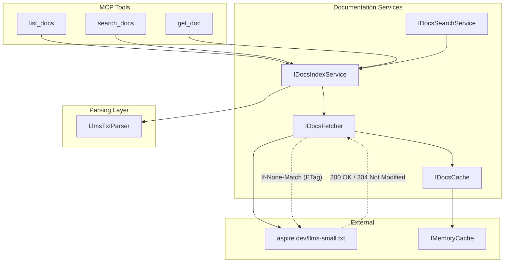
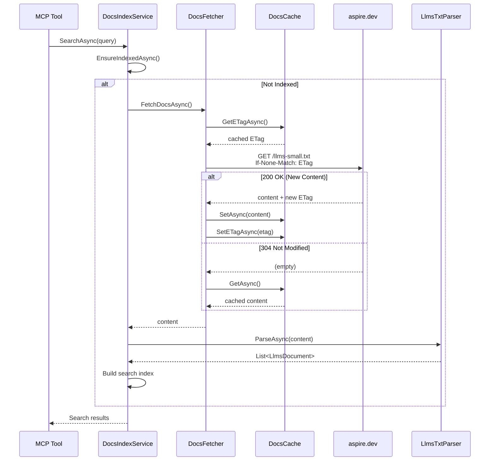

# Aspire MCP Documentation Search Services

## Overview

This specification describes the design and implementation of documentation fetching, caching, and lexical search capabilities for the Aspire MCP server. These features enable AI agents and developers to query aspire.dev documentation, powered by weighted lexical search with pre-indexed documents.

## Background

### Motivation

The Aspire MCP server provides tools for interacting with Aspire applications, but lacks direct access to Aspire documentation. Developers and AI agents often need to:

1. **Find documentation** - Locate relevant Aspire documentation for specific features, APIs, or concepts
2. **Get context-aware answers** - Retrieve documentation snippets that are relevant to their questions
3. **Stay current** - Access up-to-date documentation from aspire.dev without manual lookups

### Prior Art

- **aspire.dev/llms-small.txt** - The Aspire documentation site exposes an LLM-friendly documentation file at `https://aspire.dev/llms-small.txt` containing abridged documentation suitable for AI agent consumption

## Design Goals

### Primary Objectives

1. **Dynamic documentation fetching** - Fetch aspire.dev documentation on-demand with ETag-based caching
2. **Lexical search capability** - Enable natural language queries against documentation using weighted field search
3. **Zero external dependencies** - Work without any embedding provider or external services
4. **Eager indexing** - Pre-index documentation on MCP server startup for fast first query
5. **Aspire pair programmer persona** - Provide prompts that guide AI agents to use documentation effectively
6. **CLI delegation** - Prefer Aspire CLI commands over reimplementing functionality

### Non-Goals

- **Offline-first** - Not designed for fully offline scenarios (requires network for initial fetch)
- **Full-text indexing** - Not a replacement for a full search engine
- **Vector embeddings** - Lexical search chosen over embeddings for simplicity and zero dependencies

## Architecture

### Component Overview

```txt
┌─────────────────────────────────────────────────────────────────────┐
│                         MCP Server                                  │
├─────────────────────────────────────────────────────────────────────┤
│  Tools                             │  Prompts                       │
│  ├─ list_docs                      │  ├─ aspire-pair-programmer     │
│  ├─ search_docs                    │  ├─ debug-resource             │
│  └─ get_doc                        │  ├─ add-integration            │
│                                    │  ├─ deploy-app                 │
│                                    │  └─ troubleshoot-app           │
├─────────────────────────────────────────────────────────────────────┤
│  Services                                                           │
│  ├─ IDocsFetcher      - HTTP client for aspire.dev docs with ETag   │
│  ├─ IDocsCache        - IMemoryCache wrapper with ETag storage      │
│  ├─ IDocsIndexService - Pre-indexing and weighted lexical search    │
│  └─ IDocsSearchService- High-level search API                       │
├─────────────────────────────────────────────────────────────────────┤
│  Parsers                                                            │
│  └─ LlmsTxtParser     - Async parallel parser for llms.txt format   │
└─────────────────────────────────────────────────────────────────────┘
```

### Service Architecture Diagram



### Data Flow Diagram



### Service Interfaces

#### IDocsFetcher

Fetches documentation content from aspire.dev with ETag-based caching:

```csharp
internal interface IDocsFetcher
{
    Task<string?> FetchDocsAsync(CancellationToken cancellationToken = default);
}
```

**Implementation details:**
- Base URL: `https://aspire.dev/`
- Endpoint: `llms-small.txt`
- Uses `HttpClient` with conditional requests (`If-None-Match` header)
- Returns cached content on `304 Not Modified` response
- Falls back to cached content on network errors

#### IDocsCache

Provides caching for documentation content with ETag tracking:

```csharp
internal interface IDocsCache
{
    Task<string?> GetAsync(string key, CancellationToken cancellationToken = default);
    Task SetAsync(string key, string content, CancellationToken cancellationToken = default);
    Task<string?> GetETagAsync(string url, CancellationToken cancellationToken = default);
    Task SetETagAsync(string url, string etag, CancellationToken cancellationToken = default);
    Task InvalidateAsync(string key, CancellationToken cancellationToken = default);
}
```

**Implementation details:**
- Wraps `IMemoryCache` from `Microsoft.Extensions.Caching.Memory`
- Stores ETags separately from content for conditional request support
- No TTL-based expiration; cache validity determined by ETag

#### IDocsIndexService

Provides document indexing and weighted lexical search:

```csharp
internal interface IDocsIndexService
{
    ValueTask EnsureIndexedAsync(CancellationToken cancellationToken = default);
    ValueTask<IReadOnlyList<DocsListItem>> ListDocumentsAsync(CancellationToken cancellationToken = default);
    ValueTask<IReadOnlyList<DocsSearchResult>> SearchAsync(string query, int topK = 5, CancellationToken cancellationToken = default);
    ValueTask<LlmsDocument?> GetDocumentAsync(string slug, CancellationToken cancellationToken = default);
}
```

**Implementation details:**
- Parses llms.txt using `LlmsTxtParser.ParseAsync` with parallel document processing
- Pre-indexes documents with lowercase text for faster case-insensitive matching
- Extracts code identifiers for bonus scoring
- Uses `ValueTask` for efficient async operations

### LlmsTxtParser

Async parallel parser for llms.txt format documentation:

```csharp
internal static partial class LlmsTxtParser
{
    public static async Task<IReadOnlyList<LlmsDocument>> ParseAsync(
        string content,
        CancellationToken cancellationToken = default);
}
```

**Implementation details:**
- Finds document boundaries (H1 headers) in single pass
- Parses each document in parallel using `Task.WhenAll`
- Uses `ReadOnlySpan<char>` throughout for zero-allocation parsing
- Uses `ArrayPool<char>` for slug generation

### Document Model

```csharp
internal sealed class LlmsDocument
{
    public required string Title { get; init; }
    public required string Slug { get; init; }
    public string? Summary { get; init; }
    public required string Content { get; init; }
    public required IReadOnlyList<LlmsSection> Sections { get; init; }
}

internal sealed class LlmsSection
{
    public required string Heading { get; init; }
    public required int Level { get; init; }
    public required string Content { get; init; }
}
```

### Weighted Lexical Search

Search uses weighted field scoring for relevance ranking:

**Field Weights:**
- Title: 10.0x
- Summary: 8.0x
- Section Heading: 6.0x
- Code blocks: 5.0x
- Body text: 1.0x

**Scoring Bonuses:**
- Word boundary match: +0.5
- Multiple occurrences: +0.25 per occurrence (max 3)
- Code identifier match: +0.5

**Implementation optimizations:**
- Pre-computed lowercase text in `IndexedDocument` and `IndexedSection` classes
- Span-based `CountOccurrences` method for zero-allocation matching
- Static lambdas to avoid closure allocations
- Pre-extracted code spans and identifiers

## MCP Tools

### list_docs

Lists all available documents from aspire.dev.

**Input Schema:**
```json
{
  "type": "object",
  "properties": {},
  "additionalProperties": false,
  "description": "Lists all available documentation from aspire.dev. No parameters required."
}
```

**Behavior:**
- Returns list of documents with title, slug, and summary
- Triggers indexing if not already indexed
- Useful for discovering available documentation topics

### search_docs

Performs weighted lexical search across indexed documentation.

**Input Schema:**
```json
{
  "type": "object",
  "properties": {
    "query": {
      "type": "string",
      "description": "The search query to find relevant documentation."
    },
    "topK": {
      "type": "integer",
      "description": "Number of results to return (default: 5, max: 20)."
    }
  },
  "required": ["query"]
}
```

**Behavior:**
1. Tokenizes query into search terms
2. Scores each document section using weighted field matching
3. Returns top-K results with document title, section, content, and score
4. Results formatted as markdown with separators

### get_doc

Retrieves a specific document by its slug.

**Input Schema:**
```json
{
  "type": "object",
  "properties": {
    "slug": {
      "type": "string",
      "description": "The document slug (URL-friendly identifier)."
    }
  },
  "required": ["slug"]
}
```

**Behavior:**
- Returns full document content for the specified slug
- Case-insensitive slug matching
- Returns error if document not found

## MCP Prompts

### aspire-pair-programmer

Main persona prompt that activates an Aspire expert assistant.

**Arguments:**
- `context` (optional) - What the user is working on

**Behavior:**
- Provides system context about Aspire architecture, integrations, and best practices
- Lists available MCP tools and when to use them
- Emphasizes using Aspire CLI (not dotnet CLI) for operations
- Guides toward documentation-backed answers

### debug_resource

Workflow prompt for debugging resource issues.

**Arguments:**
- `resourceName` (required) - Resource to debug
- `issue` (optional) - Description of the problem

**Behavior:**
- Guides through systematic debugging: status → logs → traces → recommendations

### add_integration

Workflow prompt for adding new integrations.

**Arguments:**
- `integrationType` (required) - Type of integration (redis, postgresql, etc.)
- `resourceName` (optional) - Name for the resource

**Behavior:**
- Searches for integration documentation
- Provides AppHost and client configuration guidance

### deploy_app

Workflow prompt for deployment guidance.

**Arguments:**
- `target` (required) - Deployment target (azure, kubernetes, docker-compose)
- `environment` (optional) - Target environment name

**Behavior:**
- Runs environment checks via `doctor`
- Fetches deployment documentation
- Guides through `aspire publish` and `aspire deploy` workflows

### troubleshoot_app

Comprehensive troubleshooting prompt.

**Arguments:**
- `symptom` (required) - Description of the issue

**Behavior:**
- Systematic analysis: environment → resources → logs → traces → docs → recommendations

## Startup Behavior

Documentation indexing begins immediately when the MCP server starts:

```csharp
// In McpStartCommand.ExecuteAsync
_ = Task.Run(async () => await _docsIndexService.EnsureIndexedAsync(cancellationToken), cancellationToken);
```

This ensures the index is ready by the time a user makes their first docs-related query.

## Future Considerations

### Full Documentation Support

Currently uses `llms-small.txt` for abridged documentation. Could add support for:
- `llms-full.txt` for comprehensive documentation
- Configurable doc source selection

### Disk Persistence

Consider adding disk persistence for faster startup:
- Serialize parsed documents to disk
- Use file modification time for cache invalidation
- Reduce network requests on repeated startups

### Search Improvements

Potential search enhancements:
- TF-IDF or BM25 for more sophisticated ranking
- Fuzzy matching for typo tolerance
- Query expansion for related terms

## Implementation Notes

### File Locations

```directory
└───📂 Mcp
     ├───📂 Docs
     │    ├─── DocsCache.cs
     │    ├─── DocsFetcher.cs
     │    ├─── DocsIndexService.cs
     │    ├─── DocsSearchService.cs
     │    ├─── IDocsCache.cs
     │    └─── LlmsTxtParser.cs
     ├───📂 Prompts
     │    ├─── AddIntegrationPrompt.cs
     │    ├─── AspirePairProgrammerPrompt.cs
     │    ├─── CliMcpPrompt.cs
     │    ├─── DebugResourcePrompt.cs
     │    ├─── DeployAppPrompt.cs
     │    └─── TroubleshootAppPrompt.cs
     ├───📂 Tools
     │    ├─── CliMcpTool.cs
     │    ├─── DoctorTool.cs
     │    ├─── ExecuteResourceCommandTool.cs
     │    ├─── GetDocTool.cs
     │    ├─── ListAppHostsTool.cs
     │    ├─── ListConsoleLogsTool.cs
     │    ├─── ListDocsTool.cs
     │    ├─── ListIntegrationsTool.cs
     │    ├─── ListResourcesTool.cs
     │    ├─── ListStructuredLogsTool.cs
     │    ├─── ListTracesTool.cs
     │    ├─── ListTraceStructuredLogsTool.cs
     │    ├─── RefreshToolsTool.cs
     │    ├─── SearchDocsTool.cs
     │    └─── SelectAppHostTool.cs
     ├─── KnownMcpPrompts.cs
     └─── KnownMcpTools.cs
```

### Dependencies

- `Microsoft.Extensions.Caching.Memory` - For `IMemoryCache`
- `System.Buffers` - For `ArrayPool<char>` in slug generation

### Testing Strategy

1. **Unit tests** for `LlmsTxtParser` parsing logic
2. **Unit tests** for `DocsIndexService` search scoring
3. **Integration tests** for end-to-end tool behavior
4. **Manual testing** with real aspire.dev content

## References

- [aspire.dev/llms-small.txt](https://aspire.dev/llms-small.txt) - Abridged documentation for LLMs
- [MCP Specification](https://modelcontextprotocol.io/) - Model Context Protocol
