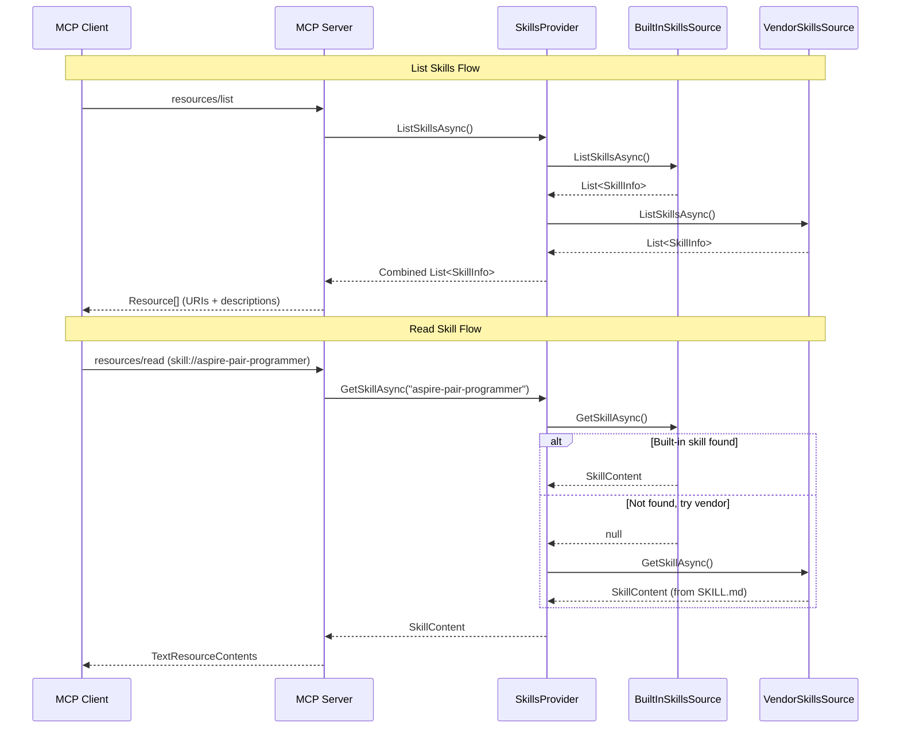

# Aspire MCP Skills-as-Resources

## Overview

This specification describes the design and implementation of a skills-as-resources pattern for the Aspire MCP server. Skills are dynamic, discoverable instruction files exposed as MCP resources, decoupling skill content from Aspire CLI releases.

## Background

### Motivation

Currently, MCP prompts (like `aspire-pair-programmer`, `troubleshoot-app`, etc.) are implemented as static C# classes with hardcoded instruction text. This approach has limitations:

1. **Release coupling** - Updating skill content requires a new Aspire CLI release
2. **No discoverability** - Clients cannot browse available skills without invoking prompts
3. **No progressive disclosure** - All prompt content is returned at once, no lazy loading
4. **Limited extensibility** - Cannot add custom skills without modifying CLI source

### Prior Art

- **FastMCP SkillsProvider** - Python implementation exposing SKILL.md files as MCP resources with URI scheme `skill://{name}/SKILL.md`
- **Claude Code skills** - Local skills stored in `~/.claude/skills/` directories
- **Aspire repo skills** - Existing `.github/skills/` directory with SKILL.md files for development guidance

### MCP Resource Pattern

The MCP protocol supports resources as addressable content units:

```txt
resources/list    - List available resources
resources/read    - Retrieve resource content by URI
```

Resources can be:
- **Static resources** - Fixed URIs like `skill://add-integration`
- **Resource templates** - Parameterized URIs like `skill://{name}` (RFC 6570)

## Design Goals

### Primary Objectives

1. **Dynamic skills** - Skill content fetched from remote sources (aspire.dev) and updated independently of CLI releases
2. **Backward compatible prompts** - Existing prompt endpoints continue working, using skills as backing content
3. **Progressive disclosure** - Clients can list skills (lightweight) before reading full content
4. **Skill manifest** - Each skill exposes metadata (name, description, version)
5. **Extensibility** - Future support for local custom skills

### Non-Goals

- **Skill versioning** - Not tracking skill version history (may add later)
- **Skill editing** - MCP server is read-only for skills (except via `save_skill` tool)

## Architecture

### Component Overview

```txt
┌─────────────────────────────────────────────────────────────────────┐
│                         MCP Server                                  │
├─────────────────────────────────────────────────────────────────────┤
│  Resources                         │  Tools                         │
│  ├─ skill://aspire-pair-programmer │  ├─ list_docs                  │
│  ├─ skill://troubleshoot-app       │  ├─ search_docs                │
│  ├─ skill://debug-resource         │  ├─ get_doc                    │
│  ├─ skill://add-integration        │  ├─ save_skill                 │
│  └─ skill://deploy-app             │  └─ ...                        │
│                                    │                                │
│                                    │  Prompts (backward compat)     │
│                                    │  ├─ aspire-pair-programmer     │
│                                    │  ├─ troubleshoot-app           │
│                                    │  └─ ...                        │
├─────────────────────────────────────────────────────────────────────┤
│  Skills Services                                                    │
│  ├─ ISkillsProvider     - Unified access to skill content          │
│  ├─ BuiltInSkillsSource - Hardcoded MCP-aware skills               │
│  └─ VendorSkillsSource  - Skills from ~/.claude/, ~/.aspire/, etc. │
└─────────────────────────────────────────────────────────────────────┘
```

### Data Flow Diagram



### Skill URI Scheme

Skills are exposed via a `skill://` URI scheme:

```txt
skill://aspire-pair-programmer        - Main persona skill
skill://troubleshoot-app              - Troubleshooting workflow
skill://debug-resource                - Resource debugging workflow
skill://add-integration               - Integration guidance
skill://add-integration?type=redis    - Parameterized skill (future)
skill://deploy-app                    - Deployment workflow
```

### Service Interfaces

#### ISkillsProvider

Provides unified access to skills from multiple sources:

```csharp
internal interface ISkillsProvider
{
    /// <summary>
    /// Lists all available skills from all registered sources.
    /// </summary>
    ValueTask<IReadOnlyList<SkillInfo>> ListSkillsAsync(
        CancellationToken cancellationToken = default);

    /// <summary>
    /// Gets a skill by its identifier.
    /// </summary>
    ValueTask<SkillContent?> GetSkillAsync(
        string skillName,
        CancellationToken cancellationToken = default);

    /// <summary>
    /// Saves a skill to disk in the specified directory.
    /// </summary>
    ValueTask<string> SaveSkillAsync(
        string skillName,
        string content,
        string? description = null,
        string? targetDirectory = null,
        CancellationToken cancellationToken = default);

    /// <summary>
    /// Gets the default skills directory for persisting user skills.
    /// </summary>
    string GetDefaultSkillsDirectory();
}
```

#### SkillInfo

Lightweight metadata for skill discovery:

```csharp
internal sealed class SkillInfo
{
    public required string Name { get; init; }
    public required string Description { get; init; }
    public string Uri => $"skill://{Name}";
}
```

#### SkillContent

Full skill content for reading:

```csharp
internal sealed class SkillContent
{
    public required string Name { get; init; }
    public required string Content { get; init; }
    public string? MimeType { get; init; } = "text/markdown";
}
```

### Skill Content Sources

Skills come from multiple sources, with built-in skills taking precedence:

1. **Built-in skills** (`BuiltInSkillsSource`) - Hardcoded C# implementations with MCP-specific knowledge
2. **Vendor skills** (`VendorSkillsSource`) - Discovered from platform directories:
   - `~/.claude/skills/`
   - `~/.cursor/skills/`
   - `~/.copilot/skills/`
   - `~/.gemini/skills/`
   - `~/.codex/skills/`
   - `~/.config/agents/skills/` (Goose)
   - `~/.config/opencode/skills/` (OpenCode)
   - `~/.aspire/skills/` (Aspire-specific)

#### BuiltInSkillsSource

Provides hardcoded skills with MCP-specific knowledge:

```csharp
internal static class BuiltInSkillsSource
{
    public static ValueTask<IReadOnlyList<SkillInfo>> ListSkillsAsync(
        CancellationToken cancellationToken = default);

    public static ValueTask<SkillContent?> GetSkillAsync(
        string skillName,
        CancellationToken cancellationToken = default);
}
```

Built-in skills include:
- `aspire-pair-programmer` - Main persona with MCP tool knowledge
- `troubleshoot-app` - Systematic troubleshooting workflow
- `debug-resource` - Resource-specific debugging
- `add-integration` - Integration guidance
- `deploy-app` - Deployment workflows

#### VendorSkillsSource

Discoveries skills from vendor-specific directories:

```csharp
internal static class VendorSkillsSource
{
    public static ValueTask<IReadOnlyList<SkillInfo>> ListSkillsAsync(
        CancellationToken cancellationToken = default);

    public static ValueTask<SkillContent?> GetSkillAsync(
        string skillName,
        CancellationToken cancellationToken = default);
}
```

Vendor skills are discovered by scanning known directories for subdirectories containing a `SKILL.md` file.

### Skill Mapping Strategy

Map aspire.dev documentation to skills:

| Skill Name | Documentation Source | Description |
|------------|---------------------|-------------|
| `aspire-pair-programmer` | Built-in + tools list | Main persona with MCP tool knowledge |
| `troubleshoot-app` | troubleshooting/* docs | Systematic debugging workflow |
| `debug-resource` | Built-in workflow | Resource-specific debugging |
| `add-integration` | integrations/* docs | Integration guidance |
| `deploy-app` | deployment/* docs | Deployment workflows |
| `{integration-name}` | integration-specific doc | Per-integration skill |

### Prompt-to-Skill Delegation

Prompts delegate to skills for content, maintaining backward compatibility:

```csharp
internal sealed class TroubleshootAppPrompt : CliMcpPrompt
{
    private readonly ISkillsProvider _skills;

    public override async GetPromptResult GetPrompt(
        IReadOnlyDictionary<string, string>? arguments)
    {
        // Get skill content (may be cached)
        var skill = await _skills.GetSkillAsync("troubleshoot-app");

        // Build prompt with skill content + user arguments
        var prompt = BuildPromptFromSkill(skill, arguments);

        return new GetPromptResult { ... };
    }
}
```

## MCP Resource Handlers

### ListResourcesHandler

```csharp
handlers.ListResourcesHandler = async (request, cancellationToken) =>
{
    var skills = await _skillsProvider.ListSkillsAsync(cancellationToken);

    return new ListResourcesResult
    {
        Resources = skills.Select(s => new Resource
        {
            Uri = s.Uri,
            Name = s.Name,
            Description = s.Description,
            MimeType = "text/markdown"
        }).ToList()
    };
};
```

### ReadResourceHandler

```csharp
handlers.ReadResourceHandler = async (request, cancellationToken) =>
{
    var uri = request.Params?.Uri;
    if (uri is null || !uri.StartsWith("skill://"))
    {
        throw new McpProtocolException("Invalid skill URI", McpErrorCode.InvalidParams);
    }

    var skillName = uri.Substring("skill://".Length);
    var content = await _skillsProvider.GetSkillAsync(skillName, cancellationToken);

    if (content is null)
    {
        throw new McpProtocolException($"Skill not found: {skillName}", McpErrorCode.ResourceNotFound);
    }

    return new ReadResourceResult
    {
        Contents = [new TextResourceContents
        {
            Uri = uri,
            Text = content.Content,
            MimeType = content.MimeType
        }]
    };
};
```

## Skill Content Format

Skills use markdown format with optional YAML frontmatter:

```markdown
---
name: add-integration
description: Step-by-step guidance for adding Aspire integrations
version: 1.0.0
arguments:
  - name: integrationType
    description: Type of integration (redis, postgresql, etc.)
    required: true
  - name: resourceName
    description: Name for the resource
    required: false
---

# Add Integration Skill

You are helping the user add a new Aspire integration to their application.

## Available Tools

Use these MCP tools to assist:
- `search_docs` - Find integration documentation
- `list_integrations` - List available integrations
- `get_doc` - Get detailed integration docs

## Workflow

1. **Identify integration type** from user request
2. **Search documentation** using `search_docs`
3. **Provide NuGet packages** required for both hosting and client
4. **Show AppHost configuration** code
5. **Show client configuration** code

...
```

## Built-in Skills

Some skills require MCP-specific knowledge (available tools, server capabilities) that isn't in documentation. These are built-in:

### aspire-pair-programmer

Main persona skill with:
- Aspire architecture knowledge
- Available MCP tools and when to use them
- CLI vs dotnet CLI guidance
- Integration recommendations

### debug-resource

Resource debugging workflow with:
- Step-by-step debugging process
- Tool usage patterns for logs/traces
- Common error patterns

## Caching Strategy

Skills are loaded on-demand:

1. **Built-in skills** - Hardcoded in `BuiltInSkillsSource`, no caching needed
2. **Vendor skills** - Read from disk on each request (file I/O is fast for small markdown files)

Future consideration: Add memory caching for vendor skills with file watcher invalidation.

## Implementation Status

### Completed

1. ✅ `ISkillsProvider` interface and `SkillsProvider` implementation
2. ✅ `BuiltInSkillsSource` with hardcoded MCP-aware skills
3. ✅ `VendorSkillsSource` scanning platform directories
4. ✅ `ListResourcesHandler` and `ReadResourceHandler` in MCP server
5. ✅ `SaveSkillTool` for persisting skills via MCP
6. ✅ Skills exposed as MCP resources with `skill://` URI scheme

### Future Work

1. Support skill versioning and metadata
2. Add skill subscriptions for change notifications
3. Memory caching for vendor skills with file watcher

## File Locations

```directory
└───📂 Mcp
     ├───📂 Skills
     │    ├─── BuiltInSkillsSource.cs
     │    ├─── ISkillsProvider.cs
     │    ├─── KnownSkills.cs
     │    ├─── SkillContent.cs
     │    ├─── SkillInfo.cs
     │    ├─── SkillsProvider.cs
     │    └─── VendorSkillsSource.cs
     ├───📂 Tools
     │    └─── SaveSkillTool.cs
     ├───📂 Docs
     │    └─── (see mcp-docs-search.md)
     └───📂 Prompts
          └─── (existing, may delegate to skills)
```

## Testing Strategy

1. **Unit tests** for skill parsing and content generation
2. **Unit tests** for resource URI handling
3. **Integration tests** for skill discovery flow
4. **End-to-end tests** for prompt-to-skill delegation

## Security Considerations

- **Read-only resources** - Skills are read-only as MCP resources
- **Write via tool** - `save_skill` tool allows saving skills to disk with user confirmation
- **URI validation** - Strict validation of skill URIs
- **Content sanitization** - Skill content sanitized before serving
- **Trusted sources only** - Skills only from built-in or known vendor directories

## Future Considerations

### Skill Versioning

Track skill versions for debugging and compatibility:

```csharp
public sealed class SkillInfo
{
    public string? Version { get; init; }
    public DateTimeOffset? LastUpdated { get; init; }
    public string? SourceUri { get; init; }  // e.g., aspire.dev URL
}
```

### Skill Subscriptions

Allow clients to subscribe to skill updates:

```csharp
handlers.SubscribeToResourcesHandler = async (request, cancellationToken) =>
{
    // Track client interest in skill://* URIs
    // Send notifications when skills update
};
```

## References

- [FastMCP SkillsProvider](https://github.com/jlowin/fastmcp/tree/main/src/fastmcp/server/providers/skills)
- [MCP Resources Specification](https://modelcontextprotocol.io/docs/concepts/resources)
- [Aspire MCP Documentation Search](./mcp-docs-search.md)
