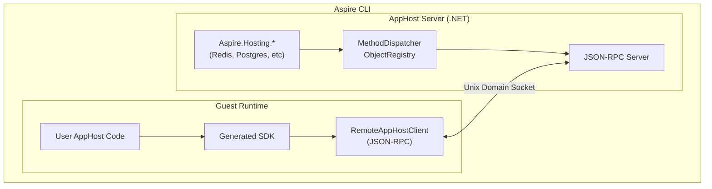
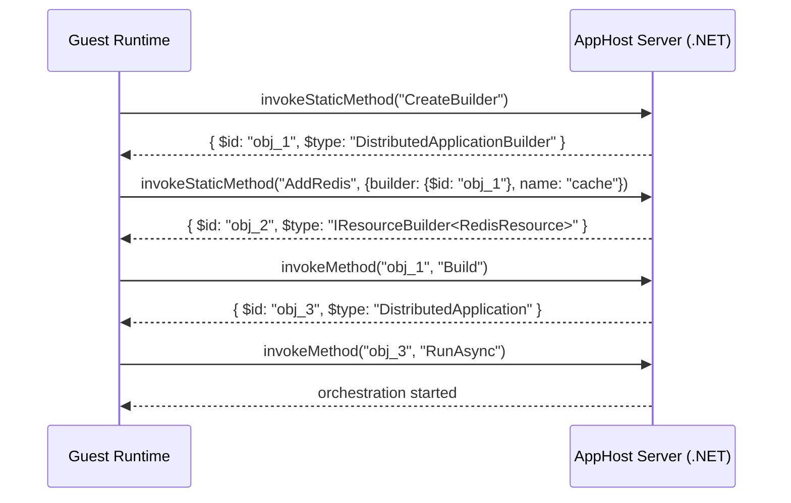
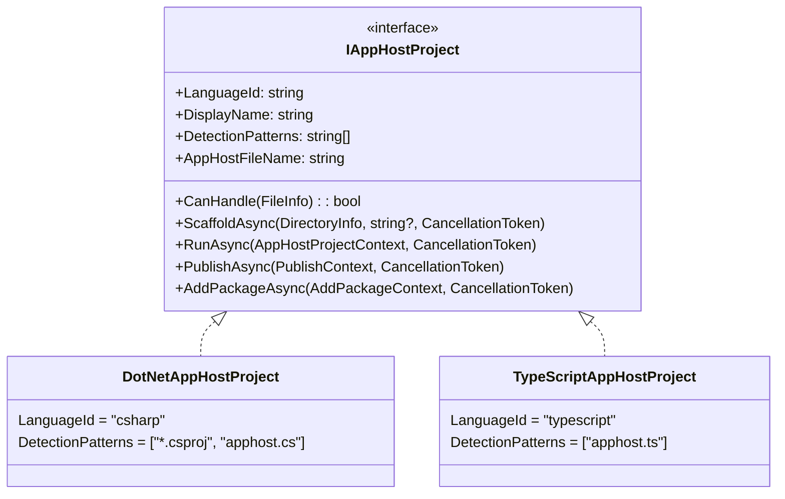

# Polyglot AppHost Support

This document describes how the Aspire CLI supports non-.NET app hosts. Currently, TypeScript is the supported guest language.

## Table of Contents

- [Overview](#overview)
- [Architecture](#architecture)
- [JSON-RPC Protocol](#json-rpc-protocol)
- [Type System and Marshalling](#type-system-and-marshalling)
- [Code Generation](#code-generation)
- [TypeScript Implementation](#typescript-implementation)
- [CLI Integration](#cli-integration)
- [Process Lifecycle](#process-lifecycle)
- [Configuration](#configuration)
- [Adding New Guest Languages](#adding-new-guest-languages)
- [Development Mode](#development-mode)
- [Challenges and Limitations](#challenges-and-limitations)

---

## Overview

The polyglot apphost feature allows developers to write Aspire app hosts in non-.NET languages. The CLI detects the guest language entry point and orchestrates the guest runtime alongside an AppHost server.

**Terminology:**
- **Host (AppHost server)**: The .NET process running Aspire.Hosting
- **Guest**: The non-.NET runtime executing the user's apphost code

**Design Goals:**
1. **Reuse Existing Integrations** - All 100+ Aspire.Hosting.* packages work automatically
2. **Native Language Experience** - Generated SDKs with idiomatic APIs
3. **Consistent CLI Experience** - `aspire run`, `aspire add`, `aspire publish` work identically

---

## Architecture

The CLI scaffolds the AppHost server project that references the required hosting integration packages. Code generation reflects over these assemblies to produce a language-specific SDK. At runtime, the AppHost server uses `Aspire.Hosting.RemoteHost` to expose a JSON-RPC server over Unix domain sockets. The guest connects and sends RPC calls (e.g., `addRedis()`, `withEnvironment()`) which are executed against the real Aspire.Hosting APIs.





### Key Projects

| Project | Purpose |
|---------|---------|
| `Aspire.Hosting.CodeGeneration` | Reflection-based model building from Aspire.Hosting assemblies |
| `Aspire.Hosting.CodeGeneration.<Language>` | Language-specific SDK generator |
| `Aspire.Hosting.RemoteHost` | JSON-RPC server, method dispatcher, object registry |

---

## JSON-RPC Protocol

Communication between the guest and host uses JSON-RPC 2.0 over Unix domain sockets (or named pipes on Windows).

### Protocol Summary

| Method | Direction | Purpose |
|--------|-----------|---------|
| `ping` | Guest → Host | Health check |
| `createObject` | Guest → Host | Instantiate a .NET type |
| `invokeStaticMethod` | Guest → Host | Call static/extension methods |
| `invokeMethod` | Guest → Host | Call instance methods |
| `getProperty` / `setProperty` | Guest → Host | Instance property access |
| `getStaticProperty` / `setStaticProperty` | Guest → Host | Static property access |
| `getIndexer` / `setIndexer` | Guest → Host | Collection access (list/dictionary) |
| `unregisterObject` | Guest → Host | Release object from registry |
| `invokeCallback` | Host → Guest | Invoke registered callback |

### Design Philosophy: Generic .NET Remoting

The JSON-RPC server in `Aspire.Hosting.RemoteHost` is designed as a **generic .NET remoting layer**. The protocol distinguishes between two categories of method calls:

**Instance Methods** - Operate on a specific object in the registry:

| RPC Method | .NET Concept |
|------------|--------------|
| `invokeMethod` | Call instance method on registered object |
| `getProperty` / `setProperty` | Instance property access |
| `getIndexer` / `setIndexer` | Indexer access (lists, dictionaries) |
| `unregisterObject` | Release object reference |

**Static Methods** - Require assembly/type resolution (no target instance):

| RPC Method | .NET Concept |
|------------|--------------|
| `createObject` | Instantiate a type via constructor |
| `invokeStaticMethod` | Call static method or extension method |
| `getStaticProperty` / `setStaticProperty` | Static property access |

**Key Insight: Extension Methods are Static Methods**

Extension methods in .NET are syntactic sugar for static method calls. When calling an extension method via `invokeStaticMethod`, the "this" parameter is passed as an argument:

```json
// C#: builder.AddRedis("cache")
// Actually calls: RedisBuilderExtensions.AddRedis(builder, "cache")

// Request
{"jsonrpc":"2.0","id":5,"method":"invokeStaticMethod","params":[
    "Aspire.Hosting.Redis",
    "Aspire.Hosting.Redis.RedisBuilderExtensions",
    "AddRedis",
    {"builder":{"$id":"obj_1"},"name":"cache"}
]}
```

This design means the protocol can invoke **any .NET API** - not just Aspire.Hosting methods. The guest SDK is generated from reflection over the actual .NET assemblies, so new integrations automatically get type-safe APIs without protocol changes.

### Transport Layer

The protocol uses **header-delimited messages** matching the `vscode-jsonrpc` format:

```text
Content-Length: 123\r\n
\r\n
{"jsonrpc":"2.0","id":1,"method":"ping","params":[]}
```

### RPC Methods (Guest → Host)

These methods are called by the guest to interact with the .NET host.

#### `ping`

Health check to verify connection.

| | |
|---|---|
| **Parameters** | None |
| **Returns** | `string` - Always `"pong"` |

```json
// Request
{"jsonrpc":"2.0","id":1,"method":"ping","params":[]}

// Response
{"jsonrpc":"2.0","id":1,"result":"pong"}
```

#### `createObject`

Instantiate a .NET type by calling its constructor.

| | |
|---|---|
| **Parameters** | `assemblyName: string` - Assembly containing the type<br/>`typeName: string` - Fully qualified type name<br/>`args: object?` - Constructor arguments as JSON object |
| **Returns** | `object` - Marshalled object with `$id` for future reference |

```json
// Request
{"jsonrpc":"2.0","id":2,"method":"createObject","params":[
    "Aspire.Hosting",
    "Aspire.Hosting.DistributedApplicationOptions",
    {"Args":["--operation","run"],"ProjectDirectory":"/path/to/project"}
]}

// Response
{"jsonrpc":"2.0","id":2,"result":{"$id":"obj_1","$type":"DistributedApplicationOptions"}}
```

#### `invokeStaticMethod`

Call a static method on a .NET type. This is the primary method for calling extension methods - pass the target object as the first argument.

| | |
|---|---|
| **Parameters** | `assemblyName: string` - Assembly containing the type<br/>`typeName: string` - Fully qualified type name<br/>`methodName: string` - Method name<br/>`args: object?` - Method arguments as JSON object |
| **Returns** | `object?` - Method return value (marshalled) |

```json
// Extension method: builder.AddRedis("cache")
// Request
{"jsonrpc":"2.0","id":3,"method":"invokeStaticMethod","params":[
    "Aspire.Hosting.Redis",
    "Aspire.Hosting.Redis.RedisBuilderExtensions",
    "AddRedis",
    {"builder":{"$id":"obj_1"},"name":"cache"}
]}

// Response
{"jsonrpc":"2.0","id":3,"result":{"$id":"obj_2","$type":"IResourceBuilder<RedisResource>"}}
```

**Generic Method Handling**: When calling generic methods, type arguments are inferred from the actual argument values at runtime. For example, `AddContainer<T>` will infer `T` from the builder type.

#### `invokeMethod`

Call an instance method on a registered object. Use this for true instance methods only (not extension methods).

| | |
|---|---|
| **Parameters** | `objectId: string` - Object ID from registry<br/>`methodName: string` - Method to invoke<br/>`args: object?` - Method arguments as JSON object |
| **Returns** | `object?` - Method return value (marshalled) |

```json
// Request
{"jsonrpc":"2.0","id":4,"method":"invokeMethod","params":["obj_1","Build",null]}

// Response
{"jsonrpc":"2.0","id":4,"result":{"$id":"obj_2","$type":"DistributedApplication"}}
```

#### `getProperty` / `setProperty`

Get or set a property value on a registered object.

```json
// Get property
{"jsonrpc":"2.0","id":5,"method":"getProperty","params":["obj_1","Name"]}

// Set property
{"jsonrpc":"2.0","id":6,"method":"setProperty","params":["obj_1","Name","new-cache"]}
```

#### `getIndexer` / `setIndexer`

Get or set an indexed value from a collection (list or dictionary).

```json
// Get from dictionary
{"jsonrpc":"2.0","id":7,"method":"getIndexer","params":["obj_1","REDIS_URL"]}

// Get from list
{"jsonrpc":"2.0","id":8,"method":"getIndexer","params":["obj_2",0]}

// Set value
{"jsonrpc":"2.0","id":9,"method":"setIndexer","params":["obj_1","MY_VAR","my-value"]}
```

#### `getStaticProperty` / `setStaticProperty`

Get or set a static property value on a .NET type.

```json
// Get static property
{"jsonrpc":"2.0","id":10,"method":"getStaticProperty","params":[
    "Aspire.Hosting",
    "Aspire.Hosting.SomeType",
    "StaticProperty"
]}

// Set static property
{"jsonrpc":"2.0","id":11,"method":"setStaticProperty","params":[
    "Aspire.Hosting",
    "Aspire.Hosting.SomeType",
    "StaticProperty",
    "new-value"
]}
```

#### `unregisterObject`

Release an object from the registry when no longer needed.

```json
{"jsonrpc":"2.0","id":12,"method":"unregisterObject","params":["obj_1"]}
```

### RPC Methods (Host → Guest)

#### `invokeCallback`

Invoke a callback function that was registered by the guest.

| | |
|---|---|
| **Parameters** | `callbackId: string` - Callback ID (e.g., `"callback_1_1234567890"`)<br/>`args: object?` - Arguments to pass to callback |
| **Returns** | `object?` - Callback return value |
| **Timeout** | 60 seconds |

```json
// Request (Host → Guest)
{"jsonrpc":"2.0","id":100,"method":"invokeCallback","params":[
    "callback_1_1234567890",
    {"$id":"obj_5","$type":"EnvironmentCallbackContext"}
]}

// Response (Guest → Host)
{"jsonrpc":"2.0","id":100,"result":null}
```

### Callback Mechanism

Callbacks allow the host to invoke guest functions during method execution (e.g., `withEnvironment` callbacks):

1. Guest registers a callback function with a unique ID (e.g., `callback_1_1234567890`)
2. Guest passes the callback ID as an argument to an RPC method call
3. Host executes the method, which invokes the callback
4. Host sends `invokeCallback` request to guest with the callback ID and args
5. Guest executes the callback and returns the result

---

## Type System and Marshalling

The polyglot architecture bridges two type systems: the host (.NET) and the guest.

### Design Principles

1. **Primitives pass directly**: Strings, numbers, booleans serialize as JSON primitives
2. **Complex objects become proxies**: Non-primitive types are registered in the host and accessed via JSON-RPC calls
3. **Callbacks are bidirectional**: Guest can register callbacks that the host invokes

### Object Registry

The `ObjectRegistry` in the host maintains a `ConcurrentDictionary<string, object>` mapping unique IDs to live .NET objects. When a complex object needs to be returned to the guest:

1. Object is registered with a unique ID (e.g., `obj_1`, `obj_2`)
2. A marshalled representation is sent: `{ $id, $type, ...properties }`
3. Guest wraps this in a proxy class
4. Subsequent operations use the `$id` to reference the object in the host

### Marshalled Object Format

```json
{
    "$id": "obj_1",
    "$type": "RedisResource",
    "Name": "cache"
}
```

### Type Mappings

#### Guest → Host

| Guest Type | .NET Type | Handling |
|------------|-----------|----------|
| String | `string` | Direct JSON |
| Number | `int`, `long`, `double` | Type coercion |
| Boolean | `bool` | Direct JSON |
| Null | `null` | Direct JSON |
| Object with `$id` | Registry lookup | Proxy reference resolved |
| `{ $referenceExpression, format }` | `ReferenceExpression` | Special handling |
| Arrays | `T[]`, `List<T>` | JSON deserialization |

#### Host → Guest

| .NET Type | Guest Type | Notes |
|-----------|------------|-------|
| Primitives | string/number/boolean | Direct |
| `DateTime`, `Guid` | string | ISO 8601 / string format |
| Enums | string | Enum name |
| Complex objects | Proxy | Marshalled with `$id` |

### ReferenceExpression

`ReferenceExpression` allows building connection strings that reference host objects:

```json
{ "$referenceExpression": true, "format": "redis://{obj_4}" }
```

The format string contains `{$id}` placeholders. The host reconstructs the expression using object registry lookups.

---

## Code Generation

The CLI generates language-specific SDK code that provides type-safe APIs with instance methods for all Aspire integrations.

### Generation Trigger

Code generation runs automatically when:

1. **First Run**: SDK folder doesn't exist
2. **Package Changes**: Hash of package references has changed
3. **After `aspire add`**: When adding new integrations
4. **Development Mode**: When `ASPIRE_REPO_ROOT` is set

### What Gets Generated

For each Aspire integration, the generator creates:

1. **Builder methods** on `DistributedApplicationBuilder`
2. **Resource-specific builder classes** with fluent methods
3. **Proxy wrapper classes** for callback contexts and model types

---

## TypeScript Implementation

This section covers TypeScript-specific details for the polyglot apphost feature.

### Generated File Structure

```text
.modules/
├── .codegen-hash              # SHA256 hash of package references
├── distributed-application.ts # Main SDK with builder classes
├── types.ts                   # Type definitions for RPC communication
└── RemoteAppHostClient.ts     # JSON-RPC client implementation
```

### Base Proxy Classes

**`DotNetProxy`** - Foundation for all remote object access:
```typescript
class DotNetProxy {
    readonly $id: string;
    readonly $type: string;

    async invokeMethod(name: string, args?: Record<string, unknown>): Promise<unknown>;
    async getProperty(name: string): Promise<unknown>;
    async setProperty(name: string, value: unknown): Promise<void>;
    async getIndexer(key: string | number): Promise<unknown>;
    async setIndexer(key: string | number, value: unknown): Promise<void>;
    async dispose(): Promise<void>;
}
```

**`ListProxy<T>`** - For `IList<T>` operations:
```typescript
class ListProxy<T> {
    async add(item: T): Promise<void>;
    async get(index: number): Promise<T>;
    async set(index: number, value: T): Promise<void>;
    async count(): Promise<number>;
    async clear(): Promise<void>;
    async remove(item: T): Promise<boolean>;
    async removeAt(index: number): Promise<void>;
}
```

### Generated Proxy Wrappers

The code generator produces **specially generated proxy wrapper classes** for callback context types. These provide typed access to .NET objects passed into callbacks.

| Generated Proxy | .NET Type | Purpose |
|-----------------|-----------|---------|
| `EnvironmentCallbackContextProxy` | `EnvironmentCallbackContext` | Access `EnvironmentVariables` dictionary |
| `CommandLineArgsCallbackContextProxy` | `CommandLineArgsCallbackContext` | Access `Args` list |
| `EndpointReferenceProxy` | `EndpointReference` | Access endpoint metadata |

Example generated proxy:
```typescript
class EnvironmentCallbackContextProxy {
    private _proxy: DotNetProxy;
    get proxy(): DotNetProxy { return this._proxy; }

    async getEnvironmentVariables(): Promise<DotNetProxy>;
    async getResource(): Promise<DotNetProxy>;
    async getExecutionContext(): Promise<DotNetProxy>;
}
```

### ReferenceExpression Support

The `refExpr` tagged template literal creates reference expressions:

```typescript
const endpoint = await redis.getEndpoint("tcp");
const expr = refExpr`redis://${endpoint}`;
// Serializes as: { $referenceExpression: true, format: "redis://{obj_4}" }
```

### Example Usage

```typescript
// apphost.ts
import { createBuilder } from './.modules/distributed-application.js';
import { EnvironmentCallbackContextProxy } from './.modules/distributed-application.js';

const builder = await createBuilder();

const redis = await builder.addRedis('cache');

// Callback receives typed proxy wrapper
await redis.withEnvironmentCallback(async (context: EnvironmentCallbackContextProxy) => {
    const envVars = await context.getEnvironmentVariables();
    await envVars.set("REDIS_CONFIG", "custom-value");
});

const app = builder.build();
await app.run();
```

---

## CLI Integration

The CLI uses the `IAppHostProject` interface as the **single extension point** for language support. Each language implements this interface, which handles identity, detection, creation, and execution concerns.



### CLI Command Mapping

| CLI Command | IAppHostProject Method | Description |
|-------------|------------------------|-------------|
| `aspire init` | `ScaffoldAsync` | Create apphost in current directory |
| `aspire new` | `ScaffoldAsync` | Create new project with apphost |
| `aspire run` | `RunAsync` | Build and run in development mode |
| `aspire publish` / `deploy` | `PublishAsync` | Build and run in publish mode |
| `aspire add` | `AddPackageAsync` | Add an integration package |

### Execution Model

For polyglot app hosts, `RunAsync` and `PublishAsync` follow the same pattern:

1. **Start the AppHost server** - A .NET process running Aspire.Hosting that exposes a JSON-RPC server
2. **Start the guest** - The guest language process that connects via JSON-RPC
3. **Guest defines resources** - Via RPC calls like `addRedis()`, `addPostgres()`
4. **Guest calls `run()`** - Triggers orchestration (run mode) or pipeline execution (publish mode)

In **run mode**, the AppHost server runs until interrupted (Ctrl+C). In **publish mode**, it exits when the pipeline completes.

---

## Process Lifecycle

### Startup Sequence

1. **Detection**: `ProjectLocator` finds the guest entry point
2. **AppHost Server Preparation**:
   - CLI scaffolds a .NET project in `$TMPDIR/.aspire/hosts/<hash>/`
   - References `Aspire.AppHost.Sdk` and required hosting packages
   - Builds the project with `dotnet build`
3. **Code Generation**:
   - Loads assemblies from build output using `AssemblyLoaderContext`
   - Builds `ApplicationModel` via reflection on loaded assemblies
   - Generates SDK into language-specific output folder
4. **Host Launch**: AppHost server started via `dotnet exec` with:
   - `REMOTE_APP_HOST_SOCKET_PATH` - Unix domain socket path for JSON-RPC
   - `REMOTE_APP_HOST_PID` - CLI process ID for orphan detection
5. **Guest Launch**: Guest runtime started with the entry point
6. **Connection**: Guest connects to host over Unix domain socket

### Shutdown Scenarios

| Scenario | Trigger | Behavior |
|----------|---------|----------|
| **Normal Exit** | User presses Ctrl+C | CLI terminates AppHost server gracefully |
| **Guest Completes** | Guest finishes (publish mode) | AppHost server completes and exits |
| **CLI Crash** | CLI process dies | `OrphanDetector` terminates AppHost server |
| **AppHost Crash** | AppHost server dies | Guest detects connection loss and exits |
| **Guest Crash** | Guest process dies | AppHost server detects disconnect |

The `OrphanDetector` prevents zombie processes by monitoring the CLI's PID (passed via `REMOTE_APP_HOST_PID`) and terminating if the parent dies.

---

## Configuration

### apphost.run.json

Launch settings for the app host, similar to `launchSettings.json` in .NET projects:

```json
{
  "profiles": {
    "https": {
      "applicationUrl": "https://localhost:17193;http://localhost:15069",
      "environmentVariables": {
        "ASPNETCORE_ENVIRONMENT": "Development",
        "DOTNET_ENVIRONMENT": "Development"
      }
    }
  }
}
```

### .aspire/settings.json

Integration package references for polyglot app hosts:

```json
{
  "packages": {
    "Aspire.Hosting.Redis": "<version>",
    "Aspire.Hosting.PostgreSQL": "<version>"
  }
}
```

When you run `aspire add`, the CLI updates this file and regenerates the SDK.

---

## Adding New Guest Languages

The polyglot architecture supports additional languages. The host-side infrastructure (`Aspire.Hosting.RemoteHost`) is language-agnostic—only code generation and CLI integration are language-specific.

**Adding a new language requires:**
1. Implement `IAppHostProject` interface
2. Create a code generator in `Aspire.Hosting.CodeGeneration.<Language>`
3. Implement a JSON-RPC client for the guest runtime

### Components to Implement

| Component | Location | Purpose |
|-----------|----------|---------|
| AppHost Project | `Aspire.Cli/Projects/<Language>AppHostProject.cs` | Implement `IAppHostProject` |
| Code Generator | `Aspire.Hosting.CodeGeneration.<Language>` | Generate idiomatic SDK |
| Runtime Client | Embedded or generated | JSON-RPC client with proxy classes |

### Runtime Client Requirements

The guest language needs a JSON-RPC client that:
1. Connects to Unix domain socket (path from `REMOTE_APP_HOST_SOCKET_PATH`)
2. Implements `vscode-jsonrpc` header-delimited message format
3. Handles `invokeCallback` requests from host
4. Wraps marshalled objects (`$id`, `$type`) in proxy classes

### Reusable Infrastructure

These components work unchanged for any guest language:
- `Aspire.Hosting.RemoteHost` - JSON-RPC server, method dispatcher, object registry
- `Aspire.Hosting.CodeGeneration` - Reflection-based model building
- AppHost server scaffolding and build process

---

## Development Mode

Set `ASPIRE_REPO_ROOT` to your local Aspire repository for development:

```bash
export ASPIRE_REPO_ROOT=/path/to/aspire
```

This:
- Skips SDK caching (always regenerates)
- Uses local build artifacts from `artifacts/bin/` instead of NuGet packages

---

## Challenges and Limitations

The generic .NET remoting approach is powerful but presents challenges when exposing the full .NET type system to guest languages.

### Known Challenges

| Challenge | Description | Status |
|-----------|-------------|--------|
| **Generic methods** | Methods like `GetRequiredService<T>()` require runtime type specification | Inferred from args |
| **Overload resolution** | Complex overloading may be ambiguous over JSON | Resolved by argument names |
| **ref/out parameters** | By-reference parameters cannot be marshalled | Skipped in codegen |
| **Span/Memory types** | Stack-allocated types cannot be marshalled | Not supported |
| **Async enumerable** | `IAsyncEnumerable<T>` streaming requires special handling | TBD |
| **Disposable patterns** | Guest languages may not have deterministic disposal | Manual via `unregisterObject` |
| **Exception mapping** | .NET exception hierarchy doesn't map to guest languages | Flattened to error messages |
