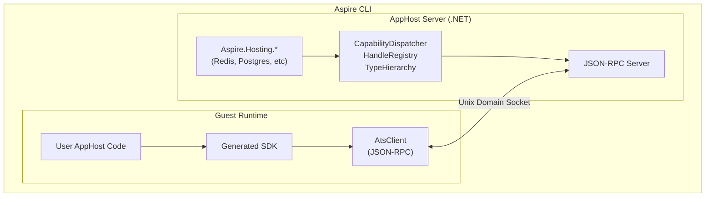
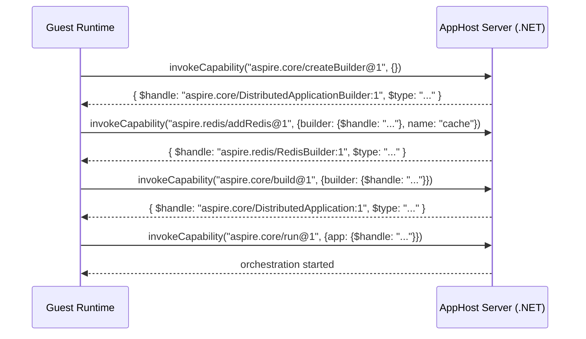
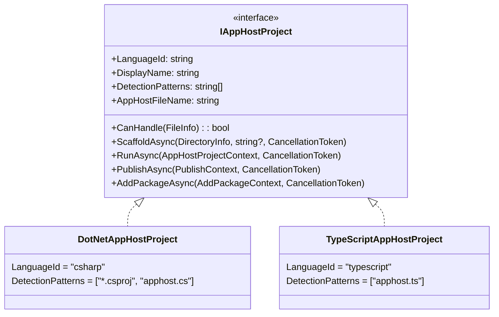

# Polyglot AppHost Support

This document describes how the Aspire CLI supports non-.NET app hosts using the **Aspire Type System (ATS)**.

## Table of Contents

- [Overview](#overview)
- [Architecture](#architecture)
- [Aspire Type System (ATS)](#aspire-type-system-ats)
- [JSON-RPC Protocol](#json-rpc-protocol)
- [Type System and Marshalling](#type-system-and-marshalling)
- [Code Generation](#code-generation)
- [TypeScript Implementation](#typescript-implementation)
- [CLI Integration](#cli-integration)
- [Process Lifecycle](#process-lifecycle)
- [Configuration](#configuration)
- [Adding New Guest Languages](#adding-new-guest-languages)
- [Code Generator Architecture](#code-generator-architecture)
- [Development Mode](#development-mode)
- [Security and Threat Model](#security-and-threat-model)
- [Challenges and Limitations](#challenges-and-limitations)

---

## Overview

The polyglot apphost feature allows developers to write Aspire app hosts in non-.NET languages. The **Aspire Type System (ATS)** defines a safe, portable subset of the AppHost APIs that can be exposed to any language. ATS provides an intentional, stable API surface for polyglot clients via JSON-RPC.

Integration authors can expose their existing extension methods to ATS by simply adding `[AspireExport]` attributes—no wrapper code or separate API surface required. An analyzer flags unsupported parameter or return types, warning when a method is incompatible with ATS. Currently, TypeScript is the supported guest language.

**Terminology:**
- **Host (AppHost server)**: The .NET process running Aspire.Hosting
- **Guest**: The non-.NET runtime executing the user's apphost code
- **Capability**: A named operation (e.g., `aspire.redis/addRedis@1`)
- **Handle**: An opaque typed reference to a .NET object
- **DTO**: A serializable data transfer object

**Design Goals:**
1. **Safe Portable Subset** - ATS defines a safe, portable subset of the AppHost APIs that can be exposed to any language
2. **Easy Integration Transition** - Adding `[AspireExport]` to existing extension methods is all that's needed to expose them via ATS
3. **Intentional API Surface** - Capabilities are the contract, not CLR signatures
4. **Polyglot-First** - .NET is an implementation detail behind a stable surface
5. **Type Safety** - Strict type boundaries prevent accidental leakage of .NET internals
6. **Evolvable** - Versioned capability IDs enable breaking changes without breaking clients
7. **Reuse Existing Integrations** - All 100+ Aspire.Hosting.* packages work with minimal annotation
8. **Consistent CLI Experience** - `aspire run`, `aspire add`, `aspire publish` work identically across languages

**What This Is NOT:**
- Not a generic .NET remoting layer
- Not exposing arbitrary .NET types/methods
- Not reflection-based invocation

---

## Architecture

The CLI scaffolds the AppHost server project that references the required hosting integration packages. Code generation scans these assemblies for ATS attributes to produce a language-specific SDK. At runtime, the AppHost server uses `Aspire.Hosting.RemoteHost` to expose a capability-based JSON-RPC server over Unix domain sockets. The guest connects and invokes capabilities (e.g., `aspire.redis/addRedis@1`) which are dispatched to capability implementations.





### Key Projects

| Project | Purpose |
|---------|---------|
| `Aspire.Hosting` | ATS attributes (`[AspireExport]`, `[AspireCallback]`) and intrinsic type definitions |
| `Aspire.Hosting.Analyzers` | Compile-time validation of `[AspireExport]` attributes |
| `Aspire.Hosting.RemoteHost` | CapabilityDispatcher, HandleRegistry, TypeHierarchy, JSON-RPC server |
| `Aspire.Hosting.CodeGeneration` | ATS manifest scanning from capability attributes |
| `Aspire.Hosting.CodeGeneration.<Language>` | Language-specific SDK generator from ATS manifest |

---

## Aspire Type System (ATS)

ATS defines three core concepts that form the contract between .NET and guest languages.

### Capabilities

Capabilities are named operations with globally unique IDs. They replace direct method invocation.

**Naming Convention:** `aspire/{operation}@{version}` or `aspire.{package}/{operation}@{version}`

| Example | Description |
|---------|-------------|
| `aspire/createBuilder@1` | Create a DistributedApplicationBuilder |
| `aspire/addContainer@1` | Add a container resource |
| `aspire/withEnvironment@1` | Set an environment variable |
| `aspire/build@1` | Build the application |
| `aspire.redis/addRedis@1` | Add a Redis resource (integration package) |

**Definition in .NET:**

Capabilities are defined using the `[AspireExport]` attribute, which can be applied directly to existing extension methods:

```csharp
// Direct annotation on existing extension method (preferred)
[AspireExport("aspire/addContainer@1", Description = "Adds a container resource")]
public static IResourceBuilder<ContainerResource> AddContainer(
    this IDistributedApplicationBuilder builder,
    [ResourceName] string name,
    string image)
{
    // Existing implementation unchanged
}
```

Or for integration packages:

```csharp
[AspireExport("aspire.redis/addRedis@1", Description = "Adds a Redis resource")]
public static IResourceBuilder<RedisResource> AddRedis(
    this IDistributedApplicationBuilder builder,
    [ResourceName] string name,
    int? port = null)
{
    // Existing implementation
}
```

**ExtendsTypeId (for code generation):**

During code generation, the capability scanner tracks what type each extension method extends via the `ExtendsTypeId` property. This determines which class the method is generated on:

| ExtendsTypeId | Generated On |
|---------------|--------------|
| `aspire/Builder` | `DistributedApplicationBuilder` class |
| `aspire/Redis` | `RedisBuilder` class |
| `aspire/Container` | `ContainerBuilder` class |
| `aspire/IResourceWithEnvironment` | Interface base class |

This is derived from the first parameter of extension methods (the `this` parameter).

**AppliesTo Constraint:**

Capabilities can specify type constraints for polymorphic operations. When applied to generic extension methods, `AppliesTo` is automatically derived from the type constraint:

```csharp
// AppliesTo auto-derived from generic constraint: applies to IResourceWithEnvironment
[AspireExport("aspire/withEnvironment@1", Description = "Sets an environment variable")]
public static IResourceBuilder<T> WithEnvironment<T>(
    this IResourceBuilder<T> builder,
    string name,
    string? value) where T : IResourceWithEnvironment
{
    // Existing implementation
}
```

### Handles

Handles are opaque typed references to .NET objects. They replace direct object proxies. **Handles are derived automatically** - you don't need to define them explicitly.

**Handle ID Format:** `{typeId}:{instanceId}`

| Example | Description |
|---------|-------------|
| `aspire/Builder:1` | Builder handle |
| `aspire/Redis:42` | Redis resource builder handle |

**Automatic Handle Derivation:**

Handle types are automatically derived from .NET types:

| .NET Type | Derived Handle Type | Rule |
|-----------|---------------------|------|
| `IDistributedApplicationBuilder` | `aspire/Builder` | Intrinsic |
| `DistributedApplication` | `aspire/Application` | Intrinsic |
| `IResourceBuilder<ContainerResource>` | `aspire/Container` | From resource type `T` |
| `IResourceBuilder<RedisResource>` | `aspire/Redis` | From resource type `T` |
| Any `IResource` implementation | `aspire/{TypeName}` | Strip `Resource` suffix |

**Type Hierarchy:**

Handles form a type hierarchy based on the CLR type hierarchy, enabling polymorphic capabilities:

```
aspire/IResource (base interface)
├── aspire/IResourceWithEnvironment
├── aspire/IResourceWithEndpoints
├── aspire/IResourceWithArgs
├── aspire/Container
├── aspire/Executable
└── aspire/Redis
```

The hierarchy is derived from CLR inheritance - if `RedisResource : ContainerResource`, then `aspire/Redis` extends `aspire/Container`.

**JSON Representation:**

```json
{
    "$handle": "aspire/Redis:42",
    "$type": "aspire/Redis"
}
```

### DTOs (Data Transfer Objects)

DTOs are serializable types for passing structured data. They must be explicitly marked.

**Definition in .NET:**

```csharp
[AspireDto]
public sealed class AddRedisOptions
{
    public required string Name { get; init; }
    public int? Port { get; init; }
}
```

**JSON Representation:**

```json
{
    "name": "cache",
    "port": 6379
}
```

**Strict Enforcement:**

Only types marked with `[AspireDto]` can cross the serialization boundary:

| Direction | `[AspireDto]` Type | Non-`[AspireDto]` Type |
|-----------|-------------------|----------------------|
| Input (JSON → .NET) | Deserialized | **Error thrown** |
| Output (.NET → JSON) | Serialized | Marshaled as Handle |

This prevents accidental leakage of internal .NET types.

### Callbacks

Callbacks allow the guest to provide functions that the host can invoke during capability execution.

**Definition in .NET:**

```csharp
[AspireExport("aspire/withEnvironmentCallback@1", AppliesTo = "aspire/IResourceWithEnvironment", Description = "Adds an environment callback")]
public static IResourceBuilder<IResourceWithEnvironment> WithEnvironmentCallback(
    IResourceBuilder<IResourceWithEnvironment> resource,
    [AspireCallback("aspire/EnvironmentCallback")] Func<EnvironmentCallbackContext, Task> callback)
{
    return resource.WithEnvironment(callback);
}
```

**JSON Representation:**

Callbacks are passed as string IDs that the guest registers:

```json
{
    "resource": {"$handle": "aspire.redis/RedisBuilder:1"},
    "callback": "callback_1_1234567890"
}
```

When the host needs to invoke the callback, it sends an `invokeCallback` request to the guest.

### Context Types

Context types are objects passed to callbacks that provide access to runtime state. Properties on context types are automatically exposed as capabilities.

**Definition in .NET:**

```csharp
[AspireContextType("aspire/EnvironmentContext")]
public class EnvironmentCallbackContext
{
    // Auto-exposed as "aspire/EnvironmentContext.environmentVariables@1"
    public Dictionary<string, object> EnvironmentVariables { get; }

    // Auto-exposed as "aspire/EnvironmentContext.executionContext@1"
    public DistributedApplicationExecutionContext ExecutionContext { get; }

    // Skipped - ILogger is not an ATS-compatible type
    public ILogger Logger { get; set; }
}
```

**Auto-Generated Capabilities:**

Properties that return ATS-compatible types are automatically exposed:

| Property | Generated Capability ID |
|----------|------------------------|
| `EnvironmentVariables` | `aspire/EnvironmentContext.environmentVariables@1` |
| `ExecutionContext` | `aspire/EnvironmentContext.executionContext@1` |

**ATS-Compatible Property Types:**
- Primitives (string, int, bool, etc.)
- Intrinsic Aspire types (IDistributedApplicationBuilder, EndpointReference, etc.)
- Types marked with `[AspireExport(AtsTypeId)]`, `[AspireDto]`, or `[AspireContextType]`
- `IResourceBuilder<T>` for any resource type
- Collections of the above

Properties returning non-ATS types (ILogger, etc.) are automatically skipped.

### CancellationTokens

CancellationTokens allow cancellation of long-running operations.

**JSON Representation:**

```json
{ "$cancellationToken": "ct_1" }
```

**Operations:**
- `createCancellationToken` - Guest creates a token to pass to capabilities
- `cancel` - Guest or host cancels a token

### Type Summary

| ATS Type | Attribute | Purpose | JSON Shape |
|----------|-----------|---------|------------|
| **Capability** | `[AspireExport]` | Named operation | N/A (invoked by ID) |
| **Handle** | *(auto-derived)* | Opaque object reference | `{ $handle, $type }` |
| **DTO** | `[AspireDto]` | Serializable data | Plain JSON object |
| **Callback** | `[AspireCallback]` | Guest function reference | `"callback_id"` |
| **Context Type** | `[AspireContextType]` | Callback context with auto-exposed properties | Handle |
| **CancellationToken** | N/A | Cancellation signal | `{ $cancellationToken }` |

> **Note:** Handles are automatically derived from intrinsic types and `IResource` implementations. No explicit attribute is needed.

### AspireExport Analyzer

The `Aspire.Hosting.Analyzers` package includes compile-time validation for `[AspireExport]` attributes:

| Diagnostic | Description |
|------------|-------------|
| `ASPIRE007` | Method marked with `[AspireExport]` must be static |
| `ASPIRE008` | Export ID must follow format `aspire/{operation}@{version}` or `aspire.{package}/{operation}@{version}` |
| `ASPIRE009` | Return type must be ATS-compatible (void, Task, Task<T>, or supported Aspire types) |
| `ASPIRE010` | Parameter types must be ATS-compatible (primitives, enums, or supported Aspire types) |

**ATS-Compatible Types:**

| Category | Types |
|----------|-------|
| Primitives | `string`, `int`, `long`, `double`, `bool`, `DateTime`, `TimeSpan`, `Guid`, `Uri` |
| Enums | Any enum type |
| Nullable | `T?` where T is a primitive or enum |
| Arrays | Arrays of compatible types |
| Aspire Types | `IDistributedApplicationBuilder`, `DistributedApplication`, `IResourceBuilder<T>`, `IResource`, etc. |
| Callbacks | Delegate types (`Func<>`, `Action<>`) |

### Type Mapping

ATS uses explicit type mappings to associate CLR types with ATS type IDs. This eliminates inference and string parsing, providing a single source of truth for type identity.

**Declaring Type Mappings:**

Type mappings are declared using `[AspireExport]` with the `AtsTypeId` property:

```csharp
// On a type you own
[AspireExport(AtsTypeId = "aspire/Redis")]
public class RedisResource : ContainerResource { }

// At assembly level for types you don't own
[assembly: AspireExport(typeof(IDistributedApplicationBuilder), AtsTypeId = "aspire/Builder")]
[assembly: AspireExport(typeof(DistributedApplication), AtsTypeId = "aspire/Application")]
```

**Core Type Mappings (in `Aspire.Hosting`):**

| .NET Type | ATS Type ID |
|-----------|-------------|
| `IDistributedApplicationBuilder` | `aspire/Builder` |
| `DistributedApplication` | `aspire/Application` |
| `DistributedApplicationExecutionContext` | `aspire/ExecutionContext` |
| `EndpointReference` | `aspire/EndpointReference` |
| `EnvironmentCallbackContext` | `aspire/EnvironmentContext` |

**Resource Interface Types (for `AppliesTo` constraints):**

| .NET Type | ATS Type ID |
|-----------|-------------|
| `IResource` | `aspire/IResource` |
| `IResourceWithEnvironment` | `aspire/IResourceWithEnvironment` |
| `IResourceWithEndpoints` | `aspire/IResourceWithEndpoints` |
| `IResourceWithArgs` | `aspire/IResourceWithArgs` |
| `IResourceWithConnectionString` | `aspire/IResourceWithConnectionString` |
| `IResourceWithWaitSupport` | `aspire/IResourceWithWaitSupport` |
| `ContainerResource` | `aspire/Container` |

**Service Types:**

| .NET Type | ATS Type ID |
|-----------|-------------|
| `IServiceProvider` | `aspire/ServiceProvider` |
| `ResourceNotificationService` | `aspire/ResourceNotificationService` |
| `ResourceLoggerService` | `aspire/ResourceLoggerService` |

**`AtsTypeMapping` Class:**

The `AtsTypeMapping` class provides centralized type lookup:

```csharp
// Build mapping from assemblies
var mapping = AtsTypeMapping.FromAssemblies(assemblies);

// Lookup type ID
string? typeId = mapping.GetTypeId(typeof(RedisResource));  // "aspire/Redis"

// Get type ID or infer one for unmapped types
string typeId = mapping.GetTypeIdOrInfer(resourceType);  // Fallback to inference
```

**Inference Fallback:**

For types without explicit `[AspireExport(AtsTypeId = "...")]` mappings, the system infers the type ID:

- Resource types: Strip `Resource` suffix → `RedisResource` → `aspire/Redis`
- Interface types: Keep the name → `IResourceWithEnvironment` → `aspire/IResourceWithEnvironment`

**`IResourceBuilder<T>` - First-Class Support:**

`IResourceBuilder<T>` is handled specially - the ATS type ID is derived from the resource type `T`:

| .NET Type | ATS Type ID |
|-----------|-------------|
| `IResourceBuilder<RedisResource>` | `aspire/Redis` |
| `IResourceBuilder<ContainerResource>` | `aspire/Container` |
| `IResourceBuilder<ParameterResource>` | `aspire/Parameter` |
| `IResourceBuilder<PostgresServerResource>` | `aspire/PostgresServer` |

### Extension Method Compatibility

Most Aspire extension methods map directly to ATS capabilities. This section describes which patterns work and which need adaptation.

**Works Directly:**

| Pattern | Example | Notes |
|---------|---------|-------|
| Primitives | `(string name, int? port)` | JSON primitives |
| `TimeSpan` | `(TimeSpan timeout)` | Marshalled as milliseconds |
| `IResourceBuilder<T>` | `(IResourceBuilder<ParameterResource> password)` | Marshalled as handle |
| Simple callbacks | `Func<EnvironmentCallbackContext, Task>` | Via `[AspireCallback]` |

**Example - Redis with password parameter:**

```csharp
// This works - IResourceBuilder<ParameterResource> is just a handle
[AspireExport("aspire.redis/addRedis@1")]
public static IResourceBuilder<RedisResource> AddRedis(
    IDistributedApplicationBuilder builder,
    string name,
    int? port = null,
    IResourceBuilder<ParameterResource>? password = null)
{
    return builder.AddRedis(name, port, password);
}
```

```typescript
// TypeScript usage
const password = await client.invoke("aspire/addParameter@1", {
    builder, name: "redis-password", secret: true
});

const redis = await client.invoke("aspire.redis/addRedis@1", {
    builder, name: "cache", password  // Pass the handle
});
```

**Needs Adaptation:**

| Pattern | Issue | Solution |
|---------|-------|----------|
| `X509Certificate2` | Binary data, .NET-specific | Accept base64-encoded certificate data |

Note: `TimeSpan` parameters work directly - they are automatically marshalled as milliseconds (see [TimeSpan Marshalling](#timespan-marshalling)).

**`Action<IResourceBuilder<T>>` Callbacks:**

Callbacks that receive a different resource type work because the resource builder is just a handle:

```csharp
// .NET pattern - callback receives a different resource type
redis.WithRedisCommander(commander => {
    commander.WithHostPort(8081);
});
```

**ATS export:**

```csharp
[AspireExport("aspire.redis/withRedisCommander@1", AppliesTo = "aspire/Redis")]
public static IResourceBuilder<RedisResource> WithRedisCommander(
    IResourceBuilder<RedisResource> redis,
    [AspireCallback] Action<IResourceBuilder<RedisCommanderResource>>? configureContainer = null,
    string? containerName = null)
{
    return redis.WithRedisCommander(configureContainer, containerName);
}
```

**TypeScript usage:**

```typescript
await client.invoke("aspire.redis/withRedisCommander@1", {
    redis,
    configureContainer: async (commander) => {
        // commander is a handle to IResourceBuilder<RedisCommanderResource>
        await client.invoke("aspire/withHostPort@1", { resource: commander, port: 8081 });
    }
});
```

**How it works:**

1. Guest registers callback `callback_123`
2. Guest invokes `withRedisCommander@1` with `{ redis, configureContainer: "callback_123" }`
3. Host creates the `RedisCommanderResource` builder
4. Host invokes: `invokeCallback("callback_123", { $handle: "aspire/RedisCommander:1" })`
5. Guest callback receives the handle and invokes capabilities on it
6. Callback returns, host continues

The `IResourceBuilder<RedisCommanderResource>` is marshalled as an `aspire/RedisCommander` handle, which the guest can use with any applicable capability.

### Direct Extension Method Annotation

Instead of creating wrapper methods, you can annotate existing extension methods directly with `[AspireExport]`. The dispatcher automatically handles:

1. **Extension method detection** - Recognizes `this` parameter
2. **AppliesTo derivation** - Inferred from first parameter type
3. **Generic constraint handling** - Uses constraints like `where T : JavaScriptAppResource`

**Before (wrapper method):**

```csharp
// Separate wrapper in Ats/RedisExports.cs
[AspireExport("aspire.redis/addRedis@1")]
public static IResourceBuilder<RedisResource> AddRedis(
    IDistributedApplicationBuilder builder,
    string name,
    int? port = null)
{
    return builder.AddRedis(name, port);  // Calls the real method
}
```

**After (direct annotation):**

```csharp
// Just add the attribute to the existing method!
[AspireExport("aspire.redis/addRedis@1")]
public static IResourceBuilder<RedisResource> AddRedis(
    this IDistributedApplicationBuilder builder,
    [ResourceName] string name,
    int? port = null,
    IResourceBuilder<ParameterResource>? password = null)
{
    // Existing implementation unchanged
}
```

**AppliesTo Auto-Derivation:**

The `AppliesTo` constraint is automatically derived from the method signature:

| First Parameter | Derived AppliesTo |
|----------------|-------------------|
| `this IDistributedApplicationBuilder` | *(none - entry point)* |
| `this IResourceBuilder<RedisResource>` | `aspire/Redis` |
| `this IResourceBuilder<ContainerResource>` | `aspire/Container` |
| `this IResourceBuilder<T> where T : JavaScriptAppResource` | `aspire/JavaScriptApp` |
| `this IResourceBuilder<T> where T : IResourceWithEnvironment` | `aspire/IResourceWithEnvironment` |

**Generic Constraint Example:**

```csharp
// AppliesTo automatically derived as "aspire/JavaScriptApp" from constraint
[AspireExport("aspire.node/withNpm@1")]
public static IResourceBuilder<TResource> WithNpm<TResource>(
    this IResourceBuilder<TResource> resource,
    bool install = true,
    string? installCommand = null,
    string[]? installArgs = null)
    where TResource : JavaScriptAppResource
{
    // Existing implementation
}
```

**Callback Parameters:**

For callbacks, add `[AspireCallback]` to the parameter:

```csharp
[AspireExport("aspire.redis/withRedisCommander@1")]
public static IResourceBuilder<RedisResource> WithRedisCommander(
    this IResourceBuilder<RedisResource> builder,
    [AspireCallback] Action<IResourceBuilder<RedisCommanderResource>>? configureContainer = null,
    string? containerName = null)
{
    // Existing implementation
}
```

**What Works Automatically (90%+):**

| Pattern | Example | Auto-handled |
|---------|---------|--------------|
| Extension on builder | `this IDistributedApplicationBuilder` | ✅ |
| Extension on resource | `this IResourceBuilder<T>` | ✅ |
| Generic with constraint | `where T : JavaScriptAppResource` | ✅ |
| Primitives | `string`, `int?`, `bool` | ✅ |
| `TimeSpan` | `TimeSpan? interval` | ✅ (milliseconds) |
| `string[]` | `string[]? args` | ✅ |
| `IResourceBuilder<T>` params | `IResourceBuilder<ParameterResource>? password` | ✅ |
| `Action<IResourceBuilder<T>>` | With `[AspireCallback]` | ✅ |

**What Needs Wrapper Methods (10%):**

| Pattern | Example | Solution |
|---------|---------|----------|
| `X509Certificate2` | `WithHttpsCertificate(cert)` | Wrapper accepting base64 |
| Complex internal types | `ManifestPublishingContext` | Create DTO or exclude |

### Service Capabilities

ATS exposes key Aspire services through capabilities, allowing guest code to access logging, notifications, and resource state.

**Getting Services:**

| Capability | Description |
|------------|-------------|
| `aspire/getServiceProvider@1` | Gets the `IServiceProvider` from the builder |
| `aspire/getResourceNotificationService@1` | Gets the `ResourceNotificationService` |
| `aspire/getResourceLoggerService@1` | Gets the `ResourceLoggerService` |

**Logging:**

| Capability | Description |
|------------|-------------|
| `aspire/getLogger@1` | Gets an `ILogger` for a resource |
| `aspire/getLoggerByName@1` | Gets an `ILogger` by resource name |
| `aspire/log@1` | Logs a message with specified level |
| `aspire/logInformation@1` | Logs an information message |
| `aspire/logWarning@1` | Logs a warning message |
| `aspire/logError@1` | Logs an error message |
| `aspire/logDebug@1` | Logs a debug message |
| `aspire/completeLog@1` | Completes the log stream for a resource |

**Resource Notifications:**

| Capability | Description |
|------------|-------------|
| `aspire/waitForResourceState@1` | Waits for a resource to reach a specified state |
| `aspire/waitForResourceStates@1` | Waits for a resource to reach one of specified states |
| `aspire/waitForResourceHealthy@1` | Waits for a resource to become healthy |
| `aspire/waitForDependencies@1` | Waits for all dependencies of a resource |
| `aspire/tryGetResourceState@1` | Gets current state of a resource (if available) |
| `aspire/publishResourceUpdate@1` | Publishes a state update for a resource |

**TypeScript Usage Example:**

```typescript
// Get services from the builder
const serviceProvider = await client.invoke("aspire/getServiceProvider@1", { builder });
const notificationService = await client.invoke("aspire/getResourceNotificationService@1", { serviceProvider });
const loggerService = await client.invoke("aspire/getResourceLoggerService@1", { serviceProvider });

// Get a logger for a resource and log messages
const logger = await client.invoke("aspire/getLogger@1", { loggerService, resource: redis });
await client.invoke("aspire/logInformation@1", { logger, message: "Redis is starting..." });

// Wait for a resource to be healthy
const event = await client.invoke("aspire/waitForResourceHealthy@1", {
    notificationService,
    resourceName: "redis"
});
console.log(`Redis is healthy! State: ${event.state}`);

// Check current state without waiting
const currentState = await client.invoke("aspire/tryGetResourceState@1", {
    notificationService,
    resourceName: "redis"
});
if (currentState) {
    console.log(`Current state: ${currentState.state}`);
}
```

**Mutable Collections:**

Lists and dictionaries are marshalled as handles with standard operations:

| Capability | Description |
|------------|-------------|
| `aspire/List.add@1` | Add item to list |
| `aspire/List.get@1` | Get item by index |
| `aspire/List.count@1` | Get list count |
| `aspire/Dictionary.set@1` | Set dictionary value |
| `aspire/Dictionary.get@1` | Get dictionary value |
| `aspire/Dictionary.keys@1` | Get dictionary keys |

This enables mutation of collections like `EnvironmentCallbackContext.EnvironmentVariables`:

```typescript
// In an environment callback
const envVars = await client.invoke("aspire/EnvironmentContext.environmentVariables@1", { context });
await client.invoke("aspire/Dictionary.set@1", { dictionary: envVars, key: "MY_VAR", value: "hello" });
```

---

## JSON-RPC Protocol

Communication between the guest and host uses JSON-RPC 2.0 over Unix domain sockets (or named pipes on Windows).

### Protocol Summary

| Method | Direction | Purpose |
|--------|-----------|---------|
| `authenticate` | Guest → Host | Authenticate with server token |
| `ping` | Guest → Host | Health check |
| `invokeCapability` | Guest → Host | Invoke an ATS capability |
| `getCapabilities` | Guest → Host | List available capabilities |
| `createCancellationToken` | Guest → Host | Create a new CancellationToken |
| `cancel` | Guest → Host | Cancel a CancellationToken |
| `invokeCallback` | Host → Guest | Invoke registered callback |

### Transport Layer

The protocol uses **header-delimited messages** matching the `vscode-jsonrpc` format:

```text
Content-Length: 123\r\n
\r\n
{"jsonrpc":"2.0","id":1,"method":"ping","params":[]}
```

### RPC Methods (Guest → Host)

#### `authenticate`

Authenticate with the server using a secret token. Must be called before any other method (except `ping`).

| | |
|---|---|
| **Parameters** | `token: string` - Authentication token |
| **Returns** | `boolean` - `true` if successful |

```json
// Request
{"jsonrpc":"2.0","id":1,"method":"authenticate","params":["<secret-token>"]}

// Response
{"jsonrpc":"2.0","id":1,"result":true}
```

#### `ping`

Health check to verify connection. Does not require authentication.

| | |
|---|---|
| **Parameters** | None |
| **Returns** | `string` - Always `"pong"` |

```json
// Request
{"jsonrpc":"2.0","id":1,"method":"ping","params":[]}

// Response
{"jsonrpc":"2.0","id":1,"result":"pong"}
```

#### `invokeCapability`

Invoke an ATS capability by ID. This is the primary method for all operations.

| | |
|---|---|
| **Parameters** | `capabilityId: string` - Capability ID (e.g., `"aspire.redis/addRedis@1"`)<br/>`args: object?` - Arguments as JSON object |
| **Returns** | Result (handle, DTO, primitive, or null) |

```json
// Request - Create builder
{"jsonrpc":"2.0","id":2,"method":"invokeCapability","params":[
    "aspire.core/createBuilder@1",
    {}
]}

// Response
{"jsonrpc":"2.0","id":2,"result":{
    "$handle": "aspire.core/DistributedApplicationBuilder:1",
    "$type": "aspire.core/DistributedApplicationBuilder"
}}
```

```json
// Request - Add Redis with options DTO
{"jsonrpc":"2.0","id":3,"method":"invokeCapability","params":[
    "aspire.redis/addRedis@1",
    {
        "builder": {"$handle": "aspire.core/DistributedApplicationBuilder:1"},
        "options": {"name": "cache", "port": 6379}
    }
]}

// Response
{"jsonrpc":"2.0","id":3,"result":{
    "$handle": "aspire.redis/RedisBuilder:1",
    "$type": "aspire.redis/RedisBuilder"
}}
```

```json
// Request - Set environment variable (polymorphic - works on any resource builder)
{"jsonrpc":"2.0","id":4,"method":"invokeCapability","params":[
    "aspire.core/withEnvironment@1",
    {
        "resource": {"$handle": "aspire.redis/RedisBuilder:1"},
        "name": "MY_VAR",
        "value": "hello"
    }
]}

// Response - Returns same handle type as input
{"jsonrpc":"2.0","id":4,"result":{
    "$handle": "aspire.redis/RedisBuilder:1",
    "$type": "aspire.redis/RedisBuilder"
}}
```

#### `getCapabilities`

List all registered capability IDs.

| | |
|---|---|
| **Parameters** | None |
| **Returns** | `string[]` - Array of capability IDs |

```json
// Request
{"jsonrpc":"2.0","id":5,"method":"getCapabilities","params":[]}

// Response
{"jsonrpc":"2.0","id":5,"result":[
    "aspire.core/createBuilder@1",
    "aspire.core/build@1",
    "aspire.core/run@1",
    "aspire.core/withEnvironment@1",
    "aspire.redis/addRedis@1",
    "aspire.redis/withDataVolume@1"
]}
```

### RPC Methods (Host → Guest)

#### `invokeCallback`

Invoke a callback function registered by the guest.

| | |
|---|---|
| **Parameters** | `callbackId: string` - Callback ID (e.g., `"callback_1_1234567890"`)<br/>`args: object?` - Arguments to pass to callback |
| **Returns** | `object?` - Callback return value |
| **Timeout** | 60 seconds |

```json
// Request (Host → Guest)
{"jsonrpc":"2.0","id":100,"method":"invokeCallback","params":[
    "callback_1_1234567890",
    {
        "context": {"$handle": "aspire.core/EnvironmentCallbackContext:5"}
    }
]}

// Response (Guest → Host)
{"jsonrpc":"2.0","id":100,"result":null}
```

### Callback Mechanism

Callbacks allow the host to invoke guest functions during capability execution (e.g., `withEnvironmentCallback`):

1. Guest registers a callback function with a unique ID (e.g., `callback_1_1234567890`)
2. Guest passes the callback ID as an argument to a capability invocation
3. Host executes the capability, which invokes the callback
4. Host sends `invokeCallback` request to guest with the callback ID and args
5. Guest executes the callback and returns the result

### CancellationToken Support

CancellationTokens are supported in two directions:

1. **Host → Guest (callbacks)**: When the host invokes a callback with a `CancellationToken` parameter
2. **Guest → Host (capability calls)**: When the guest needs to pass a cancellable token to a capability

#### Callbacks with CancellationToken

When a .NET capability passes a `CancellationToken` to a callback, the token is marshalled as a proxy:

```json
// Callback invocation with CancellationToken
// Host → Guest
{
  "method": "invokeCallback",
  "params": ["callback_1", {
    "context": {"$handle": "aspire.core/HealthCheckContext:5"},
    "cancellationToken": {"$cancellationToken": "ct_1"}
  }]
}

// Guest cancels the token
// Guest → Host
{"method": "cancel", "params": ["ct_1"]}
```

**Linked Token Behavior:**
- If the .NET token is cancelled (e.g., host shutdown), the linked token is also cancelled
- If the guest calls `cancel`, the linked token is cancelled

#### Guest-Created CancellationTokens

The guest can create its own CancellationTokens:

```json
// 1. Create a cancellation token
{"jsonrpc":"2.0","id":1,"method":"createCancellationToken","params":[]}
// Response: {"$cancellationToken":"ct_1"}

// 2. Pass the token to a capability
{"method": "invokeCapability", "params": ["aspire.core/run@1", {
    "app": {"$handle": "..."},
    "cancellationToken": {"$cancellationToken": "ct_1"}
}]}

// 3. Later, cancel the operation
{"method": "cancel", "params": ["ct_1"]}
```

### Error Responses

Errors use a structured format with ATS error codes:

```json
{
    "jsonrpc": "2.0",
    "id": 1,
    "result": {
        "$error": {
            "code": "CAPABILITY_NOT_FOUND",
            "message": "Unknown capability: aspire.foo/bar@1",
            "capability": "aspire.foo/bar@1"
        }
    }
}
```

| Code | Description |
|------|-------------|
| `CAPABILITY_NOT_FOUND` | Unknown capability ID |
| `HANDLE_NOT_FOUND` | Handle ID doesn't exist or was disposed |
| `TYPE_MISMATCH` | Handle type doesn't satisfy capability's `AppliesTo` constraint |
| `INVALID_ARGUMENT` | Missing required argument, wrong type, or type lacks `[AspireDto]` |
| `CALLBACK_ERROR` | Error occurred during callback invocation |
| `INTERNAL_ERROR` | Unexpected error in capability execution |

### JSON Value Shapes

**Input Values (Guest → Host)**

| Type | JSON Shape | Example |
|------|------------|---------|
| Primitive | raw value | `"hello"`, `42`, `true` |
| Handle ref | `{ "$handle": "..." }` | `{ "$handle": "aspire.redis/RedisBuilder:1" }` |
| DTO | JSON object (type must have `[AspireDto]`) | `{ "name": "cache", "port": 6379 }` |
| Callback | string | `"callback_001"` |
| Array | `[...]` | `[1, 2, 3]` or `[{"$handle": "..."}]` |

**Output Values (Host → Guest)**

| Type | JSON Shape | Example |
|------|------------|---------|
| Null | `null` | `null` |
| Primitive | raw value | `"hello"`, `42`, `true` |
| Handle | `{ "$handle": "...", "$type": "..." }` | `{ "$handle": "aspire.redis/RedisBuilder:1", "$type": "aspire.redis/RedisBuilder" }` |
| DTO | JSON object (type must have `[AspireDto]`) | `{ "name": "cache", "port": 6379 }` |
| Error | `{ "$error": {...} }` | See error format above |

---

## Type System and Marshalling

ATS bridges two type systems with strict boundaries.

### Design Principles

1. **Primitives pass directly**: Strings, numbers, booleans serialize as JSON primitives
2. **Handles are opaque**: Complex objects become typed handles, not serialized
3. **DTOs are explicit**: Only `[AspireDto]` types serialize as JSON objects
4. **Strict validation**: Type mismatches throw errors, never silently convert

### Primitive Types

The following types serialize directly to JSON values:

| Category | Types |
|----------|-------|
| Strings | `string`, `char` |
| Numbers | `int`, `long`, `float`, `double`, `decimal` |
| Boolean | `bool` |
| Date/Time | `DateTime`, `DateTimeOffset`, `TimeSpan`, `DateOnly`, `TimeOnly` |
| Identifiers | `Guid`, `Uri` |
| Enums | Any `enum` type |
| Nullable | `T?` where T is any of the above |

### TimeSpan Marshalling

`TimeSpan` is serialized as **total milliseconds** (a number) for easy JavaScript interop:

**Marshalling (.NET → JSON):**

```csharp
TimeSpan.FromMinutes(5)  →  300000
TimeSpan.FromSeconds(30) →  30000
TimeSpan.FromHours(1)    →  3600000
```

**Unmarshalling (JSON → .NET):**

The marshaller accepts two formats:

| Format | Example | Notes |
|--------|---------|-------|
| Number (milliseconds) | `5000` | Primary format, recommended |
| String (TimeSpan.Parse) | `"00:05:00"` | Standard .NET format, also supported |

**TypeScript usage:**

```typescript
// Using milliseconds (recommended)
await client.invoke("aspire/withTimeout@1", { resource, timeout: 5000 });

// Helper functions for readability
const seconds = (n: number) => n * 1000;
const minutes = (n: number) => n * 60 * 1000;
const hours = (n: number) => n * 60 * 60 * 1000;

await client.invoke("aspire/withTimeout@1", { resource, timeout: minutes(5) });

// String format also works
await client.invoke("aspire/withTimeout@1", { resource, timeout: "00:05:00" });
```

### Handle Resolution

When a JSON object contains `$handle`, it's resolved from the HandleRegistry:

```json
// Input
{ "$handle": "aspire.redis/RedisBuilder:1" }

// Resolved to the actual .NET object registered with that ID
```

### DTO Serialization

DTOs require the `[AspireDto]` attribute. Without it:

| Direction | Behavior |
|-----------|----------|
| Input (JSON → .NET) | **Error**: `"Type 'X' must have [AspireDto] attribute to be deserialized from JSON"` |
| Output (.NET → JSON) | Marshaled as a handle instead |

This prevents accidental serialization of internal types like `IConfiguration` or `ILogger`.

### Array Handling

Arrays support primitives, handles, and DTOs:

```json
// Array of primitives
[1, 2, 3]

// Array of handles
[
    {"$handle": "aspire.redis/RedisBuilder:1"},
    {"$handle": "aspire.redis/RedisBuilder:2"}
]

// Array of DTOs (element type must have [AspireDto])
[
    {"name": "cache1", "port": 6379},
    {"name": "cache2", "port": 6380}
]
```

### Type Hierarchy Validation

The `AppliesTo` constraint is validated against the handle's type hierarchy:

```csharp
// Capability requires IResourceWithEnvironment - derived from the generic constraint
[AspireExport("aspire/withEnvironment@1", Description = "Sets an environment variable")]
public static IResourceBuilder<T> WithEnvironment<T>(...) where T : IResourceWithEnvironment
```

```json
// Valid - Redis extends IResourceWithEnvironment
{"resource": {"$handle": "aspire/Redis:1"}}

// Invalid - some type that doesn't implement IResourceWithEnvironment
{"resource": {"$handle": "aspire/SomeOtherType:1"}}
// Error: TYPE_MISMATCH
```

---

## Code Generation

The CLI generates language-specific SDK code from ATS capability manifests.

### Generation Trigger

Code generation runs automatically when:

1. **First Run**: SDK folder doesn't exist
2. **Package Changes**: Hash of package references has changed
3. **After `aspire add`**: When adding new integrations
4. **Development Mode**: When `ASPIRE_REPO_ROOT` is set

### What Gets Generated

The generator scans assemblies for `[AspireExport]` attributes and produces:

1. **Handle type aliases** - TypeScript types for each handle (e.g., `BuilderHandle`, `RedisBuilderHandle`)
2. **Entry point function** - `createBuilder()` function that creates a `DistributedApplicationBuilder`
3. **DistributedApplicationBuilder class** - Methods for capabilities that extend `IDistributedApplicationBuilder`
4. **DistributedApplication class** - The built application with `run()` method
5. **Resource builder classes** - Per-resource builders (e.g., `RedisBuilder`, `ContainerBuilder`)
6. **Thenable wrappers** - Promise wrappers for fluent async chaining (e.g., `RedisBuilderPromise`)
7. **DTO interfaces** - TypeScript interfaces for each DTO

**Capability Scanning Process:**

The `AtsCapabilityScanner` processes each `[AspireExport]` attribute and extracts:

| Property | Source | Example |
|----------|--------|---------|
| `CapabilityId` | `[AspireExport("...")]` | `aspire.redis/addRedis@1` |
| `MethodName` | Derived from capability ID or `MethodName` property | `addRedis` |
| `Package` | Prefix before `/` in capability ID | `aspire.redis` |
| `AppliesTo` | `AppliesTo` property or derived from generic constraint | `aspire/Redis` |
| `ExtendsTypeId` | First parameter type (for extension methods) | `aspire/Builder` |
| `Parameters` | Method parameters (excluding `this` for extension methods) | `[{ name: "name", type: "string" }]` |
| `ReturnTypeId` | Method return type mapped to ATS type ID | `aspire/Redis` |

The `ExtendsTypeId` is key for the builder-centric API - it determines which class each method is generated on.

---

## ATS to TypeScript Type Mapping

This section formally defines how ATS types are mapped to TypeScript types during code generation. This mapping is implemented in `AtsTypeScriptCodeGenerator`.

### Primitive Types

| ATS Type | TypeScript Type | Notes |
|----------|-----------------|-------|
| `string` | `string` | Direct mapping |
| `number` | `number` | Covers int, long, float, double, etc. |
| `boolean` | `boolean` | Direct mapping |
| `any` | `unknown` | Used for unmapped types |

### Handle Type Aliases

Handle types are mapped to TypeScript type aliases that wrap the generic `Handle<T>` type:

| ATS Type ID | TypeScript Type Alias | Underlying Type |
|-------------|----------------------|-----------------|
| `aspire/Builder` | `BuilderHandle` | `Handle<'aspire/Builder'>` |
| `aspire/Application` | `ApplicationHandle` | `Handle<'aspire/Application'>` |
| `aspire/ExecutionContext` | `ExecutionContextHandle` | `Handle<'aspire/ExecutionContext'>` |
| `aspire/EnvironmentContext` | `EnvironmentContextHandle` | `Handle<'aspire/EnvironmentContext'>` |
| `aspire/EndpointReference` | `EndpointReferenceBuilderHandle` | `Handle<'aspire/EndpointReference'>` |
| `aspire/Redis` | `RedisBuilderHandle` | `Handle<'aspire/Redis'>` |
| `aspire/Container` | `ContainerBuilderHandle` | `Handle<'aspire/Container'>` |
| `aspire/IResource` | `IResourceHandle` | `Handle<'aspire/IResource'>` |
| `aspire/IResourceWithEnvironment` | `IResourceWithEnvironmentHandle` | `Handle<'aspire/IResourceWithEnvironment'>` |

**Naming Convention:**

| ATS Type Pattern | TypeScript Handle Name | Example |
|------------------|------------------------|---------|
| Core types (`Builder`, `Application`, `ExecutionContext`) | `{TypeName}Handle` | `aspire/Builder` → `BuilderHandle` |
| Interface types (`IResource*`) | `{InterfaceName}Handle` | `aspire/IResource` → `IResourceHandle` |
| Resource types (concrete resources) | `{ResourceName}BuilderHandle` | `aspire/Redis` → `RedisBuilderHandle` |

### Builder Class Generation

Builder classes are generated from ATS type IDs based on the `AppliesTo` constraint:

| ATS Type ID | Builder Class | Thenable Wrapper | Notes |
|-------------|---------------|------------------|-------|
| `aspire/IResource` | `ResourceBuilderBase` | *(abstract)* | Interface types become abstract base classes |
| `aspire/IResourceWithEnvironment` | `ResourceWithEnvironmentBuilderBase` | *(abstract)* | Extends `ResourceBuilderBase` |
| `aspire/Redis` | `RedisBuilder` | `RedisBuilderPromise` | Concrete resource builder |
| `aspire/Container` | `ContainerBuilder` | `ContainerBuilderPromise` | Concrete resource builder |

**Naming Convention:**

| ATS Type Pattern | Builder Class Name | Example |
|------------------|--------------------|---------|
| Interface types (`IResource*`) | `{InterfaceName}BuilderBase` (strip `I`, add `BuilderBase`) | `aspire/IResourceWithEnvironment` → `ResourceWithEnvironmentBuilderBase` |
| Concrete types | `{TypeName}Builder` | `aspire/Redis` → `RedisBuilder` |

### Method Naming

Methods are derived from capability IDs:

| Capability ID | Derived Method Name | Notes |
|---------------|---------------------|-------|
| `aspire.redis/addRedis@1` | `addRedis` | Extract after `/`, strip `@version` |
| `aspire/withEnvironment@1` | `withEnvironment` | Same rule |
| `aspire/createBuilder@1` | `createBuilder` | Same rule |

**Override:** Use `[AspireExport(MethodName = "customName")]` to specify a different method name.

### Special Types

| ATS Concept | TypeScript Representation |
|-------------|---------------------------|
| Callbacks | `(context: EnvironmentContextHandle) => Promise<void>` |
| Arrays (`T[]`) | `T[]` where T is the mapped type |
| Optional parameters | `paramName?: Type` |
| Nullable parameters | `paramName?: Type` (same as optional) |

### Generated Code Structure

The code generator produces a **builder-centric API** where methods are placed directly on builder classes rather than requiring explicit handle parameters:

```typescript
// Handle type aliases
export type BuilderHandle = Handle<'aspire/Builder'>;
export type ApplicationHandle = Handle<'aspire/Application'>;
export type RedisBuilderHandle = Handle<'aspire/Redis'>;

// Entry point function
export async function createBuilder(): Promise<DistributedApplicationBuilder> {
    const client = await AspireClient.connect();
    const result = await client.invokeCapability<BuilderHandle>(
        'aspire/createBuilder@1', {}
    );
    return new DistributedApplicationBuilder(result, client);
}

// Main builder class - entry point methods go here
export class DistributedApplicationBuilder {
    constructor(private _handle: BuilderHandle, private _client: AspireClient) {}
    get handle(): BuilderHandle { return this._handle; }

    // Entry point methods that extend IDistributedApplicationBuilder
    async _addRedisInternal(name: string, port?: number): Promise<RedisBuilder> {
        const result = await this._client.invokeCapability<RedisBuilderHandle>(
            'aspire.redis/addRedis@1',
            { builder: this._handle, name, port }
        );
        return new RedisBuilder(result, this._client);
    }

    addRedis(name: string, port?: number): RedisBuilderPromise {
        return new RedisBuilderPromise(this._addRedisInternal(name, port));
    }

    async _addContainerInternal(name: string, image: string): Promise<ContainerBuilder> {
        const result = await this._client.invokeCapability<ContainerBuilderHandle>(
            'aspire/addContainer@1',
            { builder: this._handle, name, image }
        );
        return new ContainerBuilder(result, this._client);
    }

    addContainer(name: string, image: string): ContainerBuilderPromise {
        return new ContainerBuilderPromise(this._addContainerInternal(name, image));
    }

    async build(): Promise<DistributedApplication> {
        const result = await this._client.invokeCapability<ApplicationHandle>(
            'aspire/build@1', { builder: this._handle }
        );
        return new DistributedApplication(result, this._client);
    }
}

// Application class with run() method
export class DistributedApplication {
    constructor(private _handle: ApplicationHandle, private _client: AspireClient) {}
    get handle(): ApplicationHandle { return this._handle; }

    async run(): Promise<void> {
        await this._client.invokeCapability<void>('aspire/run@1', { app: this._handle });
    }
}

// Concrete resource builder
export class RedisBuilder {
    constructor(private _handle: RedisBuilderHandle, private _client: AspireClient) {}
    get handle(): RedisBuilderHandle { return this._handle; }

    async _withDataVolumeInternal(name?: string): Promise<RedisBuilder> {
        const result = await this._client.invokeCapability<RedisBuilderHandle>(
            'aspire.redis/withDataVolume@1',
            { builder: this._handle, name }
        );
        return new RedisBuilder(result, this._client);
    }

    withDataVolume(name?: string): RedisBuilderPromise {
        return new RedisBuilderPromise(this._withDataVolumeInternal(name));
    }

    async _withRedisCommanderInternal(): Promise<RedisBuilder> {
        const result = await this._client.invokeCapability<RedisBuilderHandle>(
            'aspire.redis/withRedisCommander@1',
            { builder: this._handle }
        );
        return new RedisBuilder(result, this._client);
    }

    withRedisCommander(): RedisBuilderPromise {
        return new RedisBuilderPromise(this._withRedisCommanderInternal());
    }
}

// Thenable wrapper for fluent chaining
export class RedisBuilderPromise implements PromiseLike<RedisBuilder> {
    constructor(private _promise: Promise<RedisBuilder>) {}

    then<T1, T2>(...): PromiseLike<T1 | T2> {
        return this._promise.then(...);
    }

    withDataVolume(name?: string): RedisBuilderPromise {
        return new RedisBuilderPromise(
            this._promise.then(b => b._withDataVolumeInternal(name))
        );
    }

    withRedisCommander(): RedisBuilderPromise {
        return new RedisBuilderPromise(
            this._promise.then(b => b._withRedisCommanderInternal())
        );
    }
}
```

**Key Design Decisions:**

1. **Builder-centric API**: Methods like `addRedis()` are on `DistributedApplicationBuilder`, not `AspireClient`
2. **`ExtendsTypeId` property**: The capability scanner tracks what type each extension method extends (e.g., `aspire/Builder` for methods on `IDistributedApplicationBuilder`)
3. **Entry point separation**: Methods extending `IDistributedApplicationBuilder` go on `DistributedApplicationBuilder`; methods extending resource builders go on their respective classes
4. **Thenable pattern**: Enables fluent async chaining like `builder.addRedis("cache").withDataVolume()`

### Language-Agnostic Considerations

The ATS type system is designed to be language-agnostic. Other language generators would apply their own conventions:

| Aspect | TypeScript | Python | C# |
|--------|------------|--------|-----|
| Method naming | camelCase (`addRedis`) | snake_case (`add_redis`) | PascalCase (`AddRedis`) |
| Handle types | Type aliases | Type aliases or classes | Generic types |
| Async pattern | `Promise<T>` / thenable | `async`/`await` | `Task<T>` |
| Optional params | `param?: Type` | `param: Type = None` | `Type? param = null` |

---

## TypeScript Implementation

This section covers TypeScript-specific details for the polyglot apphost feature.

### Generated File Structure

```text
.modules/
├── .codegen-hash              # SHA256 hash of package references
├── ats-client.ts              # ATS client and core types
├── handles.ts                 # Handle type definitions
├── dtos.ts                    # DTO interfaces
├── capabilities/
│   ├── core.ts                # aspire.core/* capabilities
│   └── redis.ts               # aspire.redis/* capabilities
└── index.ts                   # Main SDK exports
```

### Core Types

```typescript
// Handle reference
export interface Handle<T extends string = string> {
    readonly $handle: string;
    readonly $type: T;
}

// ATS client
export class AtsClient {
    async invokeCapability<T>(id: string, args: Record<string, unknown>): Promise<T>;
    async getCapabilities(): Promise<string[]>;
}

// Type-safe handle types
export type DistributedApplicationBuilderHandle = Handle<'aspire.core/DistributedApplicationBuilder'>;
export type RedisBuilderHandle = Handle<'aspire.redis/RedisBuilder'>;
```

### Generated Builder Methods

The code generator places methods on builder classes based on `ExtendsTypeId`:

```typescript
// Method on DistributedApplicationBuilder (ExtendsTypeId = "aspire/Builder")
// Generated from aspire.redis/addRedis@1
class DistributedApplicationBuilder {
    async _addRedisInternal(name: string, port?: number): Promise<RedisBuilder> {
        const result = await this._client.invokeCapability<RedisBuilderHandle>(
            'aspire.redis/addRedis@1',
            { builder: this._handle, name, port }
        );
        return new RedisBuilder(result, this._client);
    }

    addRedis(name: string, port?: number): RedisBuilderPromise {
        return new RedisBuilderPromise(this._addRedisInternal(name, port));
    }
}

// Method on RedisBuilder (ExtendsTypeId = "aspire/Redis")
// Generated from aspire.redis/withDataVolume@1
class RedisBuilder {
    async _withDataVolumeInternal(name?: string): Promise<RedisBuilder> {
        const result = await this._client.invokeCapability<RedisBuilderHandle>(
            'aspire.redis/withDataVolume@1',
            { builder: this._handle, name }
        );
        return new RedisBuilder(result, this._client);
    }

    withDataVolume(name?: string): RedisBuilderPromise {
        return new RedisBuilderPromise(this._withDataVolumeInternal(name));
    }
}
```

### Thenable Pattern for Fluent Async

The TypeScript generator produces `*ProxyPromise` wrapper classes that enable fluent async chaining. This pattern can be adapted to other languages with similar async models:

```typescript
// Without thenable pattern (multiple awaits):
const env = await builder.getEnvironment();
const name = await env.getEnvironmentName();

// With thenable pattern (single await, fluent chain):
const name = await builder.getEnvironment().getEnvironmentName();
```

The pattern wraps a `Promise<Proxy>` and forwards method calls through the promise:

```typescript
class EnvironmentProxyPromise implements PromiseLike<EnvironmentProxy> {
  constructor(private _promise: Promise<EnvironmentProxy>) {}

  // PromiseLike implementation
  then<T1, T2>(onFulfilled?, onRejected?): PromiseLike<T1 | T2> {
    return this._promise.then(onFulfilled, onRejected);
  }

  // Fluent method - chains through the promise
  getEnvironmentName(): Promise<string> {
    return this._promise.then(p => p.getEnvironmentName());
  }
}
```

### ReferenceExpression Support

The `refExpr` tagged template literal creates reference expressions:

```typescript
const endpoint = await redis.getEndpoint("tcp");
const expr = refExpr`redis://${endpoint}`;
// Serializes as: { $referenceExpression: true, format: "redis://{0}", args: [{$handle: "..."}] }
```

### Example Usage

The builder-centric API provides a natural, fluent coding experience:

```typescript
// apphost.ts
import { createBuilder } from './.modules/aspire.js';

// Create the distributed application builder
const builder = await createBuilder();

// Add resources using fluent chaining - methods return thenable wrappers
// so you can chain .withXxx() calls and await the final result
const cache = await builder
    .addRedis("cache")
    .withRedisCommander();

const api = await builder
    .addContainer("api", "mcr.microsoft.com/dotnet/samples:aspnetapp");

// Build and run - fully fluent!
await builder.build().run();
```

**Key differences from function-based API:**

| Function-based (old) | Builder-centric (new) |
|---------------------|----------------------|
| `addRedis(builder, { name: 'cache' })` | `builder.addRedis("cache")` |
| `withRedisCommander(redis)` | `redis.withRedisCommander()` |
| `build(builder)` | `builder.build()` |
| `run(app)` | `app.run()` |

**Fluent chaining:** Methods return thenable wrappers (`RedisBuilderPromise`, `DistributedApplicationPromise`) that allow chaining without intermediate awaits:

```typescript
// Single await with fluent chain
const cache = await builder.addRedis("cache").withRedisCommander().withDataVolume();

// Fully fluent build and run
await builder.build().run();
```

The builder-centric API feels more natural and matches how developers expect to write code in TypeScript.

---

## CLI Integration

The CLI uses the `IAppHostProject` interface as the **single extension point** for language support. Each language implements this interface, which handles identity, detection, creation, and execution concerns.



### CLI Command Mapping

| CLI Command | IAppHostProject Method | Description |
|-------------|------------------------|-------------|
| `aspire init` | `ScaffoldAsync` | Create apphost in current directory |
| `aspire new` | `ScaffoldAsync` | Create new project with apphost |
| `aspire run` | `RunAsync` | Build and run in development mode |
| `aspire publish` / `deploy` | `PublishAsync` | Build and run in publish mode |
| `aspire add` | `AddPackageAsync` | Add an integration package |

### Execution Model

For polyglot app hosts, `RunAsync` and `PublishAsync` follow the same pattern:

1. **Start the AppHost server** - A .NET process running capability dispatcher
2. **Start the guest** - The guest language process that connects via JSON-RPC
3. **Guest invokes capabilities** - Via `invokeCapability("aspire.redis/addRedis@1", ...)`
4. **Guest calls run** - Triggers orchestration (run mode) or pipeline execution (publish mode)

In **run mode**, the AppHost server runs until interrupted (Ctrl+C). In **publish mode**, it exits when the pipeline completes.

---

## Process Lifecycle

### Startup Sequence

1. **Detection**: `ProjectLocator` finds the guest entry point
2. **AppHost Server Preparation**:
   - CLI scaffolds a .NET project in `$TMPDIR/.aspire/hosts/<hash>/`
   - References `Aspire.AppHost.Sdk` and required hosting packages
   - Builds the project with `dotnet build`
3. **Code Generation**:
   - Scans assemblies for `[AspireExport]` and `[AspireCallback]` attributes
   - Builds ATS manifest
   - Generates SDK into language-specific output folder
4. **Host Launch**: AppHost server started via `dotnet exec` with:
   - `REMOTE_APP_HOST_SOCKET_PATH` - Unix domain socket path for JSON-RPC
   - `REMOTE_APP_HOST_PID` - CLI process ID for orphan detection
   - `ASPIRE_RPC_AUTH_TOKEN` - Authentication token
5. **Guest Launch**: Guest runtime started with the entry point
6. **Connection**: Guest authenticates and invokes capabilities

### Shutdown Scenarios

| Scenario | Trigger | Behavior |
|----------|---------|----------|
| **Normal Exit** | User presses Ctrl+C | CLI terminates AppHost server gracefully |
| **Guest Completes** | Guest finishes (publish mode) | AppHost server completes and exits |
| **CLI Crash** | CLI process dies | `OrphanDetector` terminates AppHost server |
| **AppHost Crash** | AppHost server dies | Guest detects connection loss and exits |
| **Guest Crash** | Guest process dies | AppHost server detects disconnect |

The `OrphanDetector` prevents zombie processes by monitoring the CLI's PID (passed via `REMOTE_APP_HOST_PID`) and terminating if the parent dies.

---

## Configuration

### apphost.run.json

Launch settings for the app host, similar to `launchSettings.json` in .NET projects:

```json
{
  "profiles": {
    "https": {
      "applicationUrl": "https://localhost:17193;http://localhost:15069",
      "environmentVariables": {
        "ASPNETCORE_ENVIRONMENT": "Development",
        "DOTNET_ENVIRONMENT": "Development"
      }
    }
  }
}
```

### .aspire/settings.json

Integration package references for polyglot app hosts:

```json
{
  "packages": {
    "Aspire.Hosting.Redis": "<version>",
    "Aspire.Hosting.PostgreSQL": "<version>"
  }
}
```

When you run `aspire add`, the CLI updates this file and regenerates the SDK.

---

## Adding New Guest Languages

The polyglot architecture supports additional languages. The host-side infrastructure (`Aspire.Hosting.RemoteHost`) is language-agnostic—only code generation and CLI integration are language-specific.

**Adding a new language requires:**
1. Implement `IAppHostProject` interface
2. Create a code generator in `Aspire.Hosting.CodeGeneration.<Language>`
3. Implement an ATS client for the guest runtime

### Components to Implement

| Component | Location | Purpose |
|-----------|----------|---------|
| AppHost Project | `Aspire.Cli/Projects/<Language>AppHostProject.cs` | Implement `IAppHostProject` |
| Code Generator | `Aspire.Hosting.CodeGeneration.<Language>` | Generate idiomatic SDK from ATS manifest |
| Runtime Client | Embedded or generated | ATS client with `invokeCapability` support |

### Runtime Client Requirements

The guest language needs an ATS client that:
1. Connects to Unix domain socket (path from `REMOTE_APP_HOST_SOCKET_PATH`)
2. Implements `vscode-jsonrpc` header-delimited message format
3. Handles `authenticate` before any other calls
4. Implements `invokeCapability` for all operations
5. Wraps handle references (`$handle`, `$type`) in typed wrappers
6. Handles `invokeCallback` requests from host

### Reusable Infrastructure

These components work unchanged for any guest language:
- `Aspire.Hosting.RemoteHost` - JSON-RPC server, capability dispatcher, handle registry
- `Aspire.Hosting.CodeGeneration` - ATS manifest building from attributes
- AppHost server scaffolding and build process

---

## Code Generator Architecture

The code generation system uses a **visitor pattern** with a shared base class that handles language-agnostic concerns, allowing new guest languages to be added with minimal effort.

### ATS Manifest

The generator first builds an ATS manifest by scanning assemblies for `[AspireExport]` attributes:

```json
{
    "capabilities": [
        {
            "id": "aspire.redis/addRedis@1",
            "appliesTo": null,
            "parameters": [
                {"name": "builder", "type": "aspire/Builder"},
                {"name": "name", "type": "string"},
                {"name": "port", "type": "number?"}
            ],
            "returnType": "aspire/Redis"
        }
    ],
    "handles": [
        {
            "typeId": "aspire/Redis",
            "extends": "aspire/IResource"
        }
    ],
    "dtos": []
}
```

### CodeGeneratorVisitor Base Class

`CodeGeneratorVisitor` in `Aspire.Hosting.CodeGeneration` provides shared logic:

| Concern | What the Base Class Handles |
|---------|----------------------------|
| **Manifest Building** | Scans for `[AspireExport]` and `[AspireCallback]` attributes |
| **Type Discovery** | Queue-based traversal of all referenced types |
| **Handle Hierarchy** | Builds type hierarchy from CLR type inheritance |
| **Two-Phase Emission** | Discovery phase then emission phase |

Language implementations override abstract methods for syntax-specific concerns:

```csharp
public abstract class CodeGeneratorVisitor : ICodeGenerator
{
    // Language implementations override these
    protected abstract string FormatType(string atsType);           // handle type → language type
    protected abstract string FormatMethodName(string name);        // camelCase vs snake_case
    protected abstract void EmitCapabilityFunction(...);            // Syntax emission
    protected abstract void EmitHandleType(...);                    // Type definition
    protected abstract void EmitDtoInterface(...);                  // DTO interface
}
```

### Adding a New Language (Example: Python)

To add Python support, create `PythonCodeGenerator : CodeGeneratorVisitor`:

```csharp
public class PythonCodeGenerator : CodeGeneratorVisitor
{
    protected override string FormatType(string atsType)
    {
        if (atsType == "string") return "str";
        if (atsType == "number") return "int";
        if (atsType == "boolean") return "bool";
        return "Any";
    }

    protected override string FormatMethodName(string name) =>
        ToSnakeCase(name);  // add_redis instead of addRedis

    protected override void EmitCapabilityFunction(string id, ...)
    {
        Writer.WriteLine($"async def {FormatMethodName(name)}(client, ...):");
        Writer.WriteLine($"    return await client.invoke_capability('{id}', {{...}})");
    }
}
```

The base class handles all the complex logic (manifest building, type traversal, hierarchy), so a new language implementation is primarily formatting and syntax.

---

## Development Mode

Set `ASPIRE_REPO_ROOT` to your local Aspire repository for development:

```bash
export ASPIRE_REPO_ROOT=/path/to/aspire
```

This:
- Skips SDK caching (always regenerates)
- Uses local build artifacts from `artifacts/bin/` instead of NuGet packages

---

## Security and Threat Model

This section describes the security considerations for the polyglot apphost feature.

### Deployment Model

**Critical Context:** Both the guest runtime and the AppHost server run locally on the same machine, started by the same CLI process. This is **not** a remote execution scenario.

```text
┌─────────────────────────────────────────────────────────────┐
│                     Local Machine                            │
│  ┌─────────────────┐         ┌─────────────────────────┐    │
│  │  Guest Runtime  │◄───────►│  AppHost Server (.NET)  │    │
│  │  (Node.js, etc) │  UDS    │                         │    │
│  └─────────────────┘         └─────────────────────────┘    │
│          ▲                              ▲                    │
│          │ spawns                       │ spawns             │
│          └──────────┬───────────────────┘                    │
│                     │                                        │
│              ┌──────┴──────┐                                 │
│              │  Aspire CLI │                                 │
│              └─────────────┘                                 │
└─────────────────────────────────────────────────────────────┘
```

### Security Improvements over Generic RPC

ATS provides significant security improvements over a generic .NET remoting approach:

| Aspect | Generic RPC | ATS |
|--------|-------------|-----|
| **API Surface** | Any .NET method | Only registered capabilities |
| **Type Access** | Any loaded type | Only intrinsic and `IResource` types |
| **Serialization** | Implicit POCO serialization | Only `[AspireDto]` types |
| **Versioning** | None (CLR signatures) | Capability version in ID |
| **Dangerous APIs** | `System.IO.File.*`, `Process.Start` accessible | Not exposed |

### Trust Boundaries

| Boundary | Description |
|----------|-------------|
| **CLI → Processes** | CLI spawns both guest and host; controls their environment |
| **Guest ↔ Host** | Unix domain socket; mutual trust assumed |
| **Socket File** | File system permissions control access |
| **Guest Dependencies** | npm/pip packages are third-party code |

### Implemented Mitigations

| Mitigation | Description | Status |
|------------|-------------|--------|
| **Capability Allowlist** | Only registered capabilities can be invoked | ✅ Implemented |
| **Handle Type Validation** | `AppliesTo` constraints are enforced | ✅ Implemented |
| **DTO Enforcement** | Only `[AspireDto]` types can be serialized | ✅ Implemented |
| **Socket Authentication** | Token-based authentication required | ✅ Implemented |
| **Socket Permissions** | Restrictive file permissions (owner only) | ✅ Implemented |

### Error Handling

Invalid operations return structured errors without exposing internal .NET details:

```json
{
    "$error": {
        "code": "CAPABILITY_NOT_FOUND",
        "message": "Unknown capability: aspire.foo/bar@1",
        "capability": "aspire.foo/bar@1"
    }
}
```

### Security Recommendations for Users

1. **Review dependencies** - Audit npm/pip packages before adding to apphost projects
2. **Use lockfiles** - Pin exact versions to prevent supply chain attacks
3. **Minimize dependencies** - Fewer packages = smaller attack surface
4. **Run with least privilege** - Don't run `aspire run` as root/admin

---

## Challenges and Limitations

The capability-based approach addresses many challenges of generic RPC but some limitations remain.

### Known Challenges

| Challenge | Description | Status |
|-----------|-------------|--------|
| **Capability coverage** | Not all Aspire APIs have capability wrappers yet | In progress |
| **Callback complexity** | Complex callback signatures need careful mapping | Supported |
| **Async enumerable** | `IAsyncEnumerable<T>` streaming requires special handling | TBD |
| **Generic handles** | Handles like `IResourceBuilder<T>` need type parameters | Handled via hierarchy |

### Advantages over Generic RPC

| Aspect | Benefit |
|--------|---------|
| **Stability** | Capability IDs are stable; CLR signatures change |
| **Security** | Only intentional APIs exposed |
| **Evolvability** | Version in capability ID enables breaking changes |
| **Documentation** | Capabilities are self-documenting |
| **Type Safety** | Strict boundaries prevent leakage |
