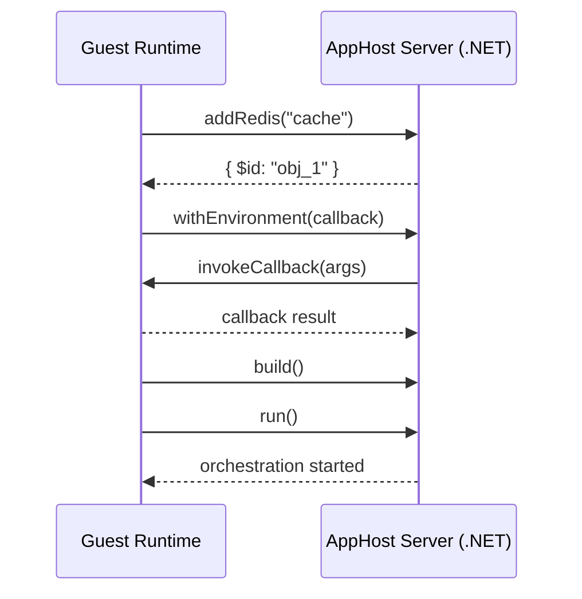
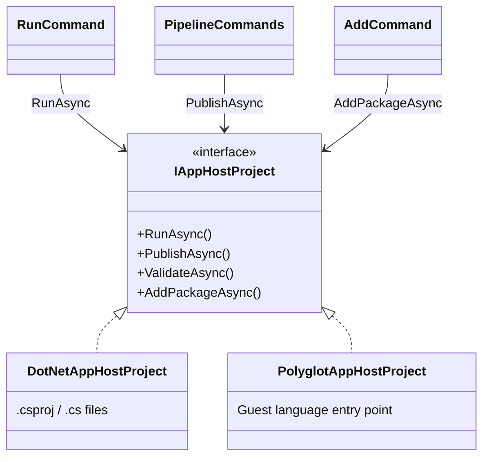

# Polyglot AppHost Support

This document describes how the Aspire CLI supports non-.NET app hosts. Currently, TypeScript is the supported guest language.

## Table of Contents

- [Overview](#overview)
- [Architecture](#architecture)
- [Configuration](#configuration)
- [Process Lifecycle](#process-lifecycle)
- [CLI Coordination](#cli-coordination)
- [JSON-RPC Protocol](#json-rpc-protocol)
- [Type System and Marshalling](#type-system-and-marshalling)
- [Code Generation](#code-generation)
- [TypeScript Implementation](#typescript-implementation)
- [Adding New Guest Languages](#adding-new-guest-languages)
- [Development Mode](#development-mode)

## Overview

The polyglot apphost feature allows developers to write Aspire app hosts in non-.NET languages. The CLI detects the guest language entry point and orchestrates the guest runtime alongside an AppHost server.

**Terminology:**
- **Host (AppHost server)**: The .NET process running Aspire.Hosting
- **Guest**: The non-.NET runtime executing the user's apphost code

**Design Goals:**
1. **Reuse Existing Integrations** - All 100+ Aspire.Hosting.* packages work automatically
2. **Native Language Experience** - Generated SDKs with idiomatic APIs
3. **Consistent CLI Experience** - `aspire run`, `aspire add`, `aspire publish` work identically

## Architecture

The CLI scaffolds the AppHost server project that references the required hosting integration packages. Code generation reflects over these assemblies to produce a language-specific SDK. At runtime, the AppHost server uses `Aspire.Hosting.RemoteHost` to expose a JSON-RPC server over Unix domain sockets. The guest connects and sends instructions (e.g., `AddRedis`, `WithEnvironment`) which are executed against the real Aspire.Hosting APIs.




### Key Projects

| Project | Purpose |
|---------|---------|
| `Aspire.Hosting.CodeGeneration` | Reflection-based model building from Aspire.Hosting assemblies |
| `Aspire.Hosting.CodeGeneration.<Language>` | Language-specific SDK generator |
| `Aspire.Hosting.RemoteHost` | JSON-RPC server, instruction processor, object registry |

## Configuration

Polyglot app hosts use two configuration files to manage settings and dependencies.

### .aspire/settings.json

This file stores the app host entry point and integration package references. It is created when you run `aspire init` or `aspire add` in a polyglot project.

```json
{
  "appHostPath": "../apphost.ts",
  "packages": {
    "Aspire.Hosting.Redis": "9.2.0",
    "Aspire.Hosting.PostgreSQL": "9.2.0"
  }
}
```

| Property | Description |
|----------|-------------|
| `appHostPath` | Relative path to the app host entry point |
| `packages` | Dictionary of Aspire.Hosting.* package references with versions |

When you run `aspire add`, the CLI updates this file and regenerates the SDK to include the new integration APIs.

### apphost.run.json

This file provides launch settings for the app host, similar to `launchSettings.json` in .NET projects. It configures environment variables and URLs for the development environment.

```json
{
  "profiles": {
    "https": {
      "applicationUrl": "https://localhost:17193;http://localhost:15069",
      "environmentVariables": {
        "ASPNETCORE_ENVIRONMENT": "Development",
        "DOTNET_ENVIRONMENT": "Development",
        "ASPIRE_DASHBOARD_OTLP_ENDPOINT_URL": "https://localhost:21293"
      }
    }
  }
}
```

The CLI reads the `https` profile (or the first available profile) and passes these settings to the AppHost server. If no `apphost.run.json` exists, default development URLs are used.

## Process Lifecycle

### Startup Sequence

1. **Detection**: `ProjectLocator` finds the guest entry point
2. **AppHost Server Preparation**:
   - CLI scaffolds a .NET project in `$TMPDIR/.aspire/hosts/<hash>/`
   - References `Aspire.AppHost.Sdk` and required hosting packages
   - Builds the project with `dotnet build`
3. **Code Generation**:
   - Loads assemblies from build output using `AssemblyLoaderContext`
   - Builds `ApplicationModel` via reflection on loaded assemblies
   - Generates SDK into language-specific output folder
4. **Host Launch**: AppHost server started via `dotnet exec` with:
   - `REMOTE_APP_HOST_SOCKET_PATH` - Unix domain socket path for JSON-RPC
   - `REMOTE_APP_HOST_PID` - CLI process ID for orphan detection
5. **Guest Launch**: Guest runtime started with the entry point
6. **Connection**: Guest connects to host over Unix domain socket

### Shutdown Scenarios

The system handles several shutdown scenarios to ensure clean termination:

| Scenario | Trigger | Behavior |
|----------|---------|----------|
| **Normal Exit** | Guest calls `run()` then user presses Ctrl+C | CLI receives SIGINT, terminates AppHost server gracefully, which stops all managed resources |
| **Guest Completes** | Guest finishes execution (publish mode) | Guest disconnects, AppHost server completes pipeline and exits |
| **User Interrupt** | Ctrl+C during startup or execution | CLI propagates signal to child processes, waits for graceful shutdown |
| **CLI Crash** | CLI process dies unexpectedly | `OrphanDetector` in AppHost server monitors CLI's PID and terminates when parent dies |
| **AppHost Server Crash** | AppHost server process dies | Guest detects JSON-RPC connection loss and exits with error |
| **Guest Crash** | Guest process dies unexpectedly | AppHost server detects client disconnect; in run mode continues until Ctrl+C, in publish mode exits with error |
| **Build Failure** | AppHost server fails to build | CLI reports error before any processes start |
| **Connection Timeout** | Guest cannot connect to host | Guest retries with backoff, eventually exits with error if host is unreachable |

The `OrphanDetector` is critical for preventing zombie processes. When the CLI starts the AppHost server, it passes its own PID via the `REMOTE_APP_HOST_PID` environment variable. The AppHost server periodically checks if this process is still alive and terminates itself if the parent has died. This handles cases where the CLI is killed with `kill -9` or crashes without cleanup.

---

## CLI Coordination

The CLI uses the `IAppHostProject` interface to abstract language-specific behavior. Each supported app host type has its own implementation, allowing CLI commands to work uniformly across languages.



| CLI Command | IAppHostProject Method | Description |
|-------------|------------------------|-------------|
| `aspire run` | `RunAsync` | Build and run in development mode |
| `aspire publish` / `deploy` / `do` | `PublishAsync` | Build and run in publish mode |
| `aspire add` | `AddPackageAsync` | Add an integration package |

### Polyglot Execution Model

For polyglot app hosts, `RunAsync` and `PublishAsync` follow the same pattern:

1. **Start the AppHost server** - A .NET process running Aspire.Hosting that exposes a JSON-RPC server
2. **Start the guest** - The guest language process that connects and sends instructions
3. **Guest defines resources** - Via JSON-RPC calls like `addRedis()`, `addPostgres()`
4. **Guest calls `run()`** - Triggers orchestration (run mode) or pipeline execution (publish mode)

In **run mode**, the AppHost server runs until interrupted (Ctrl+C). In **publish mode**, it exits when the pipeline completes.

---

## JSON-RPC Protocol

Communication between the guest and host uses JSON-RPC 2.0 over Unix domain sockets (or named pipes on Windows).

### Transport Layer

The protocol uses **header-delimited messages** matching the `vscode-jsonrpc` format:

```text
Content-Length: 123\r\n
\r\n
{"jsonrpc":"2.0","id":1,"method":"ping","params":[]}
```

### RPC Methods

| Method | Parameters | Description |
|--------|------------|-------------|
| `ping` | none | Health check, returns "pong" |
| `executeInstruction` | `instructionJson: string` | Execute a typed instruction (see below) |
| `invokeMethod` | `objectId, methodName, args?` | Call method on registered object |
| `getProperty` | `objectId, propertyName` | Get property value |
| `setProperty` | `objectId, propertyName, value` | Set property value |
| `getIndexer` | `objectId, key` | Get indexed value (list or dict) |
| `setIndexer` | `objectId, key, value` | Set indexed value |
| `unregisterObject` | `objectId` | Release object from registry |
| `invokeCallback` | `callbackId, args` | Host → Guest callback invocation |

### Instructions

Instructions are the primary way to interact with the Aspire.Hosting API:

**CREATE_BUILDER** - Create a DistributedApplicationBuilder
```json
{
    "name": "CREATE_BUILDER",
    "builderName": "builder",
    "args": ["--operation", "run"],
    "projectDirectory": "/path/to/project"
}
```

**INVOKE** - Call a method on a registered object
```json
{
    "name": "INVOKE",
    "source": "builder",
    "target": "redis",
    "methodAssembly": "Aspire.Hosting.Redis",
    "methodType": "RedisBuilderExtensions",
    "methodName": "AddRedis",
    "methodArgumentTypes": ["IDistributedApplicationBuilder", "String"],
    "metadataToken": 123456,
    "args": { "name": "cache" }
}
```

**RUN_BUILDER** - Build and run the application
```json
{
    "name": "RUN_BUILDER",
    "builderName": "builder"
}
```

### Callback Mechanism

Callbacks allow the host to invoke guest functions during method execution (e.g., `WithEnvironment` callbacks):

1. Guest registers a callback function with a unique ID (e.g., `callback_1_1234567890`)
2. Guest passes the callback ID as an argument to an instruction
3. Host executes the method, which invokes the callback
4. Host sends `invokeCallback` request to guest with the callback ID and args
5. Guest executes the callback and returns the result

---

## Type System and Marshalling

The polyglot architecture bridges two type systems: the host (.NET) and the guest.

### Design Principles

1. **Primitives pass directly**: Strings, numbers, booleans serialize as JSON primitives
2. **Complex objects become proxies**: Non-primitive types are registered in the host and accessed via JSON-RPC calls
3. **Callbacks are bidirectional**: Guest can register callbacks that the host invokes

### Object Registry

The `ObjectRegistry` in the host maintains a `ConcurrentDictionary<string, object>` mapping unique IDs to live .NET objects. When a complex object needs to be returned to the guest:

1. Object is registered with a unique ID (e.g., `obj_1`, `obj_2`)
2. A marshalled representation is sent: `{ $id, $type, $fullType, $methods, ...properties }`
3. Guest wraps this in a proxy class
4. Subsequent operations use the `$id` to reference the object in the host

### Marshalled Object Format

```json
{
    "$id": "obj_1",
    "$type": "RedisResource",
    "$fullType": "Aspire.Hosting.Redis.RedisResource",
    "$methods": ["WithEnvironment", "WithArgs", "GetEndpoint"],
    "Name": "cache"
}
```

### Type Mappings

#### Guest → Host

| Guest Type | .NET Type | Handling |
|------------|-----------|----------|
| String | `string` | Direct JSON |
| Number | `int`, `long`, `double` | Type coercion |
| Boolean | `bool` | Direct JSON |
| Null | `null` | Direct JSON |
| Object with `$id` | Registry lookup | Proxy reference resolved |
| `{ $referenceExpression, format }` | `ReferenceExpression` | Special handling |
| Arrays | `T[]`, `List<T>` | JSON deserialization |

#### Host → Guest

| .NET Type | Guest Type | Notes |
|-----------|------------|-------|
| Primitives | string/number/boolean | Direct |
| `DateTime`, `Guid` | string | ISO 8601 / string format |
| Enums | string | Enum name |
| Complex objects | Proxy | Marshalled with `$id` |

### ReferenceExpression

`ReferenceExpression` allows building connection strings that reference host objects:

```json
{ "$referenceExpression": true, "format": "redis://{obj_4}" }
```

The format string contains `{$id}` placeholders. The host reconstructs the expression using object registry lookups.

---

## Code Generation

The CLI generates language-specific SDK code that provides type-safe APIs with instance methods for all Aspire integrations.

### Generation Trigger

Code generation runs automatically when:

1. **First Run**: SDK folder doesn't exist
2. **Package Changes**: Hash of package references has changed
3. **After `aspire add`**: When adding new integrations
4. **Development Mode**: When `ASPIRE_REPO_ROOT` is set

### What Gets Generated

For each Aspire integration, the generator creates:

1. **Builder methods** on `DistributedApplicationBuilder`
2. **Resource-specific builder classes** with fluent methods
3. **Proxy wrapper classes** for callback contexts and model types

---

## TypeScript Implementation

This section covers TypeScript-specific details for the polyglot apphost feature.

### Generated File Structure

```text
.modules/
├── .codegen-hash              # SHA256 hash of package references
├── distributed-application.ts # Main SDK with builder classes
├── types.ts                   # Instruction type definitions
└── RemoteAppHostClient.ts     # JSON-RPC client implementation
```

### Base Proxy Classes

**`DotNetProxy`** - Foundation for all remote object access:
```typescript
class DotNetProxy {
    readonly $id: string;
    readonly $type: string;

    async invokeMethod(name: string, args?: Record<string, unknown>): Promise<unknown>;
    async getProperty(name: string): Promise<unknown>;
    async setProperty(name: string, value: unknown): Promise<void>;
    async getIndexer(key: string | number): Promise<unknown>;
    async setIndexer(key: string | number, value: unknown): Promise<void>;
    async dispose(): Promise<void>;
}
```

**`ListProxy<T>`** - For `IList<T>` operations:
```typescript
class ListProxy<T> {
    async add(item: T): Promise<void>;
    async get(index: number): Promise<T>;
    async set(index: number, value: T): Promise<void>;
    async count(): Promise<number>;
    async clear(): Promise<void>;
    async remove(item: T): Promise<boolean>;
    async removeAt(index: number): Promise<void>;
}
```

### Generated Proxy Wrappers

The code generator produces **specially generated proxy wrapper classes** for callback context types. These provide typed access to .NET objects passed into callbacks.

| Generated Proxy | .NET Type | Purpose |
|-----------------|-----------|---------|
| `EnvironmentCallbackContextProxy` | `EnvironmentCallbackContext` | Access `EnvironmentVariables` dictionary |
| `CommandLineArgsCallbackContextProxy` | `CommandLineArgsCallbackContext` | Access `Args` list |
| `ContainerRuntimeArgsCallbackContextProxy` | `ContainerRuntimeArgsCallbackContext` | Access container runtime `Args` list |
| `EndpointReferenceProxy` | `EndpointReference` | Access endpoint metadata |
| `EndpointAnnotationProxy` | `EndpointAnnotation` | Access endpoint configuration |

All generated proxies implement `HasProxy`:
```typescript
interface HasProxy {
    proxy: DotNetProxy;
}
```

Example generated proxy:
```typescript
class EnvironmentCallbackContextProxy {
    private _proxy: DotNetProxy;
    get proxy(): DotNetProxy { return this._proxy; }

    async getEnvironmentVariables(): Promise<DotNetProxy>;
    async getResource(): Promise<DotNetProxy>;
    async getExecutionContext(): Promise<DotNetProxy>;
}
```

### ReferenceExpression Support

The `refExpr` tagged template literal creates reference expressions:

```typescript
const endpoint = await redis.getEndpoint("tcp");
const expr = refExpr`redis://${endpoint}`;
// Serializes as: { $referenceExpression: true, format: "redis://{obj_4}" }
```

### Example Usage

```typescript
// apphost.ts
import { createBuilder, refExpr } from './.modules/distributed-application.js';
import { EnvironmentCallbackContextProxy } from './.modules/distributed-application.js';

async function main() {
    const builder = await createBuilder();

    const redis = await builder.addRedis('cache');

    // Callback receives specially generated proxy wrapper
    await redis.withEnvironmentCallback(async (context: EnvironmentCallbackContextProxy) => {
        const envVars = await context.getEnvironmentVariables();
        await envVars.set("REDIS_CONFIG", "custom-value");
    });

    // ListProxy for args manipulation
    await redis.withArgs2(async (context) => {
        const args = await context.getArgs();
        await args.add("--maxmemory");
        await args.add("256mb");
    });

    const app = builder.build();
    await app.run();
}

main();
```

---

## Adding New Guest Languages

The polyglot architecture supports additional languages. The host-side infrastructure (`Aspire.Hosting.RemoteHost`) is language-agnostic—only the code generator and CLI integration are language-specific.

### Components to Implement

| Component | Location | Purpose |
|-----------|----------|---------|
| Code Generator | `Aspire.Hosting.CodeGeneration.<Language>` | Generate idiomatic SDK from `ApplicationModel` |
| CLI Project Handler | `Aspire.Cli/Projects/<Language>AppHostProject.cs` | Implement `IAppHostProject` |
| Project Locator | `Aspire.Cli/Projects/ProjectLocator.cs` | Detect entry point file |
| Runtime Client | Embedded or generated | JSON-RPC client with proxy classes |

### Code Generator

Create `Aspire.Hosting.CodeGeneration.<Language>` implementing `ICodeGenerator`:

```csharp
public interface ICodeGenerator
{
    bool NeedsGeneration(string projectDirectory, IReadOnlyDictionary<string, string> packages);
    Task GenerateAsync(string projectDirectory, IReadOnlyDictionary<string, string> packages, CancellationToken cancellationToken);
}
```

Key concerns:
- Map .NET types to language equivalents
- Generate builder classes with instance methods
- Generate proxy wrappers for callback contexts
- Emit JSON-RPC client infrastructure

### CLI Integration

Implement `IAppHostProject`:

```csharp
internal interface IAppHostProject
{
    AppHostType SupportedType { get; }

    Task<int> RunAsync(AppHostProjectContext context, CancellationToken cancellationToken);
    Task<int> PublishAsync(PublishContext context, CancellationToken cancellationToken);
    Task<bool> ValidateAsync(FileInfo appHostFile, CancellationToken cancellationToken);
    Task<bool> AddPackageAsync(AddPackageContext context, CancellationToken cancellationToken);
}
```

Register with a keyed service for the `AppHostType`:

```csharp
services.AddKeyedSingleton<IAppHostProject, PythonAppHostProject>(AppHostType.Python);
```

### Runtime Client Requirements

The guest language needs a JSON-RPC client that:
1. Connects to Unix domain socket (path from `REMOTE_APP_HOST_SOCKET_PATH`)
2. Implements `vscode-jsonrpc` header-delimited message format
3. Handles `invokeCallback` requests from host
4. Wraps marshalled objects (`$id`, `$type`) in proxy classes

### Reusable Infrastructure

These components work unchanged for any guest language:
- `Aspire.Hosting.RemoteHost` - JSON-RPC server, instruction processor, object registry
- `Aspire.Hosting.CodeGeneration` - Reflection-based model building
- AppHost server scaffolding and build process
- Backchannel for publish progress reporting

---

## Development Mode

Set `ASPIRE_REPO_ROOT` to your local Aspire repository for development:

```bash
export ASPIRE_REPO_ROOT=/path/to/aspire
```

This:
- Skips SDK caching (always regenerates)
- Uses local build artifacts from `artifacts/bin/` instead of NuGet packages
