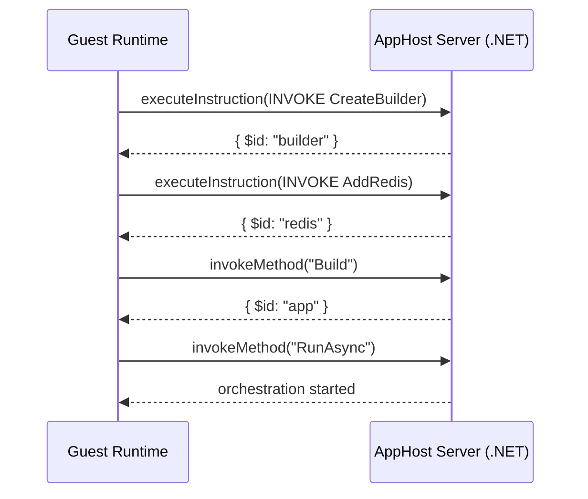
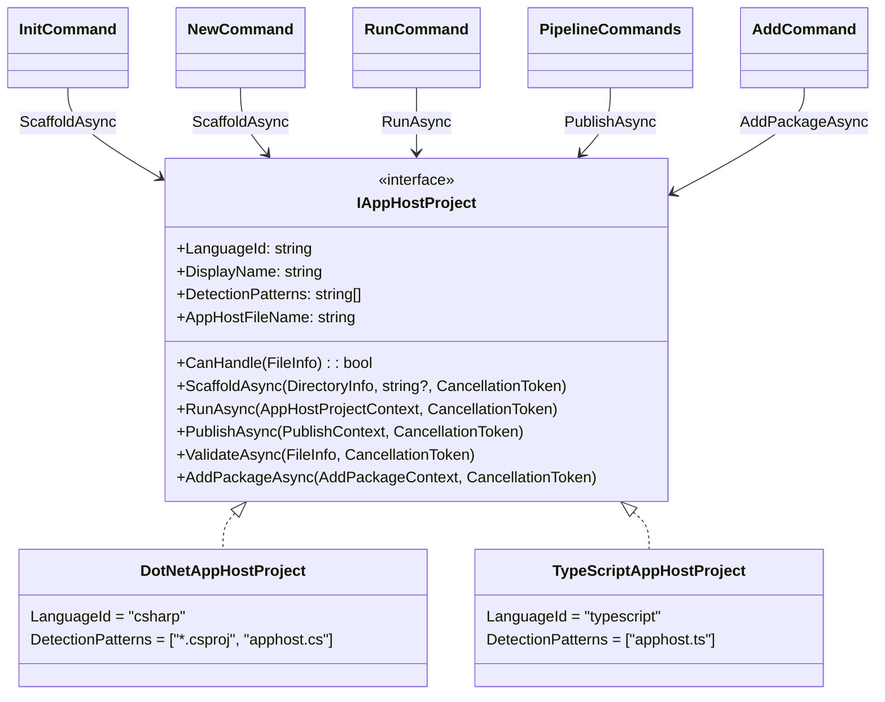

# Polyglot AppHost Support

This document describes how the Aspire CLI supports non-.NET app hosts. Currently, TypeScript is the supported guest language.

## Table of Contents

- [Overview](#overview)
- [Architecture](#architecture)
- [Configuration](#configuration)
- [Process Lifecycle](#process-lifecycle)
- [CLI Coordination](#cli-coordination)
- [JSON-RPC Protocol](#json-rpc-protocol)
- [Type System and Marshalling](#type-system-and-marshalling)
- [Code Generation](#code-generation)
- [TypeScript Implementation](#typescript-implementation)
- [Adding New Guest Languages](#adding-new-guest-languages)
- [Development Mode](#development-mode)

## Overview

The polyglot apphost feature allows developers to write Aspire app hosts in non-.NET languages. The CLI detects the guest language entry point and orchestrates the guest runtime alongside an AppHost server.

**Terminology:**
- **Host (AppHost server)**: The .NET process running Aspire.Hosting
- **Guest**: The non-.NET runtime executing the user's apphost code

**Design Goals:**
1. **Reuse Existing Integrations** - All 100+ Aspire.Hosting.* packages work automatically
2. **Native Language Experience** - Generated SDKs with idiomatic APIs
3. **Consistent CLI Experience** - `aspire run`, `aspire add`, `aspire publish` work identically

## Architecture

The CLI scaffolds the AppHost server project that references the required hosting integration packages. Code generation reflects over these assemblies to produce a language-specific SDK. At runtime, the AppHost server uses `Aspire.Hosting.RemoteHost` to expose a JSON-RPC server over Unix domain sockets. The guest connects and sends instructions (e.g., `AddRedis`, `WithEnvironment`) which are executed against the real Aspire.Hosting APIs.




### Key Projects

| Project | Purpose |
|---------|---------|
| `Aspire.Hosting.CodeGeneration` | Reflection-based model building from Aspire.Hosting assemblies |
| `Aspire.Hosting.CodeGeneration.<Language>` | Language-specific SDK generator |
| `Aspire.Hosting.RemoteHost` | JSON-RPC server, instruction processor, object registry |

## Configuration

Polyglot app hosts use configuration files to manage settings and dependencies.

### apphost.run.json

This file provides launch settings for the app host, similar to `launchSettings.json` in .NET projects. It configures environment variables and URLs for the development environment.

```json
{
  "profiles": {
    "https": {
      "applicationUrl": "https://localhost:17193;http://localhost:15069",
      "environmentVariables": {
        "ASPNETCORE_ENVIRONMENT": "Development",
        "DOTNET_ENVIRONMENT": "Development",
        "ASPIRE_DASHBOARD_OTLP_ENDPOINT_URL": "https://localhost:21293"
      }
    }
  }
}
```

The CLI reads the `https` profile (or the first available profile) and passes these settings to the AppHost server. If no `apphost.run.json` exists, default development URLs are used.

### .aspire/settings.json

This file stores integration package references for polyglot app hosts. It is created when you run `aspire add` to add an integration package.

```json
{
  "packages": {
    "Aspire.Hosting.Redis": "<version>",
    "Aspire.Hosting.PostgreSQL": "<version>"
  }
}
```

When you run `aspire add`, the CLI updates this file and regenerates the SDK to include the new integration APIs.

## Process Lifecycle

### Startup Sequence

1. **Detection**: `ProjectLocator` finds the guest entry point
2. **AppHost Server Preparation**:
   - CLI scaffolds a .NET project in `$TMPDIR/.aspire/hosts/<hash>/`
   - References `Aspire.AppHost.Sdk` and required hosting packages
   - Builds the project with `dotnet build`
3. **Code Generation**:
   - Loads assemblies from build output using `AssemblyLoaderContext`
   - Builds `ApplicationModel` via reflection on loaded assemblies
   - Generates SDK into language-specific output folder
4. **Host Launch**: AppHost server started via `dotnet exec` with:
   - `REMOTE_APP_HOST_SOCKET_PATH` - Unix domain socket path for JSON-RPC
   - `REMOTE_APP_HOST_PID` - CLI process ID for orphan detection
5. **Guest Launch**: Guest runtime started with the entry point
6. **Connection**: Guest connects to host over Unix domain socket

### Shutdown Scenarios

The system handles several shutdown scenarios to ensure clean termination:

| Scenario | Trigger | Behavior |
|----------|---------|----------|
| **Normal Exit** | Guest calls `run()` then user presses Ctrl+C | CLI receives SIGINT, terminates AppHost server gracefully, which stops all managed resources |
| **Guest Completes** | Guest finishes execution (publish mode) | Guest disconnects, AppHost server completes pipeline and exits |
| **User Interrupt** | Ctrl+C during startup or execution | CLI propagates signal to child processes, waits for graceful shutdown |
| **CLI Crash** | CLI process dies unexpectedly | `OrphanDetector` in AppHost server monitors CLI's PID and terminates when parent dies |
| **AppHost Server Crash** | AppHost server process dies | Guest detects JSON-RPC connection loss and exits with error |
| **Guest Crash** | Guest process dies unexpectedly | AppHost server detects client disconnect; in run mode continues until Ctrl+C, in publish mode exits with error |
| **Build Failure** | AppHost server fails to build | CLI reports error before any processes start |
| **Connection Timeout** | Guest cannot connect to host | Guest retries with backoff, eventually exits with error if host is unreachable |

The `OrphanDetector` is critical for preventing zombie processes. When the CLI starts the AppHost server, it passes its own PID via the `REMOTE_APP_HOST_PID` environment variable. The AppHost server periodically checks if this process is still alive and terminates itself if the parent has died. This handles cases where the CLI is killed with `kill -9` or crashes without cleanup.

---

## CLI Coordination

The CLI uses the `IAppHostProject` interface as the **single extension point** for language support. Each language implements this interface, which handles identity, detection, creation, and execution concerns. This design allows adding a new language by implementing one class and registering it in DI.



### Interface Responsibilities

| Category | Members | Purpose |
|----------|---------|---------|
| **Identity** | `LanguageId`, `DisplayName` | Unique identifier for config storage, human-readable name for prompts |
| **Detection** | `DetectionPatterns`, `CanHandle()` | File patterns for discovery, validation of specific files |
| **Creation** | `AppHostFileName`, `ScaffoldAsync()` | Default filename, scaffolding new projects |
| **Execution** | `RunAsync()`, `PublishAsync()`, `ValidateAsync()`, `AddPackageAsync()` | CLI command implementations |

### CLI Command Mapping

| CLI Command | IAppHostProject Method | Description |
|-------------|------------------------|-------------|
| `aspire init` | `ScaffoldAsync` | Create apphost in current directory |
| `aspire new` | `ScaffoldAsync` | Create new project with apphost |
| `aspire run` | `RunAsync` | Build and run in development mode |
| `aspire publish` / `deploy` / `do` | `PublishAsync` | Build and run in publish mode |
| `aspire add` | `AddPackageAsync` | Add an integration package |

### Polyglot Execution Model

For polyglot app hosts, `RunAsync` and `PublishAsync` follow the same pattern:

1. **Start the AppHost server** - A .NET process running Aspire.Hosting that exposes a JSON-RPC server
2. **Start the guest** - The guest language process that connects and sends instructions
3. **Guest defines resources** - Via JSON-RPC calls like `addRedis()`, `addPostgres()`
4. **Guest calls `run()`** - Triggers orchestration (run mode) or pipeline execution (publish mode)

In **run mode**, the AppHost server runs until interrupted (Ctrl+C). In **publish mode**, it exits when the pipeline completes.

---

## JSON-RPC Protocol

Communication between the guest and host uses JSON-RPC 2.0 over Unix domain sockets (or named pipes on Windows).

### Design Philosophy: Generic .NET Remoting

The JSON-RPC server in `Aspire.Hosting.RemoteHost` is designed as a **generic .NET remoting layer**. The RPC surface provides fundamental .NET operations:

| RPC Method | .NET Concept |
|------------|--------------|
| `invokeMethod` | Call any instance method |
| `getProperty` / `setProperty` | Property access |
| `getIndexer` / `setIndexer` | Indexer access (lists, dictionaries) |
| `unregisterObject` | Release object reference |

The instruction system adds capabilities that require assembly/type resolution:

| Instruction | Purpose |
|-------------|---------|
| `CREATE_OBJECT` | Instantiate any .NET type via constructor |
| `INVOKE` | Call static methods or extension methods |
| `pragma` | Directives and hints |

This design means the protocol can invoke **any .NET API** - not just Aspire.Hosting methods. The guest SDK is generated from reflection over the actual .NET assemblies, so new integrations automatically get type-safe APIs without protocol changes.

### Transport Layer

The protocol uses **header-delimited messages** matching the `vscode-jsonrpc` format:

```text
Content-Length: 123\r\n
\r\n
{"jsonrpc":"2.0","id":1,"method":"ping","params":[]}
```

### RPC Methods (Guest → Host)

These methods are called by the guest to interact with the .NET host.

#### `ping`

Health check to verify connection.

| | |
|---|---|
| **Parameters** | None |
| **Returns** | `string` - Always `"pong"` |

```json
// Request
{"jsonrpc":"2.0","id":1,"method":"ping","params":[]}

// Response
{"jsonrpc":"2.0","id":1,"result":"pong"}
```

#### `executeInstruction`

Execute a typed instruction for operations requiring assembly/type resolution (object creation, static methods, extension methods).

| | |
|---|---|
| **Parameters** | `instructionJson: string` - JSON-serialized instruction object |
| **Returns** | `object?` - Marshalled result (often an object with `$id` for proxying) |

```json
// Request
{"jsonrpc":"2.0","id":2,"method":"executeInstruction","params":["{ \"name\": \"CREATE_OBJECT\", ... }"]}

// Response
{"jsonrpc":"2.0","id":2,"result":{"success":true,"target":"builder","result":{"$id":"obj_1","$type":"DistributedApplicationBuilder"}}}
```

#### `invokeMethod`

Call an instance method on a registered object.

| | |
|---|---|
| **Parameters** | `objectId: string` - Object ID from registry<br/>`methodName: string` - Method to invoke<br/>`args: object?` - Method arguments as JSON object |
| **Returns** | `object?` - Method return value (marshalled) |

```json
// Request
{"jsonrpc":"2.0","id":3,"method":"invokeMethod","params":["obj_1","Build",null]}

// Response
{"jsonrpc":"2.0","id":3,"result":{"$id":"obj_2","$type":"DistributedApplication"}}
```

#### `getProperty`

Get a property value from a registered object.

| | |
|---|---|
| **Parameters** | `objectId: string` - Object ID from registry<br/>`propertyName: string` - Property name |
| **Returns** | `object?` - Property value (marshalled) |

```json
// Request
{"jsonrpc":"2.0","id":4,"method":"getProperty","params":["obj_1","Name"]}

// Response
{"jsonrpc":"2.0","id":4,"result":"cache"}
```

#### `setProperty`

Set a property value on a registered object.

| | |
|---|---|
| **Parameters** | `objectId: string` - Object ID from registry<br/>`propertyName: string` - Property name<br/>`value: any` - New value |
| **Returns** | `void` |

```json
// Request
{"jsonrpc":"2.0","id":5,"method":"setProperty","params":["obj_1","Name","new-cache"]}

// Response
{"jsonrpc":"2.0","id":5,"result":null}
```

#### `getIndexer`

Get an indexed value from a collection (list or dictionary).

| | |
|---|---|
| **Parameters** | `objectId: string` - Object ID from registry<br/>`key: string \| number` - Index or key |
| **Returns** | `object?` - Value at index/key (marshalled) |

```json
// Request (dictionary)
{"jsonrpc":"2.0","id":6,"method":"getIndexer","params":["obj_1","REDIS_URL"]}

// Request (list)
{"jsonrpc":"2.0","id":7,"method":"getIndexer","params":["obj_2",0]}
```

#### `setIndexer`

Set an indexed value in a collection.

| | |
|---|---|
| **Parameters** | `objectId: string` - Object ID from registry<br/>`key: string \| number` - Index or key<br/>`value: any` - Value to set |
| **Returns** | `void` |

```json
// Request
{"jsonrpc":"2.0","id":8,"method":"setIndexer","params":["obj_1","MY_VAR","my-value"]}
```

#### `unregisterObject`

Release an object from the registry when no longer needed.

| | |
|---|---|
| **Parameters** | `objectId: string` - Object ID to release |
| **Returns** | `void` |

```json
// Request
{"jsonrpc":"2.0","id":9,"method":"unregisterObject","params":["obj_1"]}
```

### RPC Methods (Host → Guest)

These methods are called by the host to invoke callbacks registered by the guest.

#### `invokeCallback`

Invoke a callback function that was registered by the guest.

| | |
|---|---|
| **Parameters** | `callbackId: string` - Callback ID (e.g., `"callback_1_1234567890"`)<br/>`args: object?` - Arguments to pass to callback |
| **Returns** | `object?` - Callback return value |
| **Timeout** | 60 seconds |

```json
// Request (Host → Guest)
{"jsonrpc":"2.0","id":100,"method":"invokeCallback","params":["callback_1_1234567890",{"$id":"obj_5","$type":"EnvironmentCallbackContext"}]}

// Response (Guest → Host)
{"jsonrpc":"2.0","id":100,"result":null}
```

### Instructions

Instructions are sent via `executeInstruction` to interact with the Aspire.Hosting API. The protocol uses a minimal set of generic instructions:

**CREATE_OBJECT** - Instantiate any .NET type
```json
{
    "name": "CREATE_OBJECT",
    "typeName": "Aspire.Hosting.DistributedApplicationBuilder",
    "assemblyName": "Aspire.Hosting",
    "target": "builder",
    "args": {
        "options": {
            "Args": ["--operation", "run"],
            "ProjectDirectory": "/path/to/project"
        }
    }
}
```

**INVOKE** - Call extension methods or static methods (methods requiring assembly/type resolution)
```json
// Extension method call (source is the object to invoke on)
{
    "name": "INVOKE",
    "source": "builder",
    "target": "redis",
    "methodAssembly": "Aspire.Hosting.Redis",
    "methodType": "RedisBuilderExtensions",
    "methodName": "AddRedis",
    "methodArgumentTypes": ["IDistributedApplicationBuilder", "String"],
    "metadataToken": 123456,
    "args": { "name": "cache" }
}

// Static method call (source is null/empty)
{
    "name": "INVOKE",
    "source": "",
    "target": "builder",
    "methodAssembly": "Aspire.Hosting",
    "methodType": "Aspire.Hosting.DistributedApplication",
    "methodName": "CreateBuilder",
    "args": { "options": { "Args": [], "ProjectDirectory": "/path" } }
}
```

**pragma** - Directives and hints
```json
{
    "name": "pragma",
    "type": "line",
    "value": "42 \"apphost.ts\""
}
```

> **Note:** Instance methods like `Build()` and `RunAsync()` are called via the `invokeMethod` RPC method, not instructions. Instructions are needed for:
> - **`CREATE_OBJECT`**: Object instantiation via constructor
> - **`INVOKE`**: Static or extension methods requiring assembly/type resolution
>
> The TypeScript SDK uses static `INVOKE` to call `DistributedApplication.CreateBuilder()`, matching the standard C# API pattern.

### Callback Mechanism

Callbacks allow the host to invoke guest functions during method execution (e.g., `WithEnvironment` callbacks):

1. Guest registers a callback function with a unique ID (e.g., `callback_1_1234567890`)
2. Guest passes the callback ID as an argument to an instruction
3. Host executes the method, which invokes the callback
4. Host sends `invokeCallback` request to guest with the callback ID and args
5. Guest executes the callback and returns the result

---

## Type System and Marshalling

The polyglot architecture bridges two type systems: the host (.NET) and the guest.

### Design Principles

1. **Primitives pass directly**: Strings, numbers, booleans serialize as JSON primitives
2. **Complex objects become proxies**: Non-primitive types are registered in the host and accessed via JSON-RPC calls
3. **Callbacks are bidirectional**: Guest can register callbacks that the host invokes

### Object Registry

The `ObjectRegistry` in the host maintains a `ConcurrentDictionary<string, object>` mapping unique IDs to live .NET objects. When a complex object needs to be returned to the guest:

1. Object is registered with a unique ID (e.g., `obj_1`, `obj_2`)
2. A marshalled representation is sent: `{ $id, $type, $fullType, $methods, ...properties }`
3. Guest wraps this in a proxy class
4. Subsequent operations use the `$id` to reference the object in the host

### Marshalled Object Format

```json
{
    "$id": "obj_1",
    "$type": "RedisResource",
    "$fullType": "Aspire.Hosting.Redis.RedisResource",
    "$methods": ["WithEnvironment", "WithArgs", "GetEndpoint"],
    "Name": "cache"
}
```

### Type Mappings

#### Guest → Host

| Guest Type | .NET Type | Handling |
|------------|-----------|----------|
| String | `string` | Direct JSON |
| Number | `int`, `long`, `double` | Type coercion |
| Boolean | `bool` | Direct JSON |
| Null | `null` | Direct JSON |
| Object with `$id` | Registry lookup | Proxy reference resolved |
| `{ $referenceExpression, format }` | `ReferenceExpression` | Special handling |
| Arrays | `T[]`, `List<T>` | JSON deserialization |

#### Host → Guest

| .NET Type | Guest Type | Notes |
|-----------|------------|-------|
| Primitives | string/number/boolean | Direct |
| `DateTime`, `Guid` | string | ISO 8601 / string format |
| Enums | string | Enum name |
| Complex objects | Proxy | Marshalled with `$id` |

### ReferenceExpression

`ReferenceExpression` allows building connection strings that reference host objects:

```json
{ "$referenceExpression": true, "format": "redis://{obj_4}" }
```

The format string contains `{$id}` placeholders. The host reconstructs the expression using object registry lookups.

---

## Code Generation

The CLI generates language-specific SDK code that provides type-safe APIs with instance methods for all Aspire integrations.

### Generation Trigger

Code generation runs automatically when:

1. **First Run**: SDK folder doesn't exist
2. **Package Changes**: Hash of package references has changed
3. **After `aspire add`**: When adding new integrations
4. **Development Mode**: When `ASPIRE_REPO_ROOT` is set

### What Gets Generated

For each Aspire integration, the generator creates:

1. **Builder methods** on `DistributedApplicationBuilder`
2. **Resource-specific builder classes** with fluent methods
3. **Proxy wrapper classes** for callback contexts and model types

---

## TypeScript Implementation

This section covers TypeScript-specific details for the polyglot apphost feature.

### Generated File Structure

```text
.modules/
├── .codegen-hash              # SHA256 hash of package references
├── distributed-application.ts # Main SDK with builder classes
├── types.ts                   # Instruction type definitions
└── RemoteAppHostClient.ts     # JSON-RPC client implementation
```

### Base Proxy Classes

**`DotNetProxy`** - Foundation for all remote object access:
```typescript
class DotNetProxy {
    readonly $id: string;
    readonly $type: string;

    async invokeMethod(name: string, args?: Record<string, unknown>): Promise<unknown>;
    async getProperty(name: string): Promise<unknown>;
    async setProperty(name: string, value: unknown): Promise<void>;
    async getIndexer(key: string | number): Promise<unknown>;
    async setIndexer(key: string | number, value: unknown): Promise<void>;
    async dispose(): Promise<void>;
}
```

**`ListProxy<T>`** - For `IList<T>` operations:
```typescript
class ListProxy<T> {
    async add(item: T): Promise<void>;
    async get(index: number): Promise<T>;
    async set(index: number, value: T): Promise<void>;
    async count(): Promise<number>;
    async clear(): Promise<void>;
    async remove(item: T): Promise<boolean>;
    async removeAt(index: number): Promise<void>;
}
```

### Generated Proxy Wrappers

The code generator produces **specially generated proxy wrapper classes** for callback context types. These provide typed access to .NET objects passed into callbacks.

| Generated Proxy | .NET Type | Purpose |
|-----------------|-----------|---------|
| `EnvironmentCallbackContextProxy` | `EnvironmentCallbackContext` | Access `EnvironmentVariables` dictionary |
| `CommandLineArgsCallbackContextProxy` | `CommandLineArgsCallbackContext` | Access `Args` list |
| `ContainerRuntimeArgsCallbackContextProxy` | `ContainerRuntimeArgsCallbackContext` | Access container runtime `Args` list |
| `EndpointReferenceProxy` | `EndpointReference` | Access endpoint metadata |
| `EndpointAnnotationProxy` | `EndpointAnnotation` | Access endpoint configuration |

All generated proxies implement `HasProxy`:
```typescript
interface HasProxy {
    proxy: DotNetProxy;
}
```

Example generated proxy:
```typescript
class EnvironmentCallbackContextProxy {
    private _proxy: DotNetProxy;
    get proxy(): DotNetProxy { return this._proxy; }

    async getEnvironmentVariables(): Promise<DotNetProxy>;
    async getResource(): Promise<DotNetProxy>;
    async getExecutionContext(): Promise<DotNetProxy>;
}
```

### ReferenceExpression Support

The `refExpr` tagged template literal creates reference expressions:

```typescript
const endpoint = await redis.getEndpoint("tcp");
const expr = refExpr`redis://${endpoint}`;
// Serializes as: { $referenceExpression: true, format: "redis://{obj_4}" }
```

### Example Usage

```typescript
// apphost.ts
import { createBuilder, refExpr } from './.modules/distributed-application.js';
import { EnvironmentCallbackContextProxy } from './.modules/distributed-application.js';

async function main() {
    const builder = await createBuilder();

    const redis = await builder.addRedis('cache');

    // Callback receives specially generated proxy wrapper
    await redis.withEnvironmentCallback(async (context: EnvironmentCallbackContextProxy) => {
        const envVars = await context.getEnvironmentVariables();
        await envVars.set("REDIS_CONFIG", "custom-value");
    });

    // ListProxy for args manipulation
    await redis.withArgs2(async (context) => {
        const args = await context.getArgs();
        await args.add("--maxmemory");
        await args.add("256mb");
    });

    const app = builder.build();
    await app.run();
}

main();
```

---

## Adding New Guest Languages

The polyglot architecture supports additional languages. The host-side infrastructure (`Aspire.Hosting.RemoteHost`) is language-agnostic—only code generation and CLI integration are language-specific.

**Adding a new language requires only two steps:**
1. Create a class implementing `IAppHostProject`
2. Register it in DI

### IAppHostProject Implementation

The `IAppHostProject` interface is the **single extension point** for new languages. It consolidates all language-specific concerns:

```csharp
internal interface IAppHostProject
{
    /// <summary>
    /// Gets the unique identifier for this language (e.g., "csharp", "typescript").
    /// Used for configuration storage and CLI arguments.
    /// </summary>
    string LanguageId { get; }

    /// <summary>
    /// Gets the human-readable display name (e.g., "C# (.NET)", "TypeScript (Node.js)").
    /// </summary>
    string DisplayName { get; }

    /// <summary>
    /// Gets the file patterns to search for when detecting apphosts.
    /// Examples: ["*.csproj", "*.fsproj", "apphost.cs"] or ["apphost.ts"]
    /// </summary>
    string[] DetectionPatterns { get; }

    /// <summary>
    /// Determines if this handler can process the given file.
    /// Called after DetectionPatterns match to do deeper validation.
    /// </summary>
    bool CanHandle(FileInfo appHostFile);

    /// <summary>
    /// Gets the default apphost filename for this language (e.g., "apphost.cs", "apphost.ts").
    /// </summary>
    string AppHostFileName { get; }

    /// <summary>
    /// Creates a new apphost project in the specified directory.
    /// </summary>
    Task ScaffoldAsync(DirectoryInfo directory, string? projectName, CancellationToken ct);

    /// <summary>
    /// Runs the AppHost project.
    /// </summary>
    Task<int> RunAsync(AppHostProjectContext context, CancellationToken ct);

    /// <summary>
    /// Publishes the AppHost project.
    /// </summary>
    Task<int> PublishAsync(PublishContext context, CancellationToken ct);

    /// <summary>
    /// Validates that the AppHost file is compatible with this runner.
    /// </summary>
    Task<bool> ValidateAsync(FileInfo appHostFile, CancellationToken ct);

    /// <summary>
    /// Adds a package to the AppHost project.
    /// </summary>
    Task<bool> AddPackageAsync(AddPackageContext context, CancellationToken ct);

    /// <summary>
    /// Checks for and handles any running instance of this AppHost.
    /// </summary>
    Task<bool> CheckAndHandleRunningInstanceAsync(FileInfo appHostFile, DirectoryInfo homeDir, CancellationToken ct);
}
```

Register as an enumerable service:

```csharp
services.TryAddEnumerable(ServiceDescriptor.Singleton<IAppHostProject, MyLanguageAppHostProject>());
```

### Components to Implement

| Component | Location | Purpose |
|-----------|----------|---------|
| AppHost Project | `Aspire.Cli/Projects/<Language>AppHostProject.cs` | Implement `IAppHostProject` |
| Code Generator | `Aspire.Hosting.CodeGeneration.<Language>` | Generate idiomatic SDK from `ApplicationModel` |
| Runtime Client | Embedded or generated | JSON-RPC client with proxy classes |

### Code Generation

Create a code generator in `Aspire.Hosting.CodeGeneration.<Language>` that produces an idiomatic SDK from the `ApplicationModel`. The generator is invoked by your `IAppHostProject` implementation during `RunAsync`/`PublishAsync`.

Key concerns:
- Map .NET types to language equivalents
- Generate builder classes with instance methods
- Generate proxy wrappers for callback contexts
- Emit JSON-RPC client infrastructure

### Runtime Client Requirements

The guest language needs a JSON-RPC client that:
1. Connects to Unix domain socket (path from `REMOTE_APP_HOST_SOCKET_PATH`)
2. Implements `vscode-jsonrpc` header-delimited message format
3. Handles `invokeCallback` requests from host
4. Wraps marshalled objects (`$id`, `$type`) in proxy classes

### Reusable Infrastructure

These components work unchanged for any guest language:
- `Aspire.Hosting.RemoteHost` - JSON-RPC server, instruction processor, object registry
- `Aspire.Hosting.CodeGeneration` - Reflection-based model building
- AppHost server scaffolding and build process
- Backchannel for publish progress reporting

---

## Development Mode

Set `ASPIRE_REPO_ROOT` to your local Aspire repository for development:

```bash
export ASPIRE_REPO_ROOT=/path/to/aspire
```

This:
- Skips SDK caching (always regenerates)
- Uses local build artifacts from `artifacts/bin/` instead of NuGet packages

---

## Challenges and Limitations

The generic .NET remoting approach is powerful but presents challenges when exposing the full .NET type system to guest languages. The .NET type system is very rich, and not all features translate cleanly across language boundaries.

### Known Challenges

| Challenge | Description | Status |
|-----------|-------------|--------|
| **Generic methods** | Methods like `GetRequiredService<T>()` require runtime type specification | TBD |
| **Overload resolution** | .NET supports complex overloading (by type, ref/out, params) that may be ambiguous over JSON | Partial - resolved by argument names |
| **Delegate variance** | Covariant/contravariant delegates don't map to most languages | TBD |
| **ref/out parameters** | By-reference parameters are currently skipped in code generation | Skipped |
| **Span/Memory types** | Stack-allocated types cannot be marshalled | Not supported |
| **Async enumerable** | `IAsyncEnumerable<T>` streaming requires special handling | TBD |
| **Disposable patterns** | Guest languages may not have deterministic disposal | Manual via `unregisterObject` |
| **Exception mapping** | .NET exception hierarchy doesn't map to guest languages | Flattened to error messages |
| **Threading model** | .NET async/await semantics differ from guest language models | JSON-RPC serializes calls |

### Planned Restrictions

To ensure a reliable and predictable API surface, restrictions will be added to control which .NET features are exposed over the RPC protocol. These may include:

- **Attribute-based opt-in/opt-out** for methods and types
- **Curated API surface** limiting exposure to well-known patterns
- **Type allow/deny lists** for marshalling
- **Parameter type restrictions** (e.g., no `Span<T>`, no by-ref)

The specific restrictions are **TBD** and will evolve based on real-world usage patterns.
