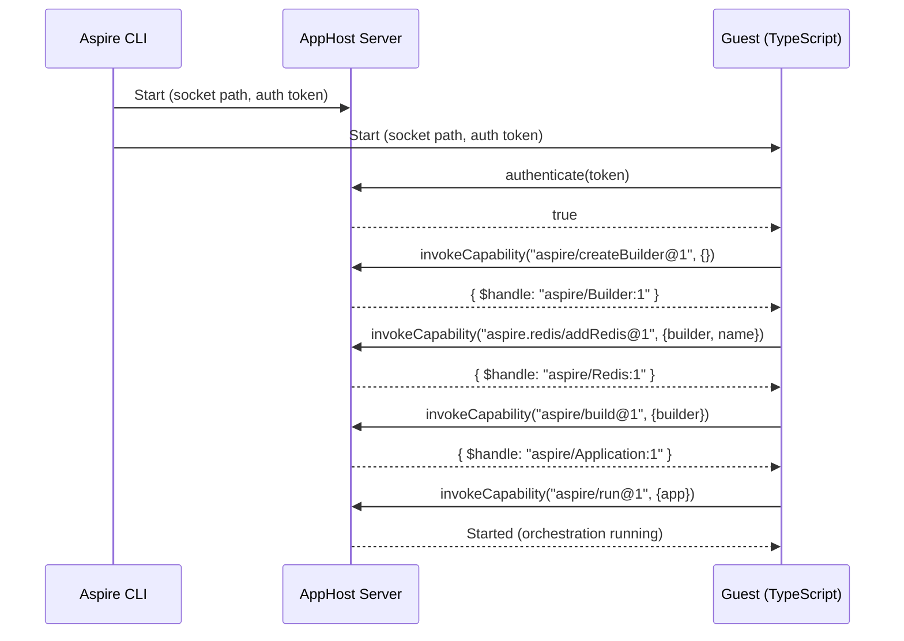
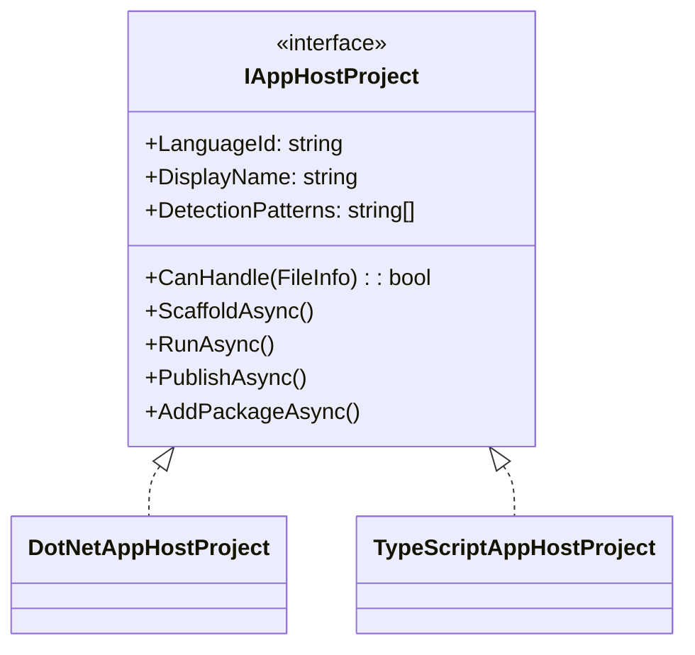

# Polyglot AppHost Support

This document describes how the Aspire CLI supports non-.NET app hosts using the **Aspire Type System (ATS)**.

## Table of Contents

1. [Overview](#overview)
2. [Architecture](#architecture)
3. [Aspire Type System (ATS)](#aspire-type-system-ats)
4. [JSON-RPC Protocol](#json-rpc-protocol)
5. [Code Generation](#code-generation)
6. [TypeScript Implementation](#typescript-implementation)
7. [CLI Integration](#cli-integration)
8. [Configuration](#configuration)
9. [Adding New Guest Languages](#adding-new-guest-languages)
10. [Security](#security)

---

## Overview

The polyglot apphost feature allows developers to write Aspire app hosts in non-.NET languages. The **Aspire Type System (ATS)** is the foundation—a portable type system that maps .NET types to a unified representation any language can work with.

Integration authors expose their existing extension methods to ATS by adding `[AspireExport]` attributes. No wrapper code needed.

**Key Concepts:**
- **ATS Type ID** - A portable type identifier (e.g., `aspire/Redis`)
- **Capability** - A named operation (e.g., `aspire.redis/addRedis@1`)
- **Handle** - An opaque typed reference to a .NET object
- **DTO** - A serializable data transfer object

---

## Architecture

The CLI orchestrates two processes: the **AppHost Server** (.NET) and the **Guest Runtime** (e.g., Node.js). They communicate via JSON-RPC over a Unix domain socket.

```
┌─────────────────────────────────────────────────────────────────┐
│                        Aspire CLI                               │
│                                                                 │
│   ┌─────────────────────┐         ┌─────────────────────────┐  │
│   │  Guest Runtime      │         │  AppHost Server (.NET)  │  │
│   │  (Node.js)          │         │                         │  │
│   │                     │         │  ┌───────────────────┐  │  │
│   │  ┌───────────────┐  │         │  │ Aspire.Hosting.*  │  │  │
│   │  │ User Code     │  │         │  │ (Redis, etc)      │  │  │
│   │  │ (apphost.ts)  │  │         │  └─────────┬─────────┘  │  │
│   │  └───────┬───────┘  │         │            │            │  │
│   │          │          │         │  ┌─────────▼─────────┐  │  │
│   │  ┌───────▼───────┐  │         │  │CapabilityDispatch │  │  │
│   │  │ Generated SDK │  │         │  │HandleRegistry     │  │  │
│   │  │ (aspire.ts)   │  │         │  └─────────┬─────────┘  │  │
│   │  └───────┬───────┘  │         │            │            │  │
│   │          │          │         │            │            │  │
│   │  ┌───────▼───────┐  │  JSON   │  ┌─────────▼─────────┐  │  │
│   │  │ ATS Client    │◄─┼──RPC────┼─►│ JSON-RPC Server   │  │  │
│   │  └───────────────┘  │  (UDS)  │  └───────────────────┘  │  │
│   └─────────────────────┘         └─────────────────────────┘  │
│            ▲                                  ▲                 │
│            │ spawns                           │ spawns          │
│            └──────────────┬───────────────────┘                 │
│                           │                                     │
└───────────────────────────┼─────────────────────────────────────┘
```

**Startup Sequence:**

1. CLI scaffolds an AppHost server project in `$TMPDIR/.aspire/hosts/<hash>/`
2. CLI adds required hosting packages (Redis, Postgres, etc.)
3. CLI builds the .NET project
4. Code generation scans assemblies for `[AspireExport]` and generates SDK
5. CLI starts the AppHost server with socket path and auth token
6. CLI starts the Guest runtime
7. Guest connects, authenticates, and invokes capabilities



---

## Aspire Type System (ATS)

ATS is the central type system that bridges .NET and guest languages. Every type crossing the boundary has an **ATS type ID** that serves as its portable identity.

### Type IDs

Type IDs are portable identifiers for .NET types:

**Format:** `aspire/{TypeName}` or `aspire.{package}/{TypeName}`

| ATS Type ID | .NET Type |
|-------------|-----------|
| `aspire/Builder` | `IDistributedApplicationBuilder` |
| `aspire/Application` | `DistributedApplication` |
| `aspire/ExecutionContext` | `DistributedApplicationExecutionContext` |
| `aspire/IResource` | `IResource` |
| `aspire/IResourceWithEnvironment` | `IResourceWithEnvironment` |
| `aspire/Container` | `ContainerResource` |
| `aspire/Executable` | `ExecutableResource` |
| `aspire/EndpointReference` | `EndpointReference` |

Declared with `[AspireExport]`:

```csharp
// On a type you own
[AspireExport(AtsTypeId = "aspire/Redis")]
public class RedisResource : ContainerResource { }

// At assembly level for types you don't own
[assembly: AspireExport(typeof(IDistributedApplicationBuilder), AtsTypeId = "aspire/Builder")]
```

### Intrinsic Types

These core types are built into ATS and available in all guest languages:

| Type | Purpose |
|------|---------|
| `aspire/Builder` | The distributed application builder |
| `aspire/Application` | The built application |
| `aspire/ExecutionContext` | Runtime context (IsPublishMode, etc.) |
| `aspire/EndpointReference` | Reference to a resource endpoint |
| `aspire/Parameter` | A configurable parameter |

### Capabilities

Capabilities are named operations with globally unique IDs. They replace direct method invocation.

**Format:** `aspire/{operation}@{version}` or `aspire.{package}/{operation}@{version}`

| Capability ID | Description |
|---------------|-------------|
| `aspire/createBuilder@1` | Create a DistributedApplicationBuilder |
| `aspire/addContainer@1` | Add a container resource |
| `aspire/withEnvironment@1` | Set an environment variable |
| `aspire/build@1` | Build the application |
| `aspire/run@1` | Run the application |
| `aspire.redis/addRedis@1` | Add a Redis resource |

Declared on extension methods:

```csharp
[AspireExport("aspire.redis/addRedis@1", Description = "Adds a Redis resource")]
public static IResourceBuilder<RedisResource> AddRedis(
    this IDistributedApplicationBuilder builder,
    [ResourceName] string name,
    int? port = null)
{
    // Existing implementation - unchanged
}
```

### Handles

Handles are opaque references to .NET objects. They carry an ATS type ID for identification.

**Format:** `{atsTypeId}:{instanceId}` (e.g., `aspire/Redis:42`)

```json
{
    "$handle": "aspire/Redis:42",
    "$type": "aspire/Redis"
}
```

**Flat Model:** ATS uses a flat type model where capabilities are grouped by their first parameter type:
- Methods with `IDistributedApplicationBuilder` as first param → on `DistributedApplicationBuilder`
- Methods with `IResourceBuilder<T>` as first param → on all resource builders
- Methods with `DistributedApplication` as first param → on `DistributedApplication`

Type validation happens at runtime when the CLR invokes the method. Invalid type combinations produce `TYPE_MISMATCH` errors.

### DTOs

Data transfer objects for passing structured data. Must be marked `[AspireDto]`:

```csharp
[AspireDto]
public sealed class ContainerMountOptions
{
    public required string Source { get; init; }
    public required string Target { get; init; }
    public bool IsReadOnly { get; init; }
}
```

**Strict Enforcement:**

| Direction | `[AspireDto]` Type | Non-`[AspireDto]` Type |
|-----------|-------------------|----------------------|
| Input (JSON → .NET) | Deserialized | **Error** |
| Output (.NET → JSON) | Serialized | Marshaled as Handle |

### Callbacks

Guest-provided functions the host can invoke during execution:

```csharp
[AspireExport("aspire/withEnvironmentCallback@1")]
public static IResourceBuilder<T> WithEnvironmentCallback<T>(
    this IResourceBuilder<T> resource,
    [AspireCallback("aspire/EnvironmentCallback")] Func<EnvironmentCallbackContext, Task> callback)
    where T : IResourceWithEnvironment
```

Callbacks are passed as string IDs:

```json
{
    "resource": {"$handle": "aspire/Redis:1"},
    "callback": "callback_1_1234567890"
}
```

### Context Types

Objects passed to callbacks with auto-exposed properties:

```csharp
[AspireContextType("aspire/EnvironmentContext")]
public class EnvironmentCallbackContext
{
    // Auto-exposed as "aspire/EnvironmentContext.environmentVariables@1"
    public Dictionary<string, object> EnvironmentVariables { get; }

    // Auto-exposed as "aspire/EnvironmentContext.executionContext@1"
    public DistributedApplicationExecutionContext ExecutionContext { get; }
}
```

### Reference Expressions

Dynamic values that reference endpoints, parameters, and other providers:

```json
{
    "$expr": {
        "format": "redis://{0}:{1}",
        "valueProviders": [
            { "$handle": "aspire/EndpointReference:1" },
            "6379"
        ]
    }
}
```

---

## JSON-RPC Protocol

Guest and host communicate via JSON-RPC 2.0 over Unix domain sockets (named pipes on Windows).

### Wire Format

Messages use the LSP/vscode-jsonrpc header format:

```
Content-Length: 123\r\n
\r\n
{"jsonrpc":"2.0","id":1,"method":"ping","params":[]}
```

### Methods

| Method | Direction | Purpose |
|--------|-----------|---------|
| `authenticate` | Guest → Host | Authenticate with secret token |
| `ping` | Guest → Host | Health check |
| `invokeCapability` | Guest → Host | Call a capability |
| `getCapabilities` | Guest → Host | List available capabilities |
| `createCancellationToken` | Guest → Host | Create cancellation token |
| `cancel` | Guest → Host | Cancel operation |
| `invokeCallback` | Host → Guest | Invoke guest callback |

### authenticate

Must be called first (except for `ping`):

```json
// Request
{"jsonrpc":"2.0","id":1,"method":"authenticate","params":["<secret-token>"]}

// Response
{"jsonrpc":"2.0","id":1,"result":true}
```

### invokeCapability

```json
// Request
{"jsonrpc":"2.0","id":2,"method":"invokeCapability","params":[
    "aspire.redis/addRedis@1",
    {
        "builder": {"$handle": "aspire/Builder:1"},
        "name": "cache",
        "port": 6379
    }
]}

// Response
{"jsonrpc":"2.0","id":2,"result":{
    "$handle": "aspire/Redis:1",
    "$type": "aspire/Redis"
}}
```

### invokeCallback (Host → Guest)

```json
// Request
{"jsonrpc":"2.0","id":100,"method":"invokeCallback","params":[
    "callback_1_1234567890",
    {"context": {"$handle": "aspire/EnvironmentContext:5"}}
]}

// Response
{"jsonrpc":"2.0","id":100,"result":null}
```

### Error Responses

```json
{
    "jsonrpc": "2.0",
    "id": 1,
    "result": {
        "$error": {
            "code": "CAPABILITY_NOT_FOUND",
            "message": "Unknown capability: aspire.foo/bar@1",
            "capability": "aspire.foo/bar@1"
        }
    }
}
```

| Code | Description |
|------|-------------|
| `CAPABILITY_NOT_FOUND` | Unknown capability ID |
| `HANDLE_NOT_FOUND` | Handle doesn't exist |
| `TYPE_MISMATCH` | Handle type incompatible |
| `INVALID_ARGUMENT` | Missing/invalid argument |
| `CALLBACK_ERROR` | Callback invocation failed |
| `INTERNAL_ERROR` | Unexpected error |

### Supported Types

**Primitives:**

| .NET Type | JSON Type | Notes |
|-----------|-----------|-------|
| `string` | string | |
| `char` | string | Single character |
| `bool` | boolean | |
| `int`, `long` | number | |
| `float`, `double`, `decimal` | number | |
| `DateTime` | string | ISO 8601 |
| `DateTimeOffset` | string | ISO 8601 |
| `TimeSpan` | number | **Total milliseconds** |
| `DateOnly` | string | YYYY-MM-DD |
| `TimeOnly` | string | HH:mm:ss |
| `Guid` | string | |
| `Uri` | string | |
| `enum` | string | Enum name |

**Complex Types:**

| Type | JSON Shape |
|------|------------|
| Handle | `{ "$handle": "type:id", "$type": "type" }` |
| DTO | Plain object (requires `[AspireDto]`) |
| Array/List | JSON array |
| Dictionary | JSON object |
| Nullable | Value or `null` |
| ReferenceExpression | `{ "$expr": { "format": "...", "valueProviders": [...] } }` |

**TimeSpan Example:**

```csharp
TimeSpan.FromMinutes(5)  →  300000
TimeSpan.FromSeconds(30) →  30000
```

---

## Code Generation

The CLI generates language-specific SDKs from ATS capabilities.

### When It Runs

- First run (no `.modules/` folder)
- Package hash changed (after `aspire add`)
- Development mode (`ASPIRE_REPO_ROOT` set)

### Process

1. Load assemblies from AppHost server build
2. Scan for `[AspireExport]` attributes using `AtsCapabilityScanner`
3. Build type mapping (CLR type → ATS type ID)
4. Generate language-specific SDK

### Output (TypeScript)

```
.modules/
├── .codegen-hash           # Hash of package references
├── aspire.ts               # Generated SDK
├── RemoteAppHostClient.ts  # ATS client
└── types.ts                # Type definitions
```

### Type Mapping

| ATS Type ID | TypeScript |
|-------------|------------|
| `aspire/Builder` | `DistributedApplicationBuilder` class |
| `aspire/Redis` | `RedisBuilder` class |
| `aspire/Application` | `DistributedApplication` class |
| primitives | `string`, `number`, `boolean` |

---

## TypeScript Implementation

### Generated SDK Usage

```typescript
import { createBuilder } from './.modules/aspire.js';

const builder = await createBuilder();

// Add resources
const cache = await builder.addRedis("cache");
const db = await builder.addPostgres("db");

// Configure
await cache.withRedisCommander();
await db.withPgAdmin();

// Connect resources
const api = await builder.addContainer("api", "myapp:latest")
    .withReference(cache)
    .withReference(db);

// Build and run
await builder.build().run();
```

### Fluent Async Chaining

Methods return `Thenable` wrappers enabling single-await chains:

```typescript
// Single await for entire chain
const cache = await builder
    .addRedis("cache")
    .withRedisCommander()
    .withDataVolume();

// Build and run in one await
await builder.build().run();
```

### Reference Expressions

```typescript
const redis = await builder.addRedis("cache");
const endpoint = await redis.getEndpoint("tcp");

// Tagged template literal
const connectionString = refExpr`redis://${endpoint}`;

await api.withEnvironment("REDIS_URL", connectionString);
```

---

## CLI Integration

The CLI uses `IAppHostProject` as the extension point for language support:



| Command | Method | Description |
|---------|--------|-------------|
| `aspire init` | `ScaffoldAsync` | Create apphost in current directory |
| `aspire new` | `ScaffoldAsync` | Create new project with apphost |
| `aspire run` | `RunAsync` | Build and run (development) |
| `aspire publish` | `PublishAsync` | Build and run (publish mode) |
| `aspire add` | `AddPackageAsync` | Add integration package |

---

## Configuration

### .aspire/settings.json

Package references for polyglot app hosts:

```json
{
  "packages": {
    "Aspire.Hosting.Redis": "9.0.0",
    "Aspire.Hosting.PostgreSQL": "9.0.0"
  }
}
```

Updated by `aspire add` command.

### apphost.run.json

Launch settings:

```json
{
  "profiles": {
    "https": {
      "applicationUrl": "https://localhost:17193;http://localhost:15069",
      "environmentVariables": {
        "ASPNETCORE_ENVIRONMENT": "Development"
      }
    }
  }
}
```

---

## Adding New Guest Languages

To add a new language:

1. **Implement `IAppHostProject`** in `Aspire.Cli`
2. **Create code generator** in `Aspire.Hosting.CodeGeneration.<Language>`
3. **Implement ATS client** with JSON-RPC support

### Reusable Infrastructure

| Component | Project | Purpose |
|-----------|---------|---------|
| JSON-RPC Server | `Aspire.Hosting.RemoteHost` | Handles all RPC |
| Capability Dispatcher | `Aspire.Hosting.RemoteHost` | Routes to implementations |
| Handle Registry | `Aspire.Hosting.RemoteHost` | Object lifecycle |
| Capability Scanner | `Aspire.Hosting.CodeGeneration` | Discovers `[AspireExport]` |

### Code Generator Requirements

1. Map ATS type IDs to language types
2. Generate methods for each capability
3. Handle async/promise patterns
4. Marshal handles, DTOs, primitives

---

## Security

Both guest and host run locally on the same machine, started by the CLI. This is **not** remote execution.

### Protections

| Protection | Description |
|------------|-------------|
| **Capability allowlist** | Only `[AspireExport]` methods callable |
| **Runtime type validation** | CLR validates types at invocation time |
| **DTO enforcement** | Only `[AspireDto]` types serialized |
| **Socket authentication** | Secret token required |
| **Socket permissions** | Unix socket owner-only (0600) |

### What's NOT Exposed

- Arbitrary .NET reflection
- File system access
- Process spawning
- Network operations
- Any type without explicit `[AspireExport]`
