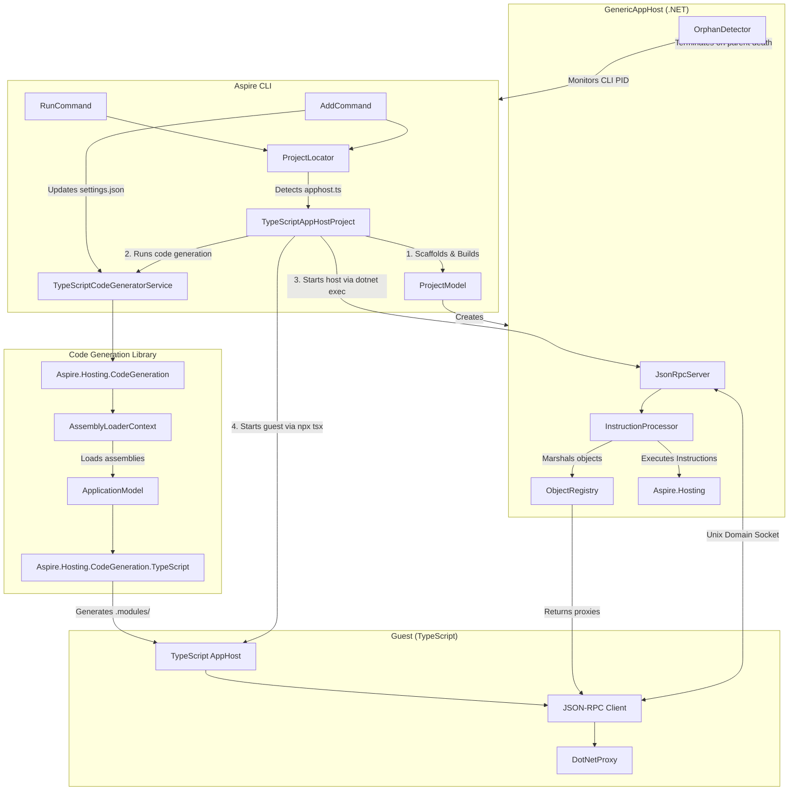

# Polyglot AppHost Support

This document describes how the Aspire CLI supports non-.NET app hosts through a polyglot architecture. Currently, TypeScript is the supported guest language.

## Overview

The polyglot apphost feature allows developers to write Aspire app hosts in guest languages other than C#. The CLI detects the app host type based on entry point files (e.g., `apphost.ts`) and orchestrates the appropriate guest runtime.

**Terminology:**
- **Host**: The .NET GenericAppHost process running Aspire.Hosting
- **Guest**: The language runtime (TypeScript) executing the user's apphost code

## Design Goals

The architecture is designed around these key principles:

1. **Reuse Existing Integrations**: All 100+ existing Aspire.Hosting.* NuGet packages work automatically with polyglot app hosts. No need to rewrite or port integrations - they're available immediately.

2. **Native Language Experience**: Generated SDKs provide idiomatic APIs with instance methods (e.g., `builder.addRedis("cache")`) rather than function-based approaches.

3. **Consistent CLI Experience**: Commands like `aspire run`, `aspire add`, and `aspire new` work identically regardless of the app host language. Developers don't need to learn different workflows.

4. **Leverage .NET Ecosystem**: The heavy lifting (container orchestration, service discovery, health checks, telemetry) remains in .NET where the mature Aspire.Hosting libraries live. Guest languages focus on providing idiomatic APIs.

This approach means that when a new Aspire integration is released (e.g., `Aspire.Hosting.Milvus`), it's immediately available to polyglot developers via `aspire add milvus` - no SDK updates required.

## Architecture



## Process Lifecycle

### Startup Sequence

1. **Detection**: `ProjectLocator` finds `apphost.ts` in the working directory
2. **GenericAppHost Preparation**:
   - `ProjectModel` scaffolds a .NET project in `$TMPDIR/.aspire/hosts/<hash>/`
   - References `Aspire.AppHost.Sdk` and required hosting packages
   - Builds the project with `dotnet build`
3. **Code Generation**:
   - Loads assemblies from build output using `AssemblyLoaderContext`
   - Builds `ApplicationModel` via reflection on loaded assemblies
   - Generates TypeScript SDK into `.modules/` folder
4. **Host Launch**: GenericAppHost started via `dotnet exec` with:
   - `REMOTE_APP_HOST_SOCKET_PATH` - Unix domain socket path for JSON-RPC
   - `REMOTE_APP_HOST_PID` - CLI process ID for orphan detection
   - Environment variables from `apphost.run.json`
5. **Guest Launch**: TypeScript guest started via `npx tsx`
6. **Connection**: Guest connects to host over Unix domain socket

### Shutdown Sequence

Shutdown can be triggered by:

1. **User Interrupt (Ctrl+C)**: CLI receives signal, terminates child processes
2. **CLI Death**: `OrphanDetector` in host monitors parent PID, terminates when parent dies
3. **Connection Loss**: Guest detects disconnection and exits
4. **Startup Failure**: Errors (e.g., port conflicts) propagate back through JSON-RPC and terminate all processes

---

## Type System and Marshalling

The polyglot architecture bridges two type systems: the host (.NET) and the guest (TypeScript). This section describes how types are mapped and how complex objects are marshalled between them.

### Design Principles

1. **Primitives pass directly**: Strings, numbers, booleans serialize as JSON primitives
2. **Complex objects become proxies**: Non-primitive types are registered in the host and accessed via JSON-RPC calls from the guest
3. **Callbacks are bidirectional**: Guest can register callbacks that the host invokes

### Object Registry

The `ObjectRegistry` in the host maintains a `ConcurrentDictionary<string, object>` mapping unique IDs to live .NET objects. When a complex object needs to be returned to the guest:

1. Object is registered with a unique ID (e.g., `obj_1`, `obj_2`)
2. A marshalled representation is sent: `{ $id, $type, $fullType, $methods, ...properties }`
3. Guest wraps this in a `DotNetProxy` or generated proxy wrapper class
4. Subsequent operations use the `$id` to reference the object in the host

### Type Mappings

#### Guest → Host (Sending data to .NET)

| TypeScript Type | .NET Type | Handling |
|-----------------|-----------|----------|
| `string` | `string` | Direct JSON |
| `number` | `int`, `long`, `double` | Explicit type coercion |
| `boolean` | `bool` | Direct JSON |
| `null` | `null` | Direct JSON |
| Object with `$id` | Registry lookup | Proxy reference resolved |
| `{ $referenceExpression, format }` | `ReferenceExpression` | Special handling |
| Arrays | `T[]`, `List<T>` | JSON deserialization |

#### Host → Guest (Returning data to TypeScript)

| .NET Type | TypeScript Type | Notes |
|-----------|-----------------|-------|
| `string` | `string` | Direct |
| `bool` | `boolean` | Direct |
| Numeric types | `number` | All numeric types become number |
| `DateTime`, `Guid` | `string` | ISO 8601 / string format |
| Enums | `string` | Enum name as string |
| Complex objects | `DotNetProxy` | Marshalled with `$id` |
| `IResourceBuilder<T>` | Generated builder class | e.g., `RedisResourceBuilder` |
| Model types | Generated proxy wrapper | e.g., `EndpointReferenceProxy` |

### Proxy Classes

#### Base Proxy: `DotNetProxy`

The foundation for all remote object access:

```typescript
class DotNetProxy {
    readonly $id: string;      // Object ID in registry
    readonly $type: string;    // Short type name

    // Remote operations via JSON-RPC
    async invokeMethod(name: string, args?: Record<string, unknown>): Promise<unknown>;
    async getProperty(name: string): Promise<unknown>;
    async setProperty(name: string, value: unknown): Promise<void>;
    async getIndexer(key: string | number): Promise<unknown>;
    async setIndexer(key: string | number, value: unknown): Promise<void>;
    async dispose(): Promise<void>;  // Release from registry
}
```

#### Collection Proxies

**`ListProxy<T>`** - For `IList<T>` operations:
```typescript
class ListProxy<T> {
    async add(item: T): Promise<void>;
    async get(index: number): Promise<T>;
    async set(index: number, value: T): Promise<void>;
    async count(): Promise<number>;
    async clear(): Promise<void>;
    async contains(item: T): Promise<boolean>;
    async remove(item: T): Promise<boolean>;
    async removeAt(index: number): Promise<void>;
    async insert(index: number, item: T): Promise<void>;
}
```

#### Generated Proxy Wrappers

The code generator creates typed wrapper classes for model types:

```typescript
// Generated for EndpointReference
class EndpointReferenceProxy {
    private _proxy: DotNetProxy;
    get proxy(): DotNetProxy { return this._proxy; }
    get $type(): string { return this._proxy.$type; }

    async getResource(): Promise<DotNetProxy> { ... }
    async getEndpointName(): Promise<string> { ... }
}

// Generated for callback contexts
class EnvironmentCallbackContextProxy {
    async getEnvironmentVariables(): Promise<DotNetProxy>;
    async getResource(): Promise<DotNetProxy>;
    async getExecutionContext(): Promise<DotNetProxy>;
}
```

All generated proxies implement `HasProxy`:
```typescript
interface HasProxy {
    proxy: DotNetProxy;
}
```

### ReferenceExpression

`ReferenceExpression` allows building connection strings and other expressions that reference host objects:

```typescript
// Tagged template literal creates ReferenceExpression
const endpoint = await redis.getEndpoint("tcp");
const expr = refExpr`redis://${endpoint}`;

// Serializes as:
{ $referenceExpression: true, format: "redis://{obj_4}" }
```

The `refExpr` function:
- Detects `DotNetProxy` instances and proxy wrappers (via `HasProxy`)
- Replaces them with `{$id}` placeholders
- Host reconstructs the expression using object registry lookups

---

## JSON-RPC Protocol

Communication between the guest and host uses JSON-RPC 2.0 over Unix domain sockets (or named pipes on Windows).

### Transport Layer

The protocol uses **header-delimited messages** matching the `vscode-jsonrpc` format:

```
Content-Length: 123\r\n
\r\n
{"jsonrpc":"2.0","id":1,"method":"ping","params":[]}
```

### Connection Setup (Guest Side)

```typescript
import * as net from 'net';
import * as rpc from 'vscode-jsonrpc/node.js';

// Socket path passed via environment variable from CLI
const socketPath = process.env.REMOTE_APP_HOST_SOCKET_PATH;

// Connect to host's Unix domain socket
const socket = net.createConnection(socketPath);

// Create JSON-RPC connection
const reader = new rpc.SocketMessageReader(socket);
const writer = new rpc.SocketMessageWriter(socket);
const connection = rpc.createMessageConnection(reader, writer);

// Start listening for messages
connection.listen();
```

### RPC Methods

#### `ping` - Health Check

```typescript
// Request
const response = await connection.sendRequest('ping');
// Response: "pong"
```

#### `executeInstruction` - High-Level Operations

Instructions are the primary way to interact with the Aspire.Hosting API. They're serialized as JSON strings.

```typescript
// CREATE_BUILDER - Create a DistributedApplicationBuilder
const createBuilderInstruction = {
    type: 'CREATE_BUILDER',
    builderName: 'builder',
    args: ['MyApp']  // Application name
};
const result = await connection.sendRequest(
    'executeInstruction',
    JSON.stringify(createBuilderInstruction)
);
// Response: { success: true, builderName: 'builder' }

// INVOKE - Call a method on the builder or resource
const invokeInstruction = {
    type: 'INVOKE',
    source: 'builder',           // Variable name holding the object
    target: 'redis',             // Variable name to store result
    methodName: 'AddRedis',      // .NET method name
    args: { name: 'cache' }      // Named parameters
};
const invokeResult = await connection.sendRequest(
    'executeInstruction',
    JSON.stringify(invokeInstruction)
);
// Response: { success: true, source: 'builder', target: 'redis',
//             result: { $id: 'obj_1', $type: 'RedisResource', ... } }

// RUN_BUILDER - Build and run the application
const runInstruction = {
    type: 'RUN_BUILDER',
    builderName: 'builder'
};
await connection.sendRequest(
    'executeInstruction',
    JSON.stringify(runInstruction)
);
```

#### `invokeMethod` - Call Method on Registered Object

```typescript
// Call Add() on a list
await connection.sendRequest('invokeMethod',
    'obj_5',           // objectId from registry
    'Add',             // method name
    { item: '--maxmemory' }  // named arguments
);

// Call a method with no arguments
const count = await connection.sendRequest('invokeMethod',
    'obj_5',
    'get_Count',       // Property getter
    null
);
```

#### `getProperty` / `setProperty` - Property Access

```typescript
// Get property value
const count = await connection.sendRequest('getProperty',
    'obj_5',           // objectId
    'Count'            // property name
);
// Response: 4

// Set property value
await connection.sendRequest('setProperty',
    'obj_3',
    'Name',
    'new-name'
);
```

#### `getIndexer` / `setIndexer` - Indexed Access

```typescript
// Get list item by index
const item = await connection.sendRequest('getIndexer',
    'obj_5',           // objectId (list)
    0                  // index
);

// Set list item by index
await connection.sendRequest('setIndexer',
    'obj_5',
    1,                 // index
    '512mb'            // new value
);

// Get dictionary item by key
const value = await connection.sendRequest('getIndexer',
    'obj_8',           // objectId (dictionary)
    'MY_VAR'           // key
);

// Set dictionary item by key
await connection.sendRequest('setIndexer',
    'obj_8',
    'MY_VAR',
    'new-value'
);
```

#### `unregisterObject` - Release Object from Registry

```typescript
// Release object when no longer needed
await connection.sendRequest('unregisterObject', 'obj_5');
```

### Callback Mechanism

Callbacks allow the host to invoke guest functions during method execution (e.g., `WithEnvironment` callbacks).

#### Registering Callbacks (Guest Side)

```typescript
// Callback registry on the guest side
const callbackRegistry = new Map<string, Function>();
let callbackIdCounter = 0;

function registerCallback<TArgs, TResult>(
    callback: (args: TArgs) => TResult | Promise<TResult>
): string {
    const callbackId = `callback_${++callbackIdCounter}_${Date.now()}`;
    callbackRegistry.set(callbackId, callback);
    return callbackId;
}
```

#### Handling Callback Invocations (Guest Side)

```typescript
// Register handler for incoming callback requests from host
connection.onRequest('invokeCallback', async (callbackId: string, args: unknown) => {
    const callback = callbackRegistry.get(callbackId);
    if (!callback) {
        throw new Error(`Callback not found: ${callbackId}`);
    }

    // Wrap marshalled objects in proxies
    const wrappedArgs = wrapIfProxy(args);

    // Execute callback (may be async)
    return await Promise.resolve(callback(wrappedArgs));
});
```

#### Example: Environment Callback

```typescript
// Register a callback that configures environment variables
const callbackId = registerCallback(async (context: DotNetProxy) => {
    // context is a marshalled EnvironmentCallbackContext from the host
    const envVars = await context.invokeMethod('get_EnvironmentVariables');

    // envVars is now a DotNetProxy for IDictionary<string, object>
    await connection.sendRequest('setIndexer',
        envVars.$id,
        'MY_VAR',
        'Hello from guest!'
    );
});

// Pass callback ID to host method via instruction
const instruction = {
    type: 'INVOKE',
    source: 'redis',
    target: 'redis',
    methodName: 'WithEnvironment',
    args: { callback: callbackId }
};
await connection.sendRequest('executeInstruction', JSON.stringify(instruction));

// During execution, host will call back to guest via 'invokeCallback'
```

### Object Marshalling Format

When the host returns complex objects, they're marshalled with metadata:

```typescript
// Marshalled object format
interface MarshalledObject {
    $id: string;        // Unique ID in object registry (e.g., "obj_1")
    $type: string;      // Short type name (e.g., "RedisResource")
    $fullType: string;  // Full type name with namespace
    $methods?: string[];// Available methods (first overload only)
    [key: string]: unknown;  // Serialized property values
}

// Example marshalled RedisResource
{
    "$id": "obj_1",
    "$type": "RedisResource",
    "$fullType": "Aspire.Hosting.Redis.RedisResource",
    "$methods": ["WithEnvironment", "WithArgs", "GetEndpoint"],
    "Name": "cache"
}
```

### Wrapping Marshalled Objects (Guest Side)

```typescript
function wrapIfProxy(value: unknown): unknown {
    if (value && typeof value === 'object' && '$id' in value && '$type' in value) {
        return new DotNetProxy(value as MarshalledObject);
    }
    return value;
}

// DotNetProxy provides a convenient API over the raw RPC calls to the host
class DotNetProxy {
    constructor(private marshalled: MarshalledObject) {}

    get $id(): string { return this.marshalled.$id; }
    get $type(): string { return this.marshalled.$type; }

    async invokeMethod(name: string, args?: Record<string, unknown>): Promise<unknown> {
        const result = await connection.sendRequest('invokeMethod', this.$id, name, args ?? null);
        return wrapIfProxy(result);
    }

    async getProperty(name: string): Promise<unknown> {
        const result = await connection.sendRequest('getProperty', this.$id, name);
        return wrapIfProxy(result);
    }

    async getIndexer(key: string | number): Promise<unknown> {
        const result = await connection.sendRequest('getIndexer', this.$id, key);
        return wrapIfProxy(result);
    }

    async setIndexer(key: string | number, value: unknown): Promise<void> {
        await connection.sendRequest('setIndexer', this.$id, key, value);
    }

    async dispose(): Promise<void> {
        await connection.sendRequest('unregisterObject', this.$id);
    }
}
```

### Error Handling

Errors from the host are returned as JSON-RPC error responses:

```typescript
try {
    await connection.sendRequest('invokeMethod', 'obj_1', 'NonExistentMethod', null);
} catch (error) {
    // error.message: "Method 'NonExistentMethod' not found on type 'RedisResource'"
    // error.code: -32603 (Internal error)
}
```

### Connection Lifecycle (Guest Side)

```typescript
// Handle disconnection from host
connection.onClose(() => {
    console.log('Connection to host closed');
    process.exit(0);
});

connection.onError((err) => {
    console.error('JSON-RPC connection error:', err);
});

// Clean disconnect
function disconnect(): void {
    connection.dispose();
    socket.end();
}
```

### Complete Example: Guest Low-Level RPC

```typescript
import * as net from 'net';
import * as rpc from 'vscode-jsonrpc/node.js';

async function main() {
    // Connect to host
    const socketPath = process.env.REMOTE_APP_HOST_SOCKET_PATH!;
    const socket = net.createConnection(socketPath);

    await new Promise<void>((resolve, reject) => {
        socket.once('connect', resolve);
        socket.once('error', reject);
    });

    const connection = rpc.createMessageConnection(
        new rpc.SocketMessageReader(socket),
        new rpc.SocketMessageWriter(socket)
    );
    connection.listen();

    // Health check
    const pong = await connection.sendRequest('ping');
    console.log('Connected:', pong);  // "pong"

    // Create builder
    await connection.sendRequest('executeInstruction', JSON.stringify({
        type: 'CREATE_BUILDER',
        builderName: 'builder',
        args: ['MyApp']
    }));

    // Add Redis
    const result = await connection.sendRequest('executeInstruction', JSON.stringify({
        type: 'INVOKE',
        source: 'builder',
        target: 'redis',
        methodName: 'AddRedis',
        args: { name: 'cache' }
    }));

    const redisProxy = new DotNetProxy(result.result);
    console.log('Created Redis:', redisProxy.$type);  // "IResourceBuilder`1"

    // Get endpoint
    const endpointResult = await connection.sendRequest('invokeMethod',
        redisProxy.$id, 'GetEndpoint', { name: 'tcp' });
    const endpointProxy = new DotNetProxy(endpointResult);
    console.log('Endpoint:', endpointProxy.$type);  // "EndpointReference"

    // Run the application
    await connection.sendRequest('executeInstruction', JSON.stringify({
        type: 'RUN_BUILDER',
        builderName: 'builder'
    }));
}

main().catch(console.error);
```

---

## Code Generation

The CLI generates language-specific SDK code that provides type-safe APIs with instance methods for all Aspire integrations.

### Generated File Structure

```
.modules/
├── .codegen-hash              # SHA256 hash of package references
├── distributed-application.ts # Main SDK with builder classes
├── types.ts                   # Instruction types for JSON-RPC
└── RemoteAppHostClient.ts     # JSON-RPC client implementation
```

### Generation Trigger

Code generation runs automatically when:

1. **First Run**: `.modules/` folder doesn't exist
2. **Package Changes**: Hash of package references has changed
3. **After `aspire add`**: When adding new integrations
4. **Development Mode**: When `ASPIRE_REPO_ROOT` is set (always regenerates)

### Generated Code Structure

For each Aspire integration, the generator creates:

1. **Builder methods** on `DistributedApplicationBuilder`:
   ```typescript
   async addRedis(name: string, port?: number | null): Promise<RedisResourceBuilder>
   ```

2. **Resource-specific builder classes**:
   ```typescript
   class RedisResourceBuilder {
       async withPersistence(...): Promise<this>;
       async getEndpoint(name: string): Promise<EndpointReferenceProxy>;
   }
   ```

3. **Proxy wrapper classes** for model types:
   ```typescript
   class EndpointReferenceProxy { ... }
   class EnvironmentCallbackContextProxy { ... }
   ```

---

## Configuration

### .aspire/settings.json

```json
{
  "appHostPath": "../apphost.ts",
  "packages": {
    "Aspire.Hosting.Redis": "13.1.0",
    "Aspire.Hosting.PostgreSQL": "13.1.0"
  }
}
```

### apphost.run.json

Launch settings for the app host:

```json
{
  "$schema": "https://json.schemastore.org/launchsettings.json",
  "profiles": {
    "https": {
      "applicationUrl": "https://localhost:17000;http://localhost:15000",
      "environmentVariables": {
        "ASPIRE_DASHBOARD_OTLP_ENDPOINT_URL": "https://localhost:21000"
      }
    }
  }
}
```

---

## Example Usage

```typescript
// apphost.ts
import { createBuilder, refExpr } from './.modules/distributed-application.js';
import { EnvironmentCallbackContextProxy } from './.modules/distributed-application.js';

async function main() {
    const builder = await createBuilder();

    // Add Redis - returns typed RedisResourceBuilder
    const redis = await builder.addRedis('cache');

    // Configure with callback - receives typed context proxy
    await redis.withEnvironmentCallback(async (context: EnvironmentCallbackContextProxy) => {
        const envVars = await context.getEnvironmentVariables();
        await envVars.set("REDIS_CONFIG", "custom-value");
    });

    // Configure args using ListProxy
    await redis.withArgs2(async (context) => {
        const args = await context.getArgs();
        await args.add("--maxmemory");
        await args.add("256mb");
    });

    // Use reference expressions with endpoint proxies
    const endpoint = await redis.getEndpoint("tcp");
    const connString = refExpr`redis://${endpoint}`;

    // Build and run
    const app = builder.build();
    await app.run();
}

main();
```

---

## File Locations

| Path | Description |
|------|-------------|
| `$TMPDIR/.aspire/hosts/<hash>/` | GenericAppHost project directory |
| `$TMPDIR/.aspire/sockets/<hash>.sock` | Unix domain socket for JSON-RPC |
| `.aspire/settings.json` | Project configuration with package references |
| `.modules/` | Generated SDK code |
| `apphost.run.json` | Launch settings (in project root) |

---

## Error Handling

Errors propagate through the JSON-RPC connection:

1. Host catches exceptions in `InstructionProcessor`
2. Error is returned as JSON-RPC error response with message and stack trace
3. Guest throws the error, which propagates to the catch block
4. CLI detects child process exit and terminates

```typescript
try {
    await (redis as any).nonExistentMethod();
} catch (e) {
    // Error message: "redis.nonExistentMethod is not a function"
}
```
