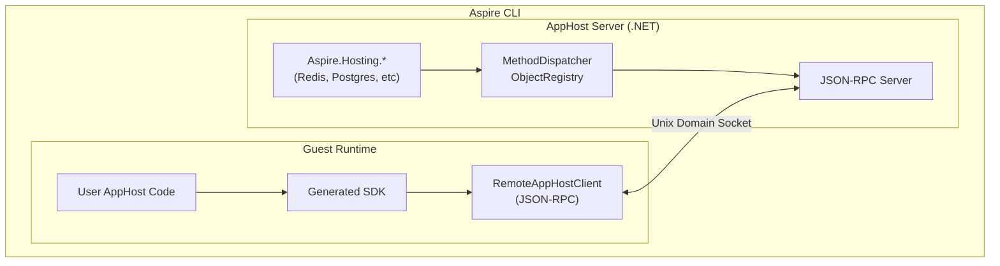
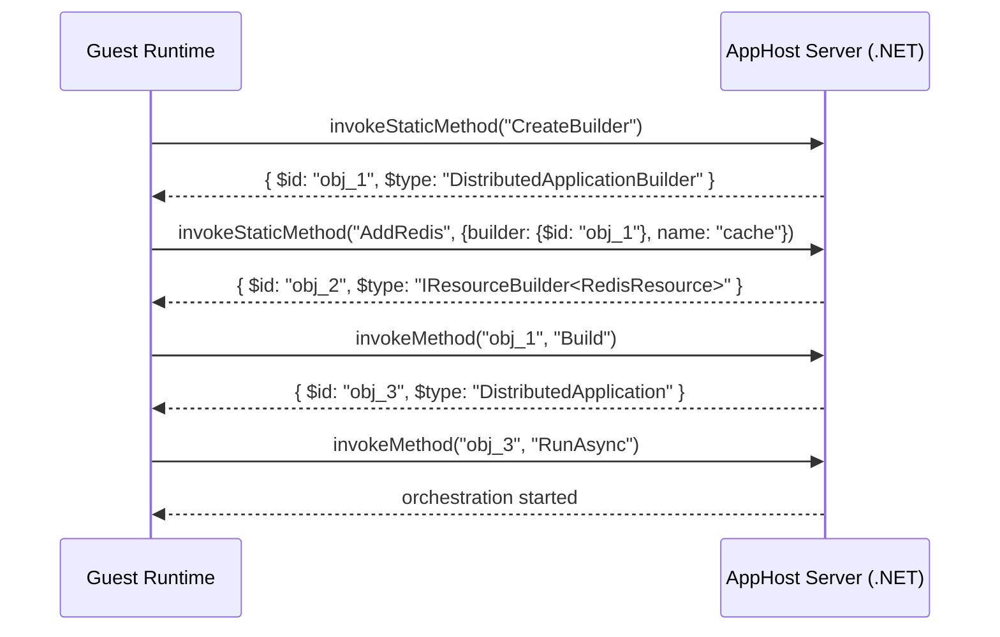
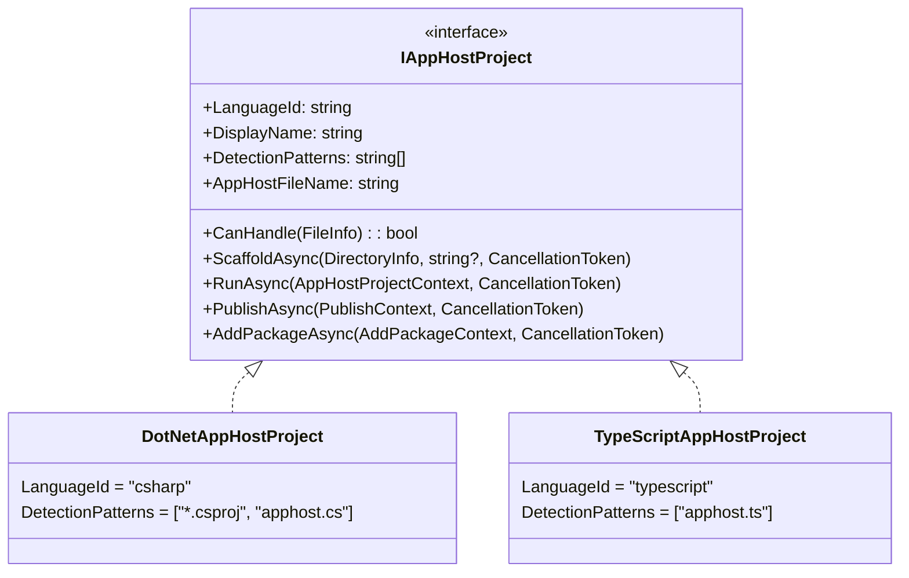

# Polyglot AppHost Support

This document describes how the Aspire CLI supports non-.NET app hosts. Currently, TypeScript is the supported guest language.

## Table of Contents

- [Overview](#overview)
- [Architecture](#architecture)
- [JSON-RPC Protocol](#json-rpc-protocol)
- [Type System and Marshalling](#type-system-and-marshalling)
- [Code Generation](#code-generation)
- [TypeScript Implementation](#typescript-implementation)
- [CLI Integration](#cli-integration)
- [Process Lifecycle](#process-lifecycle)
- [Configuration](#configuration)
- [Adding New Guest Languages](#adding-new-guest-languages)
- [Code Generator Architecture](#code-generator-architecture)
- [Development Mode](#development-mode)
- [Security and Threat Model](#security-and-threat-model)
- [Challenges and Limitations](#challenges-and-limitations)

---

## Overview

The polyglot apphost feature allows developers to write Aspire app hosts in non-.NET languages. The CLI detects the guest language entry point and orchestrates the guest runtime alongside an AppHost server.

**Terminology:**
- **Host (AppHost server)**: The .NET process running Aspire.Hosting
- **Guest**: The non-.NET runtime executing the user's apphost code

**Design Goals:**
1. **Reuse Existing Integrations** - All 100+ Aspire.Hosting.* packages work automatically
2. **Native Language Experience** - Generated SDKs with idiomatic APIs
3. **Consistent CLI Experience** - `aspire run`, `aspire add`, `aspire publish` work identically

---

## Architecture

The CLI scaffolds the AppHost server project that references the required hosting integration packages. Code generation reflects over these assemblies to produce a language-specific SDK. At runtime, the AppHost server uses `Aspire.Hosting.RemoteHost` to expose a JSON-RPC server over Unix domain sockets. The guest connects and sends RPC calls (e.g., `addRedis()`, `withEnvironment()`) which are executed against the real Aspire.Hosting APIs.





### Key Projects

| Project | Purpose |
|---------|---------|
| `Aspire.Hosting.CodeGeneration` | Reflection-based model building from Aspire.Hosting assemblies |
| `Aspire.Hosting.CodeGeneration.<Language>` | Language-specific SDK generator |
| `Aspire.Hosting.RemoteHost` | JSON-RPC server, method dispatcher, object registry |

---

## JSON-RPC Protocol

Communication between the guest and host uses JSON-RPC 2.0 over Unix domain sockets (or named pipes on Windows).

### Protocol Summary

| Method | Direction | Purpose |
|--------|-----------|---------|
| `authenticate` | Guest → Host | Authenticate with server token |
| `ping` | Guest → Host | Health check |
| `createObject` | Guest → Host | Instantiate a .NET type |
| `invokeStaticMethod` | Guest → Host | Call static/extension methods |
| `invokeMethod` | Guest → Host | Call instance methods |
| `getProperty` / `setProperty` | Guest → Host | Instance property access |
| `getStaticProperty` / `setStaticProperty` | Guest → Host | Static property access |
| `getIndexer` / `setIndexer` | Guest → Host | Collection access (list/dictionary) |
| `unregisterObject` | Guest → Host | Release object from registry |
| `createCancellationToken` | Guest → Host | Create a new CancellationToken |
| `cancel` | Guest → Host | Cancel a CancellationToken |
| `invokeCallback` | Host → Guest | Invoke registered callback |

### Design Philosophy: Generic .NET Remoting

The JSON-RPC server in `Aspire.Hosting.RemoteHost` is designed as a **generic .NET remoting layer**. The protocol distinguishes between two categories of method calls:

**Instance Methods** - Operate on a specific object in the registry:

| RPC Method | .NET Concept |
|------------|--------------|
| `invokeMethod` | Call instance method on registered object |
| `getProperty` / `setProperty` | Instance property access |
| `getIndexer` / `setIndexer` | Indexer access (lists, dictionaries) |
| `unregisterObject` | Release object reference |

**Static Methods** - Require assembly + type name (no target instance):

| RPC Method | .NET Concept |
|------------|--------------|
| `createObject` | Instantiate a type via constructor |
| `invokeStaticMethod` | Call static method or extension method |
| `getStaticProperty` / `setStaticProperty` | Static property access |

**Assembly and Type Resolution**

Top-level operations require **separate** `assemblyName` and `typeName` parameters rather than assembly-qualified names. The assembly must be loadable via `Assembly.Load(assemblyName)`:

```json
{
  "assemblyName": "Aspire.Hosting.Redis",
  "typeName": "Aspire.Hosting.Redis.RedisBuilderExtensions"
}
```

This design:
- Keeps JSON payloads readable
- Requires explicit assembly specification (no scanning)
- Works with .NET's standard assembly loading

**Key Insight: Extension Methods are Static Methods**

Extension methods in .NET are syntactic sugar for static method calls. When calling an extension method via `invokeStaticMethod`, the "this" parameter is passed as an argument:

```json
// C#: builder.AddRedis("cache")
// Actually calls: RedisBuilderExtensions.AddRedis(builder, "cache")

// Request
{"jsonrpc":"2.0","id":5,"method":"invokeStaticMethod","params":[
    "Aspire.Hosting.Redis",
    "Aspire.Hosting.Redis.RedisBuilderExtensions",
    "AddRedis",
    {"builder":{"$id":"obj_1"},"name":"cache"}
]}
```

This design means the protocol can invoke **any .NET API** - not just Aspire.Hosting methods. The guest SDK is generated from reflection over the actual .NET assemblies, so new integrations automatically get type-safe APIs without protocol changes.

### Transport Layer

The protocol uses **header-delimited messages** matching the `vscode-jsonrpc` format:

```text
Content-Length: 123\r\n
\r\n
{"jsonrpc":"2.0","id":1,"method":"ping","params":[]}
```

### RPC Methods (Guest → Host)

These methods are called by the guest to interact with the .NET host.

#### `ping`

Health check to verify connection.

| | |
|---|---|
| **Parameters** | None |
| **Returns** | `string` - Always `"pong"` |

```json
// Request
{"jsonrpc":"2.0","id":1,"method":"ping","params":[]}

// Response
{"jsonrpc":"2.0","id":1,"result":"pong"}
```

#### `createObject`

Instantiate a .NET type by calling its constructor.

| | |
|---|---|
| **Parameters** | `assemblyName: string` - Assembly containing the type<br/>`typeName: string` - Fully qualified type name<br/>`args: object?` - Constructor arguments as JSON object |
| **Returns** | `object` - Marshalled object with `$id` for future reference |

```json
// Request
{"jsonrpc":"2.0","id":2,"method":"createObject","params":[
    "Aspire.Hosting",
    "Aspire.Hosting.DistributedApplicationOptions",
    {"Args":["--operation","run"],"ProjectDirectory":"/path/to/project"}
]}

// Response
{"jsonrpc":"2.0","id":2,"result":{"$id":"obj_1","$type":"DistributedApplicationOptions"}}
```

#### `invokeStaticMethod`

Call a static method on a .NET type. This is the primary method for calling extension methods - pass the target object as the first argument.

| | |
|---|---|
| **Parameters** | `assemblyName: string` - Assembly containing the type<br/>`typeName: string` - Fully qualified type name<br/>`methodName: string` - Method name<br/>`args: object?` - Method arguments as JSON object |
| **Returns** | `object?` - Method return value (marshalled) |

```json
// Extension method: builder.AddRedis("cache")
// Request
{"jsonrpc":"2.0","id":3,"method":"invokeStaticMethod","params":[
    "Aspire.Hosting.Redis",
    "Aspire.Hosting.Redis.RedisBuilderExtensions",
    "AddRedis",
    {"builder":{"$id":"obj_1"},"name":"cache"}
]}

// Response
{"jsonrpc":"2.0","id":3,"result":{"$id":"obj_2","$type":"IResourceBuilder<RedisResource>"}}
```

**Generic Method Handling**: When calling generic methods, type arguments are inferred from the actual argument values at runtime. For example, `AddContainer<T>` will infer `T` from the builder type.

#### `invokeMethod`

Call an instance method on a registered object. Use this for true instance methods only (not extension methods).

| | |
|---|---|
| **Parameters** | `objectId: string` - Object ID from registry<br/>`methodName: string` - Method to invoke<br/>`args: object?` - Method arguments as JSON object |
| **Returns** | `object?` - Method return value (marshalled) |

```json
// Request
{"jsonrpc":"2.0","id":4,"method":"invokeMethod","params":["obj_1","Build",null]}

// Response
{"jsonrpc":"2.0","id":4,"result":{"$id":"obj_2","$type":"DistributedApplication"}}
```

#### `getProperty` / `setProperty`

Get or set a property value on a registered object.

```json
// Get property
{"jsonrpc":"2.0","id":5,"method":"getProperty","params":["obj_1","Name"]}

// Set property
{"jsonrpc":"2.0","id":6,"method":"setProperty","params":["obj_1","Name","new-cache"]}
```

#### `getIndexer` / `setIndexer`

Get or set an indexed value from a collection (list or dictionary).

```json
// Get from dictionary
{"jsonrpc":"2.0","id":7,"method":"getIndexer","params":["obj_1","REDIS_URL"]}

// Get from list
{"jsonrpc":"2.0","id":8,"method":"getIndexer","params":["obj_2",0]}

// Set value
{"jsonrpc":"2.0","id":9,"method":"setIndexer","params":["obj_1","MY_VAR","my-value"]}
```

#### `getStaticProperty` / `setStaticProperty`

Get or set a static property value on a .NET type.

```json
// Get static property
{"jsonrpc":"2.0","id":10,"method":"getStaticProperty","params":[
    "Aspire.Hosting",
    "Aspire.Hosting.SomeType",
    "StaticProperty"
]}

// Set static property
{"jsonrpc":"2.0","id":11,"method":"setStaticProperty","params":[
    "Aspire.Hosting",
    "Aspire.Hosting.SomeType",
    "StaticProperty",
    "new-value"
]}
```

#### `unregisterObject`

Release an object from the registry when no longer needed.

```json
{"jsonrpc":"2.0","id":12,"method":"unregisterObject","params":["obj_1"]}
```

#### `createCancellationToken`

Create a new CancellationToken that can be passed to host methods. This allows the guest to create cancellation tokens and pass them to methods that accept `CancellationToken` parameters, then cancel them later.

| | |
|---|---|
| **Parameters** | None |
| **Returns** | `{ "$cancellationToken": "ct_N" }` - Token reference |

```json
// Request
{"jsonrpc":"2.0","id":13,"method":"createCancellationToken","params":[]}

// Response
{"jsonrpc":"2.0","id":13,"result":{"$cancellationToken":"ct_1"}}
```

**Use Case:** When calling a method like `RunAsync` that accepts a `CancellationToken`, the guest can create a token, pass it to the method, and later cancel it to gracefully shut down the operation.

#### `cancel`

Cancel a CancellationToken that was created by the guest or passed to the guest via a callback. When the host invokes a callback with a CancellationToken parameter, the token is marshalled as `{ "$cancellationToken": "ct_N" }`. The guest can call this method to signal cancellation back to the host.

| | |
|---|---|
| **Parameters** | `cancellationTokenId: string` - Token ID (e.g., `"ct_1"`) |
| **Returns** | `boolean` - `true` if token was found and cancelled, `false` if not found |

```json
// Request
{"jsonrpc":"2.0","id":13,"method":"cancel","params":["ct_1"]}

// Response
{"jsonrpc":"2.0","id":13,"result":true}
```

**Use Case:** Methods like `WithHealthCheck` pass a CancellationToken to the callback. If the guest needs to abort the operation early (e.g., health check taking too long), it can call `cancel` with the token ID.

### RPC Methods (Host → Guest)

#### `invokeCallback`

Invoke a callback function that was registered by the guest.

| | |
|---|---|
| **Parameters** | `callbackId: string` - Callback ID (e.g., `"callback_1_1234567890"`)<br/>`args: object?` - Arguments to pass to callback |
| **Returns** | `object?` - Callback return value |
| **Timeout** | 60 seconds |

```json
// Request (Host → Guest)
{"jsonrpc":"2.0","id":100,"method":"invokeCallback","params":[
    "callback_1_1234567890",
    {"$id":"obj_5","$type":"EnvironmentCallbackContext"}
]}

// Response (Guest → Host)
{"jsonrpc":"2.0","id":100,"result":null}
```

### Callback Mechanism

Callbacks allow the host to invoke guest functions during method execution (e.g., `withEnvironment` callbacks):

1. Guest registers a callback function with a unique ID (e.g., `callback_1_1234567890`)
2. Guest passes the callback ID as an argument to an RPC method call
3. Host executes the method, which invokes the callback
4. Host sends `invokeCallback` request to guest with the callback ID and args
5. Guest executes the callback and returns the result

### CancellationToken Support

CancellationTokens are supported in two directions:

1. **Host → Guest (callbacks)**: When the host invokes a callback with a `CancellationToken` parameter
2. **Guest → Host (method calls)**: When the guest needs to pass a cancellable token to a host method

#### Scenario 1: Callbacks with CancellationToken

When a .NET method passes a `CancellationToken` to a callback, the token is marshalled as a proxy that the guest can use to observe or trigger cancellation.

**How it works:**

1. Host invokes callback with a `CancellationToken` parameter
2. Host creates a linked `CancellationTokenSource` and registers it with a unique ID (e.g., `ct_1`)
3. Token is marshalled as `{ "$cancellationToken": "ct_1" }` and sent to guest
4. Guest can call `cancel("ct_1")` to signal cancellation
5. The linked CTS is cancelled, which propagates to any operations observing it

**Linked Token Behavior:**

The marshalled token is *linked* to the original .NET token:
- If the .NET token is cancelled (e.g., host shutdown), the linked token is also cancelled
- If the guest calls `cancel`, the linked token is cancelled (but the original .NET token is not affected)

```json
// Callback invocation with CancellationToken
// Host → Guest
{
  "method": "invokeCallback",
  "params": ["callback_1", {
    "arg1": {"$id": "obj_5", "$type": "HealthCheckContext"},
    "arg2": {"$cancellationToken": "ct_1"}
  }]
}

// Guest cancels the token
// Guest → Host
{"method": "cancel", "params": ["ct_1"]}
```

**Common patterns:**
- `WithHealthCheck(Func<HealthCheckContext, CancellationToken, Task>)` - Guest receives token to abort long-running health checks
- `WithCommand(Func<ExecuteCommandContext, CancellationToken, Task>)` - Guest receives token to cancel custom commands

#### Scenario 2: Guest-Created CancellationTokens

The guest can create its own CancellationTokens and pass them to host methods. This is useful for methods that accept `CancellationToken` parameters.

**How it works:**

1. Guest calls `createCancellationToken()` to get a token reference
2. Guest passes the token reference to a method call
3. Host deserializes the token reference and retrieves the actual `CancellationToken`
4. Guest can later call `cancel("ct_N")` to cancel the operation

```json
// 1. Create a cancellation token
// Guest → Host
{"jsonrpc":"2.0","id":1,"method":"createCancellationToken","params":[]}
// Response
{"jsonrpc":"2.0","id":1,"result":{"$cancellationToken":"ct_1"}}

// 2. Pass the token to a method (e.g., RunAsync)
// Guest → Host
{
  "method": "invokeMethod",
  "params": ["obj_app", "RunAsync", {
    "cancellationToken": {"$cancellationToken": "ct_1"}
  }]
}

// 3. Later, cancel the operation
// Guest → Host
{"jsonrpc":"2.0","id":3,"method":"cancel","params":["ct_1"]}
```

**Use Cases:**
- `RunAsync(CancellationToken)` - Gracefully shut down the application
- Any async method that supports cancellation

### Error Responses

Errors follow the JSON-RPC 2.0 error format:

```json
{
  "jsonrpc": "2.0",
  "error": {
    "code": -32000,
    "message": "Object 'obj_999' not found in registry"
  },
  "id": 1
}
```

| Code | Description |
|------|-------------|
| -32700 | Parse error |
| -32600 | Invalid request |
| -32601 | Method not found |
| -32602 | Invalid params |
| -32603 | Internal error |
| -32000 | Server error (object not found, method not found, etc.) |

### JSON Value Shape Summary

**Input Values (Guest → Host)**

| Type | JSON Shape | Example |
|------|------------|---------|
| Primitive | raw value | `"hello"`, `42`, `true` |
| Object ref | `{ "$id": "..." }` | `{ "$id": "obj_1" }` |
| Ref expression | `{ "$referenceExpression": true, "format": "..." }` | `{ "$referenceExpression": true, "format": "Host={obj_1}" }` |
| Callback | string | `"cb_001"` |
| Complex object | JSON object | `{ "Name": "test", "Port": 80 }` |

**Output Values (Host → Guest)**

| Type | JSON Shape | Example |
|------|------------|---------|
| Null | `null` | `null` |
| Primitive | raw value | `"hello"`, `42`, `true` |
| Primitive array/list | `[...]` | `[1, 2, 3]`, `["a", "b"]` |
| Primitive dictionary | `{...}` | `{"key": "value", "count": 42}` |
| Complex object | `{ "$id": "...", "$type": "..." }` | `{ "$id": "obj_1", "$type": "MyType" }` |
| CancellationToken | `{ "$cancellationToken": "..." }` | `{ "$cancellationToken": "ct_1" }` |

---

## Type System and Marshalling

The polyglot architecture bridges two type systems: the host (.NET) and the guest.

### Design Principles

1. **Primitives pass directly**: Strings, numbers, booleans serialize as JSON primitives
2. **Primitive collections pass directly**: Arrays/lists of primitives become JSON arrays; string-keyed dictionaries of primitives become JSON objects
3. **Complex objects become proxies**: Non-primitive types are registered in the host and accessed via JSON-RPC calls
4. **Callbacks are bidirectional**: Guest can register callbacks that the host invokes

### Simple Types (Primitives)

The following .NET types are considered "simple" and serialize directly to JSON values without object registry:

| Category | .NET Types |
|----------|------------|
| Strings | `string`, `char` |
| Signed integers | `sbyte`, `short`, `int`, `long` |
| Unsigned integers | `byte`, `ushort`, `uint`, `ulong` |
| Floating point | `float`, `double`, `decimal` |
| Boolean | `bool` |
| Date/Time | `DateTime`, `DateTimeOffset`, `TimeSpan`, `DateOnly`, `TimeOnly` |
| Identifiers | `Guid`, `Uri` |
| Enums | Any `enum` type |
| Nullable | `T?` where T is any of the above |

**Special cases:**
- `byte[]` serializes as a **base64-encoded string**, not a JSON array
- Collections of simple types (`T[]`, `List<T>`, `Dictionary<string, T>`) serialize directly

### Unsupported Types

The following types **cannot** be marshalled and will throw `NotSupportedException`:

| Type | Reason |
|------|--------|
| `Span<T>`, `ReadOnlySpan<T>` | Ref structs cannot be boxed |
| `Memory<T>`, `ReadOnlyMemory<T>` | Use `byte[]` with base64 instead |
| `IAsyncEnumerable<T>` | Streaming not supported |
| Pointers (`int*`, `void*`) | Cannot serialize pointers |
| By-ref types (`ref`, `out`, `in`) | Cannot serialize by-reference |
| Unawaited `Task`/`ValueTask` | Must await before returning |

### Object Registry

The `ObjectRegistry` in the host maintains a `ConcurrentDictionary<string, object>` mapping unique IDs to live .NET objects. When a complex object needs to be returned to the guest:

1. Object is registered with a unique ID (e.g., `obj_1`, `obj_2`)
2. A marshalled representation is sent: `{ $id, $type, ...properties }`
3. Guest wraps this in a proxy class
4. Subsequent operations use the `$id` to reference the object in the host

### Marshalled Object Format

```json
{
    "$id": "obj_1",
    "$type": "RedisResource",
    "Name": "cache"
}
```

### Type Mappings

#### Guest → Host (Input Deserialization)

Input values are deserialized based on the target parameter type and the JSON shape:

| JSON Shape | Target Type | Handling |
|------------|-------------|----------|
| Primitives (`"hello"`, `42`, `true`) | Simple types | Direct conversion |
| `null` | Any nullable | Returns `null` |
| `{ "$id": "obj_N" }` | Any | **Reference**: Lookup in ObjectRegistry |
| `{ "$referenceExpression": true, "format": "..." }` | `ReferenceExpression` | Parsed and reconstructed |
| `"callback_id"` | Delegate type | **Callback**: Creates proxy delegate |
| `[...]` | `T[]`, `List<T>`, etc. | Array/list deserialization |
| `{...}` (no `$id`) | POCO class | **POCO**: Deserialized via `JsonSerializer` |

**POCO Deserialization**: When a JSON object without `$id` is passed to a parameter expecting a class type, it is deserialized using `System.Text.Json`. The target type must have:
- A public constructor (parameterless or with matching parameter names)
- Public settable properties matching the JSON keys

```json
// Example: createObject with POCO argument
{
  "method": "createObject",
  "params": [
    "Aspire.Hosting",
    "Aspire.Hosting.DistributedApplicationOptions",
    {
      "Args": ["--operation", "run"],
      "ProjectDirectory": "/path/to/project"
    }
  ]
}
```

The third parameter is a **POCO** - its properties are copied into a new `DistributedApplicationOptions` instance.

#### Host → Guest (Output Marshalling)

Output values are marshalled based on the .NET type. **There is an important asymmetry**: complex objects are NOT serialized as POCOs on output - they become references.

| .NET Type | JSON Output | Notes |
|-----------|-------------|-------|
| Primitives (`string`, `int`, `bool`, etc.) | raw value | Direct JSON primitive |
| `DateTime`, `DateTimeOffset`, `TimeSpan` | string | ISO 8601 / duration format |
| `DateOnly`, `TimeOnly` | string | Date/time format |
| `Guid`, `Uri` | string | String representation |
| Enums | string | Enum name (e.g., `"Wednesday"`) |
| `byte[]` | string | Base64-encoded |
| `T[]`, `List<T>` (primitive T) | `[...]` | JSON array of primitives |
| `Dictionary<string, T>` (primitive T) | `{...}` | JSON object (no `$id`/`$type`) |
| **All other objects** | `{ "$id", "$type" }` | **Reference**: Registered in ObjectRegistry |

**Key Distinction - POCOs vs References**:
- **Input (Guest → Host)**: JSON objects can be POCOs (deserialized, properties copied)
- **Output (Host → Guest)**: Complex objects are ALWAYS references (registered, not serialized)

This means if you pass a POCO in, you get a **copy**. If a method returns an object, you get a **reference** to the live .NET object.

### Input Deserialization Examples

The following examples show how different JSON inputs are deserialized based on the target .NET parameter type:

| JSON Input | Target Type | Result |
|------------|-------------|--------|
| `42` | `int` | Primitive: `42` |
| `"hello"` | `string` | Primitive: `"hello"` |
| `true` | `bool` | Primitive: `true` |
| `"Friday"` | `DayOfWeek` | Enum: `DayOfWeek.Friday` |
| `"SGVsbG8="` | `byte[]` | Base64 decoded: `[72, 101, 108, 108, 111]` |
| `{"$id": "obj_1"}` | `IResourceBuilder<T>` | **Reference**: Lookup `obj_1` in registry |
| `{"$id": "obj_1"}` | `DistributedApplicationBuilder` | **Reference**: Lookup `obj_1` in registry |
| `"cb_123"` | `Action<T>` | **Callback**: Create proxy delegate |
| `"cb_123"` | `Func<Task>` | **Callback**: Create proxy delegate |
| `{"$referenceExpression": true, "format": "redis://{obj_1}"}` | `ReferenceExpression` | **ReferenceExpression**: Parse and reconstruct |
| `[1, 2, 3]` | `int[]` | Array: `[1, 2, 3]` |
| `[1, 2, 3]` | `List<int>` | List: `[1, 2, 3]` |
| `{"Name": "test", "Port": 6379}` | `MyOptions` | **POCO**: Deserialize to new `MyOptions` instance |
| `{"Args": ["--run"], "Dir": "/app"}` | `AppOptions` | **POCO**: Deserialize to new `AppOptions` instance |

**How POCO vs Reference is determined**:

1. If JSON has `"$id"` property → **Reference** (lookup in ObjectRegistry)
2. If target type is delegate and JSON is string → **Callback**
3. If target type is `ReferenceExpression` and JSON has `"$referenceExpression"` → **ReferenceExpression**
4. If JSON is primitive value and target is simple type → **Primitive**
5. If JSON is array and target is array/list → **Array**
6. Otherwise → **POCO** (falls through to `JsonSerializer.Deserialize`)

**POCO Requirements**: The target type must be deserializable by `System.Text.Json`:
- Public parameterless constructor OR constructor with matching parameter names
- Public settable properties (or `init` properties)
- Property names match JSON keys (case-insensitive by default)

### Unsupported Input Types (POCO Validation)

The following types **cannot** be deserialized as POCOs and will throw `NotSupportedException` with a helpful message suggesting to use `{$id}` references instead:

| Type Category | Example | Error Message |
|---------------|---------|---------------|
| Interfaces | `IResourceBuilder<T>`, `IDistributedApplicationBuilder` | "Cannot deserialize JSON to interface type. Did you mean to pass an object reference?" |
| Abstract classes | `Resource`, `ContainerResource` | "Cannot deserialize JSON to abstract type. Did you mean to pass an object reference?" |
| Open generics | `List<>` (without type argument) | "Cannot deserialize JSON to open generic type." |
| Delegate types | `Action<T>`, `Func<Task>` | "Cannot deserialize JSON to delegate type. Pass a callback ID string instead." |
| Reflection types | `Type`, `MethodInfo`, `Assembly` | "Cannot deserialize JSON to reflection type." |
| Types without constructors | Classes with only private constructors | "Cannot deserialize JSON to type - no public constructors." |

**Example Error Scenario**:
```json
// WRONG: Passing JSON object to interface parameter
{"method": "invokeMethod", "params": ["obj_1", "WithReference", {"builder": {"Name": "test"}}]}
// Error: Cannot deserialize JSON to interface type 'IResourceBuilder`1'.
//        Did you mean to pass an object reference? Use {"$id": "obj_N"} format.

// CORRECT: Pass object reference
{"method": "invokeMethod", "params": ["obj_1", "WithReference", {"builder": {"$id": "obj_2"}}]}
```

**Output Examples:**

```json
// Primitive string
"hello"

// Primitive number
42

// byte[] as base64 string
"SGVsbG8gV29ybGQh"

// Array of integers (int[])
[1, 2, 3, 4, 5]

// List of strings (List<string>)
["alpha", "beta", "gamma"]

// Dictionary with string keys and primitive values (Dictionary<string, int>)
{"one": 1, "two": 2, "three": 3}

// Complex object (registered in ObjectRegistry)
{"$id": "obj_5", "$type": "IResourceBuilder<RedisResource>"}
```

### ReferenceExpression

`ReferenceExpression` allows building connection strings that reference host objects:

```json
{ "$referenceExpression": true, "format": "redis://{obj_4}" }
```

The format string contains `{$id}` placeholders. The host reconstructs the expression using object registry lookups.

### Argument Deserialization

When the host receives method arguments from the guest, they are deserialized according to the following rules (processed in order of precedence):

#### 1. Object References

**Pattern**: `{"$id": "<object_id>"}`

Looks up the object in the ObjectRegistry and returns the actual .NET instance.

```json
{ "builder": {"$id": "obj_1"} }
```

#### 2. ReferenceExpression

**Pattern**: `{"$referenceExpression": true, "format": "..."}`

Only applies when target type is `ReferenceExpression`. Parses format string for `{obj_N}` placeholders and reconstructs the expression.

```json
{ "connectionString": {"$referenceExpression": true, "format": "Server={obj_1};Port={obj_2}"} }
```

#### 3. Null

**Pattern**: `null`

Returns `null` for any nullable target type.

#### 4. Callback References

**Pattern**: `"<callback_id>"` (string value when target type is a delegate)

Creates a proxy delegate that invokes the guest callback via `invokeCallback`. Supports any delegate signature.

```json
{ "onReady": "callback_123" }
```

#### 5. Primitives

| Target Type | JSON Type | Example |
|-------------|-----------|---------|
| `string` | string | `"hello"` |
| `int`, `int?` | number | `42` |
| `long`, `long?` | number | `9999999999` |
| `double`, `double?` | number | `3.14` |
| `bool`, `bool?` | boolean | `true` |

#### 6. Arrays

**Pattern**: `[...]` (when target type is `T[]`)

Recursively deserializes each element using these same rules.

```json
{ "ports": [80, 443, 8080] }
{ "services": [{"$id": "obj_1"}, {"$id": "obj_2"}] }
```

#### 7. Complex Objects (Fallback)

Any JSON object not matching above patterns is deserialized using `System.Text.Json.JsonSerializer`.

```json
{ "options": {"name": "my-service", "replicas": 3} }
```

### Method Resolution

When multiple method overloads exist, the host selects the best match by scoring:

- **+10** for each argument name that matches a parameter name
- **-100** for each required parameter without a matching argument

Tie-breaker: Prefer methods with fewer parameters.

**Example**: Given `args: {"name": "test"}` and overloads:

| Overload | Score | Reason |
|----------|-------|--------|
| `Method(string name)` | **10** | name matches, no missing required |
| `Method(int value)` | -100 | value required but missing |
| `Method(string name, int value)` | -90 | name matches (+10), value missing (-100) |

Parameter name matching is **case-insensitive**.

---

## Code Generation

The CLI generates language-specific SDK code that provides type-safe APIs with instance methods for all Aspire integrations.

### Generation Trigger

Code generation runs automatically when:

1. **First Run**: SDK folder doesn't exist
2. **Package Changes**: Hash of package references has changed
3. **After `aspire add`**: When adding new integrations
4. **Development Mode**: When `ASPIRE_REPO_ROOT` is set

### What Gets Generated

For each Aspire integration, the generator creates:

1. **Builder methods** on `DistributedApplicationBuilder`
2. **Resource-specific builder classes** with fluent methods
3. **Proxy wrapper classes** for callback contexts and model types

---

## TypeScript Implementation

This section covers TypeScript-specific details for the polyglot apphost feature.

### Generated File Structure

```text
.modules/
├── .codegen-hash              # SHA256 hash of package references
├── distributed-application.ts # Main SDK with builder classes
├── types.ts                   # Type definitions for RPC communication
└── RemoteAppHostClient.ts     # JSON-RPC client implementation
```

### Base Proxy Classes

**`DotNetProxy`** - Foundation for all remote object access:
```typescript
class DotNetProxy {
    readonly $id: string;
    readonly $type: string;

    async invokeMethod(name: string, args?: Record<string, unknown>): Promise<unknown>;
    async getProperty(name: string): Promise<unknown>;
    async setProperty(name: string, value: unknown): Promise<void>;
    async getIndexer(key: string | number): Promise<unknown>;
    async setIndexer(key: string | number, value: unknown): Promise<void>;
    async dispose(): Promise<void>;
}
```

**`ListProxy<T>`** - For `IList<T>` operations:
```typescript
class ListProxy<T> {
    async add(item: T): Promise<void>;
    async get(index: number): Promise<T>;
    async set(index: number, value: T): Promise<void>;
    async count(): Promise<number>;
    async clear(): Promise<void>;
    async contains(item: T): Promise<boolean>;
    async remove(item: T): Promise<boolean>;
    async removeAt(index: number): Promise<void>;
    async insert(index: number, item: T): Promise<void>;
    async dispose(): Promise<void>;
}
```

### Generated Proxy Wrappers

The code generator produces typed proxy wrapper classes for common .NET types like `IConfiguration`, `IHostEnvironment`, and `IServiceProvider`. These provide typed access to .NET objects and wrap the underlying `DotNetProxy`:

```typescript
class ConfigurationProxy {
    private _proxy: DotNetProxy;
    get proxy(): DotNetProxy { return this._proxy; }

    async get(key: string): Promise<string | null>;
    async getSection(key: string): Promise<ConfigurationProxy>;
    async getConnectionString(name: string): Promise<string | null>;
}
```

### ReferenceExpression Support

The `refExpr` tagged template literal creates reference expressions:

```typescript
const endpoint = await redis.getEndpoint("tcp");
const expr = refExpr`redis://${endpoint}`;
// Serializes as: { $referenceExpression: true, format: "redis://{obj_4}" }
```

### Example Usage

```typescript
// apphost.ts
import { createBuilder } from './.modules/distributed-application.js';

const builder = await createBuilder();

const redis = await builder.addRedis('cache');
const postgres = await builder.addPostgres('db');

const api = await builder.addProject('api', '../Api/Api.csproj')
    .withReference(redis)
    .withReference(postgres);

const app = builder.build();
await app.run();
```

---

## CLI Integration

The CLI uses the `IAppHostProject` interface as the **single extension point** for language support. Each language implements this interface, which handles identity, detection, creation, and execution concerns.



### CLI Command Mapping

| CLI Command | IAppHostProject Method | Description |
|-------------|------------------------|-------------|
| `aspire init` | `ScaffoldAsync` | Create apphost in current directory |
| `aspire new` | `ScaffoldAsync` | Create new project with apphost |
| `aspire run` | `RunAsync` | Build and run in development mode |
| `aspire publish` / `deploy` | `PublishAsync` | Build and run in publish mode |
| `aspire add` | `AddPackageAsync` | Add an integration package |

### Execution Model

For polyglot app hosts, `RunAsync` and `PublishAsync` follow the same pattern:

1. **Start the AppHost server** - A .NET process running Aspire.Hosting that exposes a JSON-RPC server
2. **Start the guest** - The guest language process that connects via JSON-RPC
3. **Guest defines resources** - Via RPC calls like `addRedis()`, `addPostgres()`
4. **Guest calls `run()`** - Triggers orchestration (run mode) or pipeline execution (publish mode)

In **run mode**, the AppHost server runs until interrupted (Ctrl+C). In **publish mode**, it exits when the pipeline completes.

---

## Process Lifecycle

### Startup Sequence

1. **Detection**: `ProjectLocator` finds the guest entry point
2. **AppHost Server Preparation**:
   - CLI scaffolds a .NET project in `$TMPDIR/.aspire/hosts/<hash>/`
   - References `Aspire.AppHost.Sdk` and required hosting packages
   - Builds the project with `dotnet build`
3. **Code Generation**:
   - Loads assemblies from build output using `AssemblyLoaderContext`
   - Builds `ApplicationModel` via reflection on loaded assemblies
   - Generates SDK into language-specific output folder
4. **Host Launch**: AppHost server started via `dotnet exec` with:
   - `REMOTE_APP_HOST_SOCKET_PATH` - Unix domain socket path for JSON-RPC
   - `REMOTE_APP_HOST_PID` - CLI process ID for orphan detection
5. **Guest Launch**: Guest runtime started with the entry point
6. **Connection**: Guest connects to host over Unix domain socket

### Shutdown Scenarios

| Scenario | Trigger | Behavior |
|----------|---------|----------|
| **Normal Exit** | User presses Ctrl+C | CLI terminates AppHost server gracefully |
| **Guest Completes** | Guest finishes (publish mode) | AppHost server completes and exits |
| **CLI Crash** | CLI process dies | `OrphanDetector` terminates AppHost server |
| **AppHost Crash** | AppHost server dies | Guest detects connection loss and exits |
| **Guest Crash** | Guest process dies | AppHost server detects disconnect |

The `OrphanDetector` prevents zombie processes by monitoring the CLI's PID (passed via `REMOTE_APP_HOST_PID`) and terminating if the parent dies.

---

## Configuration

### apphost.run.json

Launch settings for the app host, similar to `launchSettings.json` in .NET projects:

```json
{
  "profiles": {
    "https": {
      "applicationUrl": "https://localhost:17193;http://localhost:15069",
      "environmentVariables": {
        "ASPNETCORE_ENVIRONMENT": "Development",
        "DOTNET_ENVIRONMENT": "Development"
      }
    }
  }
}
```

### .aspire/settings.json

Integration package references for polyglot app hosts:

```json
{
  "packages": {
    "Aspire.Hosting.Redis": "<version>",
    "Aspire.Hosting.PostgreSQL": "<version>"
  }
}
```

When you run `aspire add`, the CLI updates this file and regenerates the SDK.

---

## Adding New Guest Languages

The polyglot architecture supports additional languages. The host-side infrastructure (`Aspire.Hosting.RemoteHost`) is language-agnostic—only code generation and CLI integration are language-specific.

**Adding a new language requires:**
1. Implement `IAppHostProject` interface
2. Create a code generator in `Aspire.Hosting.CodeGeneration.<Language>`
3. Implement a JSON-RPC client for the guest runtime

### Components to Implement

| Component | Location | Purpose |
|-----------|----------|---------|
| AppHost Project | `Aspire.Cli/Projects/<Language>AppHostProject.cs` | Implement `IAppHostProject` |
| Code Generator | `Aspire.Hosting.CodeGeneration.<Language>` | Generate idiomatic SDK |
| Runtime Client | Embedded or generated | JSON-RPC client with proxy classes |

### Runtime Client Requirements

The guest language needs a JSON-RPC client that:
1. Connects to Unix domain socket (path from `REMOTE_APP_HOST_SOCKET_PATH`)
2. Implements `vscode-jsonrpc` header-delimited message format
3. Handles `invokeCallback` requests from host
4. Wraps marshalled objects (`$id`, `$type`) in proxy classes

### Reusable Infrastructure

These components work unchanged for any guest language:
- `Aspire.Hosting.RemoteHost` - JSON-RPC server, method dispatcher, object registry
- `Aspire.Hosting.CodeGeneration` - Reflection-based model building
- AppHost server scaffolding and build process

---

## Code Generator Architecture

The code generation system uses a **visitor pattern** with a shared base class that handles language-agnostic concerns, allowing new guest languages to be added with minimal effort.

### CodeGeneratorVisitor Base Class

`CodeGeneratorVisitor` in `Aspire.Hosting.CodeGeneration` provides shared logic:

| Concern | What the Base Class Handles |
|---------|----------------------------|
| **Type Discovery** | Queue-based traversal of all referenced types |
| **Overload Disambiguation** | Generates unique names (`add`, `add2`, `add3`) for overloaded methods |
| **Delegate Detection** | Identifies `Action<T>`, `Func<T>` parameters for callback generation |
| **Collection Handling** | Detects `IList<T>`, `IDictionary<K,V>`, nullable types |
| **Two-Phase Emission** | Discovery phase then emission phase (prevents forward reference issues) |

Language implementations override abstract methods for syntax-specific concerns:

```csharp
public abstract class CodeGeneratorVisitor : ICodeGenerator
{
    // Language implementations override these
    protected abstract string FormatType(RoType type);           // string vs str
    protected abstract string FormatMethodName(string name);     // camelCase vs snake_case
    protected abstract void EmitMethod(...);                     // Syntax emission
    protected abstract void EmitProxyClass(...);                 // Class structure
}
```

### TypeScript Implementation

`TypeScriptCodeGenerator` extends the base visitor with TypeScript-specific formatting:

| Base Class Method | TypeScript Override |
|-------------------|---------------------|
| `FormatType(string)` | `"string"` |
| `FormatType(int)` | `"number"` |
| `FormatMethodName("AddRedis")` | `"addRedis"` (camelCase) |
| `EmitProxyClass` | `class FooProxy { ... }` with braces |

### Adding a New Language (Example: Python)

To add Python support, create `PythonCodeGenerator : CodeGeneratorVisitor`:

```csharp
public class PythonCodeGenerator : CodeGeneratorVisitor
{
    protected override string FormatType(RoType type)
    {
        if (type == typeof(string)) return "str";
        if (type == typeof(int)) return "int";
        if (type == typeof(bool)) return "bool";
        return "Any";
    }

    protected override string FormatMethodName(string name) =>
        ToSnakeCase(name);  // add_redis instead of addRedis

    protected override void EmitProxyClass(string name, ...)
    {
        Writer.WriteLine($"class {name}:");
        Writer.WriteLine($"    def __init__(self, proxy):");
        // ... indentation-based syntax
    }
}
```

The base class handles all the complex logic (type traversal, overload resolution, callback detection), so a new language implementation is primarily formatting and syntax.

### Thenable Pattern for Fluent Async

The TypeScript generator produces `*ProxyPromise` wrapper classes that enable fluent async chaining. This pattern can be adapted to other languages with similar async models:

```typescript
// Without thenable pattern (multiple awaits):
const env = await builder.getEnvironment();
const name = await env.getEnvironmentName();

// With thenable pattern (single await, fluent chain):
const name = await builder.getEnvironment().getEnvironmentName();
```

The pattern wraps a `Promise<Proxy>` and forwards method calls through the promise:

```typescript
class EnvironmentProxyPromise implements PromiseLike<EnvironmentProxy> {
  constructor(private _promise: Promise<EnvironmentProxy>) {}

  // PromiseLike implementation
  then<T1, T2>(onFulfilled?, onRejected?): PromiseLike<T1 | T2> {
    return this._promise.then(onFulfilled, onRejected);
  }

  // Fluent method - chains through the promise
  getEnvironmentName(): Promise<string> {
    return this._promise.then(p => p.getEnvironmentName());
  }
}
```

---

## Development Mode

Set `ASPIRE_REPO_ROOT` to your local Aspire repository for development:

```bash
export ASPIRE_REPO_ROOT=/path/to/aspire
```

This:
- Skips SDK caching (always regenerates)
- Uses local build artifacts from `artifacts/bin/` instead of NuGet packages

---

## Security and Threat Model

This section describes the security considerations for the polyglot apphost feature.

### Deployment Model

**Critical Context:** Both the guest runtime and the AppHost server run locally on the same machine, started by the same CLI process. This is **not** a remote execution scenario.

```
┌─────────────────────────────────────────────────────────────┐
│                     Local Machine                            │
│  ┌─────────────────┐         ┌─────────────────────────┐    │
│  │  Guest Runtime  │◄───────►│  AppHost Server (.NET)  │    │
│  │  (Node.js, etc) │  UDS    │                         │    │
│  └─────────────────┘         └─────────────────────────┘    │
│          ▲                              ▲                    │
│          │ spawns                       │ spawns             │
│          └──────────┬───────────────────┘                    │
│                     │                                        │
│              ┌──────┴──────┐                                 │
│              │  Aspire CLI │                                 │
│              └─────────────┘                                 │
└─────────────────────────────────────────────────────────────┘
```

### Trust Boundaries

| Boundary | Description |
|----------|-------------|
| **CLI → Processes** | CLI spawns both guest and host; controls their environment |
| **Guest ↔ Host** | Unix domain socket; mutual trust assumed |
| **Socket File** | File system permissions control access |
| **Guest Dependencies** | npm/pip packages are third-party code |

### Threat Actors

| Actor | Description | Motivation |
|-------|-------------|------------|
| **Malicious Dependency** | Compromised npm/pip package in user's project | Data theft, cryptomining, lateral movement |
| **Local Attacker** | Another process/user on the same machine | Hijack socket, inject commands |
| **Compromised Guest Runtime** | Exploited vulnerability in Node.js/Python | Arbitrary code execution |
| **Malicious User Code** | User intentionally writes malicious apphost | N/A (user is attacking themselves) |

**Note:** "Malicious user code" is not a meaningful threat - if the user wants to run malicious code, they can do so directly without using Aspire. The real threats are supply chain attacks and local privilege escalation.

### Attack Vectors

#### 1. Supply Chain Attack (npm/pip packages)

**Threat:** A malicious package in `node_modules` or Python venv gains access to the RPC protocol and invokes dangerous .NET APIs.

**Attack Path:**
```
Malicious npm package
    → Reads ASPIRE_RPC_SOCKET environment variable
    → Connects to Unix domain socket
    → Invokes: invokeStaticMethod("System.IO.File", "ReadAllText", {path: "/etc/passwd"})
    → Exfiltrates data
```

**Dangerous APIs accessible today:**
- `System.IO.File.*` - Read/write arbitrary files
- `System.Diagnostics.Process.Start` - Execute arbitrary commands
- `System.Environment.GetEnvironmentVariable` - Read secrets
- `System.Reflection.*` - Load and execute arbitrary code
- `System.Net.Http.HttpClient` - Exfiltrate data

#### 2. Socket Hijacking

**Threat:** Another process on the machine connects to the Unix domain socket.

**Attack Path:**
```
Attacker process
    → Enumerates /tmp/.aspire/ or watches for socket creation
    → Connects to socket before/after legitimate guest
    → Sends malicious RPC commands
```

#### 3. Object Registry Pollution

**Threat:** Attacker creates objects that persist beyond their intended lifecycle.

**Attack Path:**
```
Attacker
    → Creates thousands of large objects via createObject
    → Never calls unregisterObject
    → Host process runs out of memory (DoS)
```

#### 4. Callback Injection

**Threat:** Attacker registers callbacks that execute malicious code when invoked.

**Attack Path:**
```
Attacker
    → Registers callback that looks legitimate
    → Callback exfiltrates data passed to it (e.g., HealthCheckContext)
```

### Current Mitigations

| Mitigation | Description | Effectiveness |
|------------|-------------|---------------|
| **Unix Domain Socket** | No network exposure; local-only | ✅ Strong |
| **Same-user execution** | Guest and host run as same user | ⚠️ Partial |
| **Socket in temp directory** | Not in predictable location | ⚠️ Weak (discoverable) |
| **CLI controls lifecycle** | Socket only exists during `aspire run` | ⚠️ Partial |

### Implemented Mitigations

#### M1: Assembly Allowlist ✅

**Problem:** Any loaded assembly's types can be invoked.

**Solution:** Restrict to known-safe assembly prefixes. Implemented in `SecurityPolicy.cs`.

```csharp
private static readonly string[] s_allowedAssemblyPrefixes =
[
    "Aspire.Hosting",
    "Microsoft.Extensions.Hosting",
    "Microsoft.Extensions.Configuration",
    "Microsoft.Extensions.DependencyInjection",
    "Microsoft.Extensions.ServiceDiscovery",
];
```

All `createObject`, `invokeStaticMethod`, `getStaticProperty`, and `setStaticProperty` calls validate the assembly name against this allowlist. Attempts to access blocked assemblies throw `UnauthorizedAccessException`.

**Blocked by default:**
- `System.IO` - File system access
- `System.Diagnostics` - Process execution
- `System.Reflection` - Dynamic code loading
- `System.Net` - Network access

#### M2: Socket Authentication Token ✅

**Problem:** Any process that can access the socket file can connect.

**Solution:** Require a secret token for authentication. Implemented in `RemoteAppHostService`.

```
1. Server is created with an optional auth token
2. Token passed to guest via environment variable (ASPIRE_RPC_TOKEN)
3. Guest must call authenticate() before any other RPC method
4. Host rejects all calls (except ping) until authenticated
5. Token comparison uses constant-time algorithm to prevent timing attacks
```

```json
// First message from guest must be:
{"jsonrpc":"2.0","id":1,"method":"authenticate","params":{"token":"<random-token>"}}

// Response on success:
{"jsonrpc":"2.0","id":1,"result":true}

// Response on failure:
{"jsonrpc":"2.0","id":1,"error":{"code":-32000,"message":"Invalid authentication token."}}
```

The `ping` method does not require authentication (used for health checks before auth).

### Proposed Mitigations

#### M3: Socket File Permissions ✅

**Problem:** Default file permissions may allow other users to access socket.

**Solution:** Set restrictive permissions on socket file.

```csharp
// On Unix: chmod 600 (owner read/write only)
File.SetUnixFileMode(socketPath, UnixFileMode.UserRead | UnixFileMode.UserWrite);
```

#### M4: Object Registry Limits

**Problem:** Unbounded object creation can exhaust memory.

**Solution:** Enforce limits on registry size.

```csharp
private const int MaxRegisteredObjects = 10_000;
private const int MaxObjectSizeBytes = 100_000_000; // 100 MB total

public string Register(object obj)
{
    if (_registry.Count >= MaxRegisteredObjects)
        throw new InvalidOperationException("Object registry limit exceeded");
    // ...
}
```

#### M5: Method Blocklist

**Problem:** Even on allowed assemblies, some methods are dangerous.

**Solution:** Block known-dangerous methods.

```csharp
private static readonly HashSet<string> BlockedMethods = new(StringComparer.OrdinalIgnoreCase)
{
    "GetType",           // Reflection entry point
    "InvokeMember",      // Dynamic invocation
    "CreateDelegate",    // Delegate creation
};
```

#### M6: Audit Logging

**Problem:** No visibility into what RPC calls are being made.

**Solution:** Log all RPC operations.

```csharp
// Log format
[2024-01-15T10:30:45Z] RPC invokeStaticMethod: Aspire.Hosting.Redis.RedisBuilderExtensions.AddRedis
[2024-01-15T10:30:45Z] RPC BLOCKED: System.IO.File.ReadAllText (assembly not allowed)
```

#### M7: Rate Limiting

**Problem:** Burst of RPC calls can overwhelm the host.

**Solution:** Limit RPC calls per time window.

```csharp
private const int MaxRpcCallsPerSecond = 1000;
```

### Mitigation Priority Matrix

| Mitigation | Threat Addressed | Effort | Status |
|------------|------------------|--------|--------|
| **M1: Assembly Allowlist** | Supply chain attack | Medium | ✅ Implemented |
| **M2: Socket Auth Token** | Socket hijacking | Medium | ✅ Implemented |
| **M3: Socket Permissions** | Local attacker | Low | ✅ Implemented |
| **M4: Registry Limits** | DoS | Low | ⚪ N/A |
| **M5: Method Blocklist** | Supply chain attack | Low | ⚪ N/A |
| **M6: Audit Logging** | Detection/forensics | Low | 🟢 Future |
| **M7: Rate Limiting** | DoS | Low | 🟢 Future |

### Residual Risks

Even with all mitigations, some risks remain:

| Risk | Description | Acceptance Rationale |
|------|-------------|---------------------|
| **Allowed API abuse** | Aspire.Hosting APIs could be misused | User code can do this anyway via .NET |
| **Resource exhaustion** | Creating many legitimate resources | Same as running any .NET code |
| **Token theft** | Environment variable could be read by malicious package | Package already has user privileges |

### Security Recommendations for Users

1. **Review dependencies** - Audit npm/pip packages before adding to apphost projects
2. **Use lockfiles** - Pin exact versions to prevent supply chain attacks
3. **Minimize dependencies** - Fewer packages = smaller attack surface
4. **Run with least privilege** - Don't run `aspire run` as root/admin
5. **Monitor for anomalies** - Watch for unexpected network connections or file access

---

## Challenges and Limitations

The generic .NET remoting approach is powerful but presents challenges when exposing the full .NET type system to guest languages.

### Known Challenges

| Challenge | Description | Status |
|-----------|-------------|--------|
| **Generic methods** | Methods like `GetRequiredService<T>()` require runtime type specification | Inferred from args |
| **Overload resolution** | Complex overloading may be ambiguous over JSON | Resolved by argument names |
| **ref/out parameters** | By-reference parameters cannot be marshalled | Skipped in codegen |
| **Span/Memory types** | Stack-allocated types cannot be marshalled | Not supported |
| **Async enumerable** | `IAsyncEnumerable<T>` streaming requires special handling | TBD |
| **Disposable patterns** | Guest languages may not have deterministic disposal | Manual via `unregisterObject` |
| **Exception mapping** | .NET exception hierarchy doesn't map to guest languages | Flattened to error messages |
