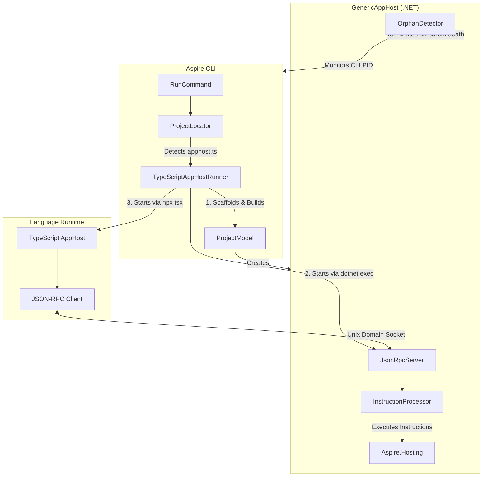
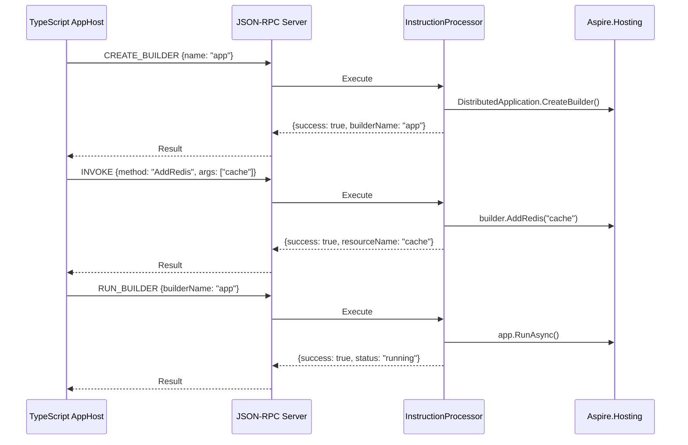
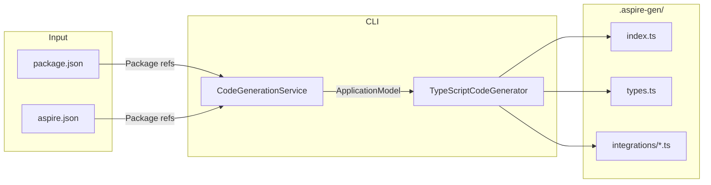

# Polyglot AppHost Support

This document describes how the Aspire CLI supports non-.NET app hosts (TypeScript, Python) through a polyglot architecture.

## Overview

The polyglot apphost feature allows developers to write Aspire app hosts in languages other than C#. The CLI detects the app host type based on entry point files (`apphost.ts`, `apphost.py`) and orchestrates the appropriate runtime.

## Architecture



## Process Lifecycle

### Startup Sequence

1. **Detection**: `ProjectLocator` finds `apphost.ts` or `apphost.py` in the working directory
2. **Code Generation**: Rosetta generates TypeScript/Python SDK wrappers for installed integrations
3. **GenericAppHost Preparation**:
   - `ProjectModel` scaffolds a .NET project in `$TMPDIR/.aspire/hosts/<hash>/`
   - References `Aspire.AppHost.Sdk` and required hosting packages
   - Builds the project with `dotnet build`
4. **GenericAppHost Launch**: Started via `dotnet exec` with:
   - `REMOTE_APP_HOST_SOCKET_PATH` - Unix domain socket path for JSON-RPC
   - `REMOTE_APP_HOST_PID` - CLI process ID for orphan detection
   - Environment variables from `apphost.run.json`
5. **Language Runtime Launch**: Started via `npx tsx` (TypeScript) or `python` (Python)
6. **Connection**: Language runtime connects to GenericAppHost over Unix domain socket

### Shutdown Sequence

Shutdown can be triggered by:

1. **User Interrupt (Ctrl+C)**: CLI receives signal, terminates child processes
2. **CLI Death**: `OrphanDetector` in GenericAppHost monitors parent PID, terminates when parent dies
3. **Connection Loss**: Language runtime detects disconnection and exits
4. **Startup Failure**: Errors (e.g., port conflicts) propagate back through JSON-RPC and terminate all processes

## JSON-RPC Protocol

Communication between the language runtime and GenericAppHost uses JSON-RPC 2.0 over Unix domain sockets.

### Instructions

| Instruction | Description |
|-------------|-------------|
| `CREATE_BUILDER` | Creates a `DistributedApplicationBuilder` |
| `INVOKE` | Invokes a method on a resource or builder |
| `RUN_BUILDER` | Builds and runs the distributed application |

### Example Flow



## Code Generation (Rosetta)

The CLI generates TypeScript/Python SDK wrappers that provide type-safe APIs for Aspire integrations. This is called "Rosetta" - translating between .NET and other languages.

### How It Works



### Generation Trigger

Code generation runs automatically when:

1. **First Run**: `.aspire-gen/` folder doesn't exist
2. **Package Changes**: Hash of package references has changed
3. **Manual**: After running `aspire add` to add new integrations

The CLI computes a SHA256 hash of all package IDs and versions. This hash is stored in `.aspire-gen/.codegen-hash` and compared on each run.

### Generated File Structure

```
.aspire-gen/
├── .codegen-hash           # SHA256 hash of package references
├── index.ts                # Re-exports all generated code
├── types.ts                # Instruction types and common interfaces
└── integrations/
    ├── hosting.ts          # Core Aspire.Hosting methods
    ├── apphost.ts          # AppHost SDK methods
    └── redis.ts            # Per-integration wrappers (e.g., AddRedis)
```

### Generated Code Example

For `Aspire.Hosting.Redis`, the generator creates:

```typescript
// .aspire-gen/integrations/redis.ts
// Auto-generated from Aspire.Hosting.Redis v13.1.0

import type { DistributedApplicationBuilder, ResourceBuilder } from '../distributed-application.js';

declare module '../distributed-application.js' {
  interface DistributedApplicationBuilder {
    /**
     * Adds a Redis container to the application.
     * @param name The name of the resource
     */
    addRedis(name: string): ResourceBuilder<RedisResource>;
  }
}

export interface RedisResource {
  readonly name: string;
}
```

This allows TypeScript app hosts to write:

```typescript
// apphost.ts
import { DistributedApplication } from '@aspire/hosting';

const builder = await DistributedApplication.createBuilder();
const cache = builder.addRedis('cache');  // Type-safe!
await builder.build().run();
```

### ApplicationModel

The code generator builds an `ApplicationModel` from package references:

```csharp
public class ApplicationModel
{
    public List<IntegrationModel> Integrations { get; set; }
}

public class IntegrationModel
{
    public string PackageId { get; set; }      // e.g., "Aspire.Hosting.Redis"
    public string Version { get; set; }         // e.g., "13.1.0"
    public List<ExtensionMethodModel> ExtensionMethods { get; set; }
}

public class ExtensionMethodModel
{
    public string Name { get; set; }            // e.g., "AddRedis"
    public string ExtendedType { get; set; }    // e.g., "IDistributedApplicationBuilder"
    public string ReturnType { get; set; }      // e.g., "IResourceBuilder<RedisResource>"
    public List<ParameterModel> Parameters { get; set; }
}
```

### Incremental Generation

The `CodeGenerationService` implements incremental generation to avoid unnecessary rebuilds:

```csharp
public bool NeedsGeneration(string appPath, IEnumerable<(string PackageId, string Version)> packages)
{
    // Check if .aspire-gen exists
    if (!Directory.Exists(generatedPath)) return true;

    // Check if hash file exists
    if (!File.Exists(hashPath)) return true;

    // Compare hashes
    var savedHash = File.ReadAllText(hashPath);
    var currentHash = ComputePackagesHash(packages);
    return savedHash != currentHash;
}
```

### TypeScript Base Library

The generated code depends on a base TypeScript library (`@aspire/hosting`) that provides:

| Class | Purpose |
|-------|---------|
| `DistributedApplication` | Entry point, creates builders |
| `DistributedApplicationBuilder` | Configures resources |
| `ResourceBuilder<T>` | Fluent API for resource configuration |
| `AspireClient` | JSON-RPC client for GenericAppHost communication |

The base library handles all communication with the GenericAppHost, translating TypeScript method calls into JSON-RPC instructions.

## Configuration

### apphost.run.json

The `apphost.run.json` file configures the app host runtime, using the same format as .NET launch settings:

```json
{
  "$schema": "https://json.schemastore.org/launchsettings.json",
  "profiles": {
    "https": {
      "applicationUrl": "https://localhost:17000;http://localhost:15000",
      "environmentVariables": {
        "ASPIRE_DASHBOARD_OTLP_ENDPOINT_URL": "https://localhost:21000",
        "ASPIRE_RESOURCE_SERVICE_ENDPOINT_URL": "https://localhost:22000"
      }
    }
  }
}
```

The CLI reads this file and passes environment variables to the GenericAppHost process.

### aspire.json

The `aspire.json` file declares package dependencies for code generation:

```json
{
  "language": "typescript",
  "sdk": "Aspire.AppHost.Sdk",
  "packages": [
    { "name": "Aspire.Hosting.Redis", "version": "9.0.0" }
  ]
}
```

## Version Handling

The GenericAppHost uses the same Aspire package version as the installed CLI:

- Production versions (e.g., `13.1.0`): Used directly
- Dev versions (e.g., `13.2.0-dev`): Falls back to latest stable (`13.1.0`)
- Override: Set `ASPIRE_POLYGLOT_PACKAGE_VERSION` environment variable

## File Locations

| Path | Description |
|------|-------------|
| `$TMPDIR/.aspire/hosts/<hash>/` | GenericAppHost project directory |
| `$TMPDIR/.aspire/sockets/<hash>.sock` | Unix domain socket for JSON-RPC |
| `.aspire-gen/` | Generated TypeScript/Python SDK code |
| `apphost.run.json` | Launch settings (in project root) |
| `aspire.json` | Package dependencies (in project root) |

The `<hash>` is derived from the SHA256 of the app host directory path, ensuring unique locations per project.

## Orphan Detection

The `OrphanDetector` class monitors the CLI process to prevent orphaned GenericAppHost processes:

```csharp
// GenericAppHost monitors CLI PID
var cliPid = Environment.GetEnvironmentVariable("REMOTE_APP_HOST_PID");
OrphanDetector.MonitorParentProcess(int.Parse(cliPid), () => {
    Environment.Exit(0);
});
```

This ensures cleanup even if the CLI crashes or is killed unexpectedly.

## Error Handling

Errors during startup (e.g., port conflicts, missing dependencies) are propagated through the JSON-RPC connection:

1. GenericAppHost catches the exception in `InstructionProcessor`
2. Error is returned as JSON-RPC error response
3. Language runtime receives error and exits with failure code
4. CLI detects child process exit and terminates

This ensures the entire process tree terminates cleanly on startup failures.
