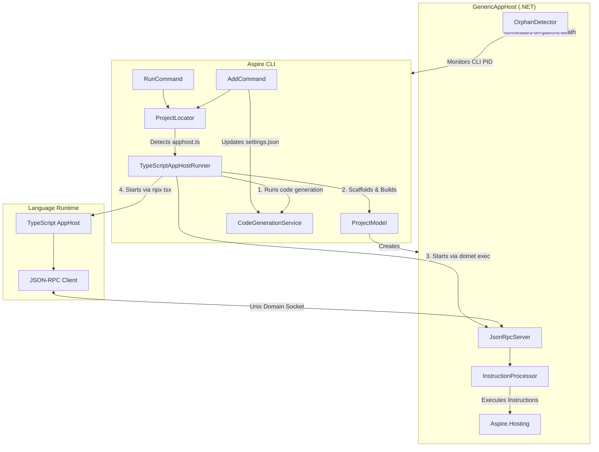
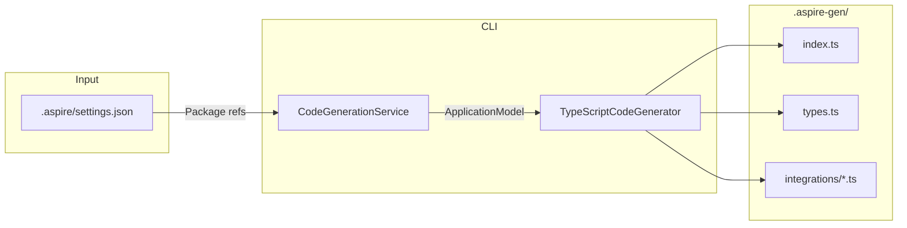

# Polyglot AppHost Support

This document describes how the Aspire CLI supports non-.NET app hosts (TypeScript, Python) through a polyglot architecture.

## Overview

The polyglot apphost feature allows developers to write Aspire app hosts in languages other than C#. The CLI detects the app host type based on entry point files (`apphost.ts`, `apphost.py`) and orchestrates the appropriate runtime.

## Design Goals

The architecture is designed around these key principles:

1. **Reuse Existing Integrations**: All 100+ existing Aspire.Hosting.* NuGet packages work automatically with TypeScript and Python app hosts. No need to rewrite or port integrations - they're available immediately.

2. **Incremental Native Support**: While the GenericAppHost provides full compatibility, language-specific SDKs can incrementally add native implementations for commonly used patterns, improving developer experience over time.

3. **Consistent CLI Experience**: Commands like `aspire run`, `aspire add`, and `aspire new` work identically regardless of the app host language. Developers don't need to learn different workflows.

4. **Leverage .NET Ecosystem**: The heavy lifting (container orchestration, service discovery, health checks, telemetry) remains in .NET where the mature Aspire.Hosting libraries live. Language runtimes focus on providing idiomatic APIs.

This approach means that when a new Aspire integration is released (e.g., `Aspire.Hosting.Milvus`), it's immediately available to TypeScript and Python developers via `aspire add milvus` - no SDK updates required.

## Architecture



## Process Lifecycle

### Startup Sequence

1. **Detection**: `ProjectLocator` finds `apphost.ts` or `apphost.py` in the working directory
2. **Code Generation**: Generates TypeScript/Python SDK wrappers for installed integrations
3. **GenericAppHost Preparation**:
   - `ProjectModel` scaffolds a .NET project in `$TMPDIR/.aspire/hosts/<hash>/`
   - References `Aspire.AppHost.Sdk` and required hosting packages
   - Builds the project with `dotnet build`
4. **GenericAppHost Launch**: Started via `dotnet exec` with:
   - `REMOTE_APP_HOST_SOCKET_PATH` - Unix domain socket path for JSON-RPC
   - `REMOTE_APP_HOST_PID` - CLI process ID for orphan detection
   - Environment variables from `apphost.run.json`
5. **Language Runtime Launch**: Started via `npx tsx` (TypeScript) or `python` (Python)
6. **Connection**: Language runtime connects to GenericAppHost over Unix domain socket

### Shutdown Sequence

Shutdown can be triggered by:

1. **User Interrupt (Ctrl+C)**: CLI receives signal, terminates child processes
2. **CLI Death**: `OrphanDetector` in GenericAppHost monitors parent PID, terminates when parent dies
3. **Connection Loss**: Language runtime detects disconnection and exits
4. **Startup Failure**: Errors (e.g., port conflicts) propagate back through JSON-RPC and terminate all processes

## JSON-RPC Protocol

Communication between the language runtime and GenericAppHost uses JSON-RPC 2.0 over Unix domain sockets.

### Instructions

| Instruction | Description |
|-------------|-------------|
| `CREATE_BUILDER` | Creates a `DistributedApplicationBuilder` |
| `INVOKE` | Invokes a method on a resource or builder |
| `RUN_BUILDER` | Builds and runs the distributed application |

### Example Flow


## Code Generation

The CLI generates TypeScript/Python SDK wrappers that provide type-safe APIs for Aspire integrations.

### How It Works



### Generation Trigger

Code generation runs automatically when:

1. **First Run**: `.aspire-gen/` folder doesn't exist
2. **Package Changes**: Hash of package references has changed
3. **After `aspire add`**: When adding new integrations

The CLI computes a SHA256 hash of all package IDs and versions. This hash is stored in `.aspire-gen/.codegen-hash` and compared on each run.

### Generated File Structure

```
.aspire-gen/
├── .codegen-hash           # SHA256 hash of package references
├── index.ts                # Re-exports all generated code
├── types.ts                # Instruction types and common interfaces
└── integrations/
    ├── hosting.ts          # Core Aspire.Hosting methods
    ├── apphost.ts          # AppHost SDK methods
    └── redis.ts            # Per-integration wrappers (e.g., AddRedis)
```

### Generated Code Example

For `Aspire.Hosting.Redis`, the generator creates:

```typescript
// .aspire-gen/integrations/redis.ts
// Auto-generated from Aspire.Hosting.Redis v13.1.0

import type { DistributedApplicationBuilder, ResourceBuilder } from '../distributed-application.js';

export async function addRedis(builder: DistributedApplicationBuilder, name: string): Promise<ResourceBuilder<'unknown'>> {
  const result = await builder.invoke('AddRedis', [name]);
  if (!result.success) {
    throw new Error(result.error || 'Failed to invoke AddRedis');
  }
  return builder.getResourceBuilder<'unknown'>(result.resourceName!);
}
```

This allows TypeScript app hosts to write:

```typescript
// apphost.ts
import { DistributedApplication } from '@aspire/hosting';

const builder = await DistributedApplication.createBuilder();
const cache = builder.addRedis('cache');  // Type-safe!
await builder.build().run();
```

### Incremental Generation

The `CodeGenerationService` implements incremental generation to avoid unnecessary rebuilds by comparing hashes of package references.

### TypeScript Base Library

The generated code depends on a base TypeScript library (`@aspire/hosting`) that provides:

| Class | Purpose |
|-------|---------|
| `DistributedApplication` | Entry point, creates builders |
| `DistributedApplicationBuilder` | Configures resources |
| `ResourceBuilder<T>` | Fluent API for resource configuration |
| `AspireClient` | JSON-RPC client for GenericAppHost communication |

The base library handles all communication with the GenericAppHost, translating TypeScript method calls into JSON-RPC instructions.

## Adding Integrations

The `aspire add` command works consistently across all app host types:

```bash
# Works the same for .NET, TypeScript, and Python projects
aspire add redis
aspire add Aspire.Hosting.Redis --version 13.1.0
```

### How It Works


### For .NET Projects
- Uses `dotnet add package` to add the NuGet package reference

### For TypeScript/Python Projects
1. Updates `.aspire/settings.json` with the package reference
2. Regenerates SDK code to include new integration wrappers
3. On next `aspire run`, the GenericAppHost will restore and include the new package

## Configuration

### .aspire/settings.json

The `.aspire/settings.json` file configures the polyglot app host. The `packages` field uses an object literal format similar to npm's `package.json`:

```json
{
  "appHostPath": "../apphost.ts",
  "packages": {
    "Aspire.Hosting.Redis": "13.1.0",
    "Aspire.Hosting.PostgreSQL": "13.1.0"
  }
}
```

| Field | Description |
|-------|-------------|
| `appHostPath` | Relative path to the app host entry point |
| `packages` | Object mapping package names to versions |

### apphost.run.json

The `apphost.run.json` file configures the app host runtime, using the same format as .NET launch settings:

```json
{
  "$schema": "https://json.schemastore.org/launchsettings.json",
  "profiles": {
    "https": {
      "applicationUrl": "https://localhost:17000;http://localhost:15000",
      "environmentVariables": {
        "ASPIRE_DASHBOARD_OTLP_ENDPOINT_URL": "https://localhost:21000",
        "ASPIRE_RESOURCE_SERVICE_ENDPOINT_URL": "https://localhost:22000"
      }
    }
  }
}
```

The CLI reads this file and passes environment variables to the GenericAppHost process.

## Version Handling

The GenericAppHost uses the same Aspire package version as the installed CLI:

- Production versions (e.g., `13.1.0`): Used directly
- Dev versions (e.g., `13.2.0-dev`): Falls back to latest stable (`13.1.0`)
- Override: Set `ASPIRE_POLYGLOT_PACKAGE_VERSION` environment variable

## File Locations

| Path | Description |
|------|-------------|
| `$TMPDIR/.aspire/hosts/<hash>/` | GenericAppHost project directory |
| `$TMPDIR/.aspire/sockets/<hash>.sock` | Unix domain socket for JSON-RPC |
| `.aspire/settings.json` | Project configuration with package references |
| `.aspire-gen/` | Generated TypeScript/Python SDK code |
| `apphost.run.json` | Launch settings (in project root) |

The `<hash>` is derived from the SHA256 of the app host directory path, ensuring unique locations per project.

## Orphan Detection

The `OrphanDetector` class monitors the CLI process to prevent orphaned GenericAppHost processes:

```csharp
// GenericAppHost monitors CLI PID
var cliPid = Environment.GetEnvironmentVariable("REMOTE_APP_HOST_PID");
OrphanDetector.MonitorParentProcess(int.Parse(cliPid), () => {
    Environment.Exit(0);
});
```

This ensures cleanup even if the CLI crashes or is killed unexpectedly.

## Error Handling

Errors during startup (e.g., port conflicts, missing dependencies) are propagated through the JSON-RPC connection:

1. GenericAppHost catches the exception in `InstructionProcessor`
2. Error is returned as JSON-RPC error response
3. Language runtime receives error and exits with failure code
4. CLI detects child process exit and terminates

This ensures the entire process tree terminates cleanly on startup failures.
