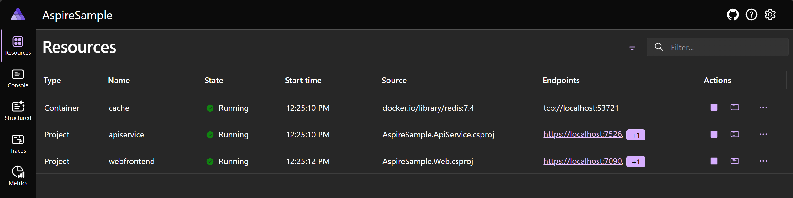

import { Aside, Steps, Tabs, TabItem, FileTree } from '@astrojs/starlight/components';
import { Kbd } from 'starlight-kbd/components'

Aspire includes tooling to help you create and configure cloud-native apps. The tooling includes useful starter project templates and other features to streamline getting started with Aspire for Visual Studio, Visual Studio Code, and CLI workflows. Assuming you have the [prerequisites](./prerequisites) installed, you can install the Aspire CLI and create a new project.

<Steps>

1. Create a new Aspire solution:

    ```console title="Create a new aspire solution"
    aspire new aspire-starter -n first-app -o first-app
    ```

    <Aside type='tip' title='Addition CLI option details'>
      The `aspire-starter` template provides several projects, including an API service, web frontend, and app host.
      
      - `-n`: specifies the name of the solution.
      - `-o`: specifies the output directory.
    </Aside>

    After running this command, your solution folder should ressemble the following:

    <FileTree>

    - first-app.sln
    - first-app.ApiService
        - Properties/
        - appsettings.Development.json
        - appsettings.json
        - first-app.ApiService.csproj
        - Program.cs
    - **first-app.AppHost** this is your local **dev-time** orchestrator
        - Properties/
        - appsettings.Development.json
        - appsettings.json
        - first-app.AppHost.csproj
        - Program.cs
    - first-app.ServiceDefaults
        - Extensions.cs
        - first-app.ServiceDefaults.csproj
    - first-app.Web
        - Properties/
        - wwwroot/
        - appsettings.Development.json
        - appsettings.json
        - first-app.Web.csproj
        - Program.cs
        - WeatherApiClient.cs
    </FileTree>

    This relies on the Aspire templates. If they're not installed already, the CLI will install them for you.

1. Change to the solution directory:

    ```console title="Change directories—stepping into the solution folder"
    cd <solution-name>
    ```

1. Run the Aspire app host project:

    ```console title="Run the app host project"
    aspire run --project ./first-app.AppHost/first-app.AppHost.csproj
    ```

    The Aspire CLI builds the solution, and when the dashboard is ready—it's URL with login token are output to the console, finally the resources are represented with live states as well:

    ```console frame="none"
    aspire run --project ./first-app.AppHost/first-app.AppHost.csproj

    Dashboard:
    📈  https://localhost:17286/login?t=<Your unique dev-time access token>

    ╭─────────────┬─────────┬─────────┬────────────────────────╮
    │ Resource    │ Type    │ State   │ Endpoint(s)            │
    ├─────────────┼─────────┼─────────┼────────────────────────┤
    │ apiservice  │ Project │ Running │ https://localhost:7438 │
    │             │         │         │ http://localhost:5571  │
    │ webfrontend │ Project │ Running │ https://localhost:7012 │
    │             │         │         │ http://localhost:5170  │
    ╰─────────────┴─────────┴─────────┴────────────────────────╯
    ```

1. Explore the running distributed application. From the dashboard, open the `HTTPS` endpoint from each resource.

    


1. Stop the app host and close the dashboard.

    <Kbd windows="Ctrl+C" mac="⌘+C" />

</Steps>

Congratulations! You've created your first Aspire app.