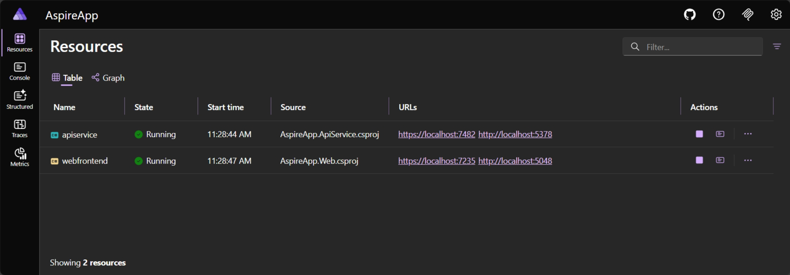

# Run your app

Use the **Run apphost** or **Debug apphost** buttons in the sidebar, or run the commands from the Command Palette. You can also right-click an apphost in the Aspire view.

When you run, the extension:
1. Discovers the apphost project in your workspace
2. Builds your solution
3. Launches all services in the correct order
4. Opens the **Aspire Dashboard** for real-time monitoring

### Debugging
When you **debug** instead of run, the extension attaches debuggers to your services automatically — set breakpoints in any project and they'll be hit as requests flow through your app.

### The dashboard
Once running, the dashboard shows all your resources, endpoints, logs, traces, and metrics in one place:

To learn more, see the [Aspire Dashboard overview](https://aspire.dev/dashboard/overview/).
