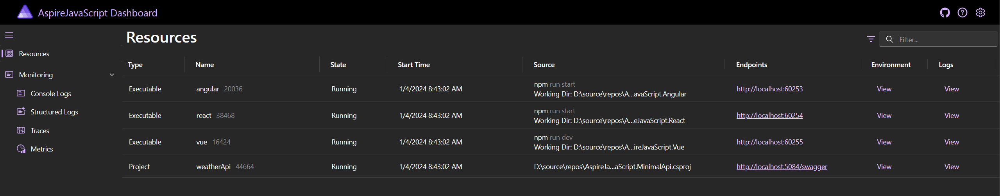
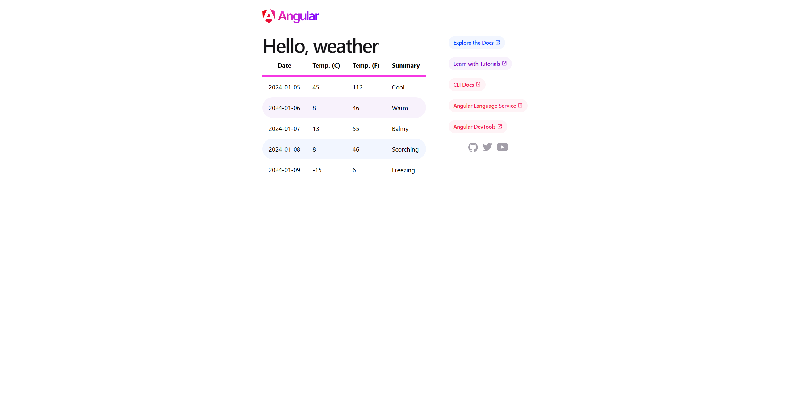
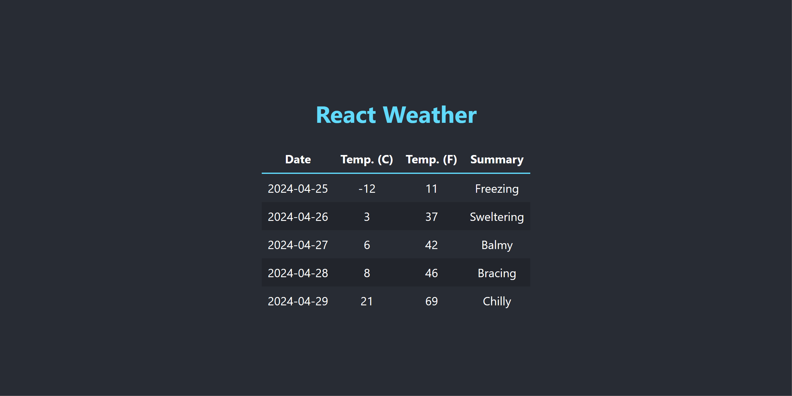
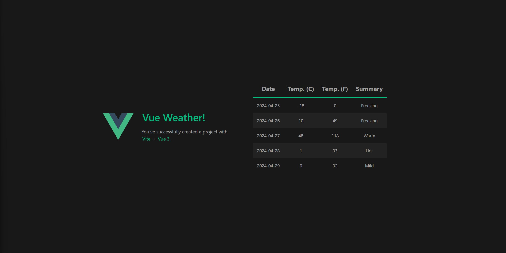

# Integrating Angular, React, and Vue with .NET Aspire

This sample demonstrates an approach for integrating several Node.js apps into a .NET Aspire application.

The app consists of four services:

- **AspireJavaScript.MinimalApi**: This is an HTTP API that returns randomly generated weather forecast data.
- **AspireJavaScript.Angular**: This is an Angular app that consumes the weather forecast API and displays the data in a table.
- **AspireJavaScript.React**: This is a React app that consumes the weather forecast API and displays the data in a table.
- **AspireJavaScript.Vue**: This is a Vue app that consumes the weather forecast API and displays the data in a table.

## Pre-requisites

- [.NET 8 SDK](https://dotnet.microsoft.com/download/dotnet/8.0)
- [Docker Desktop](https://www.docker.com/products/docker-desktop/)
- [Node.js](https://nodejs.org) - at least version 20.7.0
- **Optional** [Visual Studio 2022](https://visualstudio.microsoft.com/vs/)

### Experiencing the app

Before starting the app host run `npm install` in each javascript folder.

Once the app is running, the .NET Aspire dashboard will launch in your browser:

From the dashboard, you can navigate to the Angular, React, and Vue apps:

**Angular**

**React**

**Vue**

