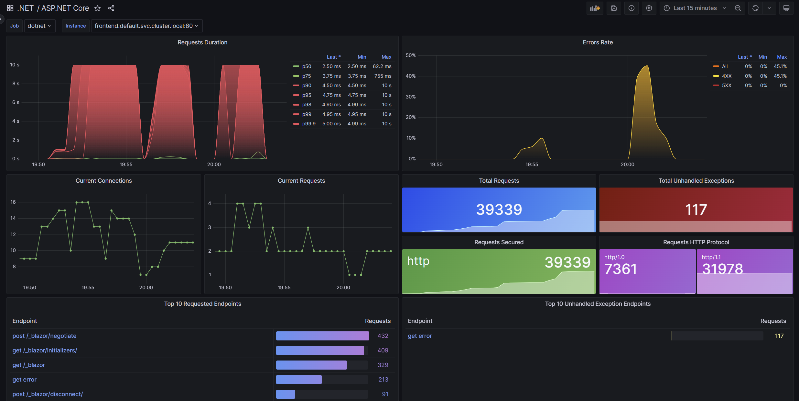

# .NET Grafana dashboards

The .NET Grafana dashboards visualize metrics built into .NET. Use metrics to see the real-time status of your apps.

## Get the dashboards

The best place to get the dashboards is from the Grafana dashboard store. The store has download links and instructions for importing dashboards into Grafana.

* [.NET team @ grafana.com](https://grafana.com/orgs/dotnetteam)
  * [ASP.NET Core](https://grafana.com/grafana/dashboards/19924) - Overview of the ASP.NET Core app
  * [ASP.NET Core Endpoint](https://grafana.com/grafana/dashboards/19925) - Detail for a specific ASP.NET Core endpoint

See [Export metrics from .NET](#export-metrics-from-net) for information on configuring a .NET app to send data to the dashboards.

## Screenshot



## Sample

.NET sample app that reports metrics to the dashboards is available at https://aka.ms/dotnet/grafana-sample.

## Technology

The dashboards use built-in .NET APIs and OSS cloud-native tools:

* [System.Diagnostics.Metrics](https://learn.microsoft.com/dotnet/core/diagnostics/compare-metric-apis#systemdiagnosticsmetrics) is the modern .NET metrics API. Libraries and apps use the API to create instruments and record values. ASP.NET Core and other .NET frameworks have built-in instruments for recording important information.
* [.NET OpenTelemetry SDK](https://github.com/open-telemetry/opentelemetry-dotnet) collects values from `System.Diaganostics.Metrics` instruments and exports values to Prometheus. OpenTelemetry needs to be configured in an application.
* [Prometheus](https://prometheus.io/) is a metrics database. Prometheus scrapes metrics values from apps and then stores them in a database. Prometheus provides an API to query values.
* [Grafana](https://grafana.com/) is a visualization and report tool for building dashboards and sending alerts. Grafana uses Prometheus as its data source.

## Source code

This repository is the home for the dashboard JSON files. We'd welcome issues and contributions to improve them.

## Export metrics from .NET

.NET metrics must be exported to Prometheus. You can do this by configuring the [.NET OpenTelemetry SDK](https://github.com/open-telemetry/opentelemetry-dotnet).

Add OpenTelemetry packages to the project file:

```xml
<ItemGroup>
  <PackageReference Include="OpenTelemetry.Exporter.Prometheus.AspNetCore" Version="1.7.0-alpha.1" />
  <PackageReference Include="OpenTelemetry.Extensions.Hosting" Version="1.7.0-alpha.1" />
</ItemGroup>
```

Configure OpenTelemetry at startup:

```csharp
var builder = WebApplication.CreateBuilder(args);
builder.Services.AddOpenTelemetry()
    .WithMetrics(builder =>
    {
        builder.AddPrometheusExporter();
        builder.AddMeter("Microsoft.AspNetCore.Hosting", "Microsoft.AspNetCore.Server.Kestrel");
    });

var app = builder.Build();
app.MapPrometheusScrapingEndpoint();

app.Run();
```

Verify OpenTelemetry has been successfully configured by browsing your app's `/metrics` endpoint. It will return metrics data formatted to be scraped by Prometheus.

## Configure Prometheus and Grafana

For information about setting up Prometheus and Grafana, see [View metrics in Grafana with OpenTelemetry and Prometheus](https://learn.microsoft.com/dotnet/core/diagnostics/metrics-collection#view-metrics-in-grafana-with-opentelemetry-and-prometheus).
